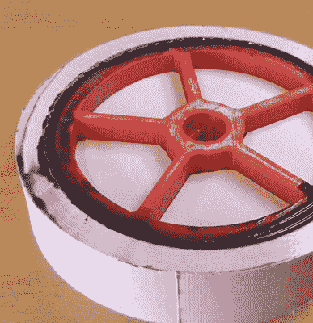

# 3D 打印车轮获得了一些急需的抓地力

> 原文：<https://hackaday.com/2019/01/30/3d-printed-wheels-get-some-much-needed-grip/>

你很难找到比我们在 Hackaday 更热情的 3D 打印支持者；NEMA 17 踏步机推动 i3 前进的声音在我们听来就像天使合唱团。但我们不得不承认，桌面 3D 打印机生产的硬塑料组件对于许多应用来说并不理想。例如，光滑的塑料除了最基本的轮子外，对其他的都没用。当然，有柔性细丝可以给印刷轮子一点抓地力，但它们也有自己的一系列问题(更不用说成本)。

 在休息之后的视频中，【设计/锻造】展示了一种将聚氨酯橡胶“轮胎”安装到 3D 打印轮毂上的巧妙方法，这肯定会引起那些想为他们的项目购买高质量定制车轮的人的兴趣。最终的结果看起来非常专业，虽然有相当多的准备工作要做，但是一旦你设置好了，你应该能够快速便宜地完成这些工作。

该过程从 3D 打印模具图案开始，包括最终的轮胎胎面纹理。这意味着你可以创建任何你想要的设计的轮胎胎面，这应该有一些创意和实际应用。然后将印刷好的部件浸入硅橡胶中，固化 8 小时。一旦固化，硅橡胶就变成了用于下一步的模具，不再需要原来打印的部分。

该过程的第二部分是 3D 打印轮胎将要附着的车轮。这些将比原来的 3D 打印组件小得多，并适合硅胶模具内部。印刷车轮的外径略小于模具的内径，这给了[设计/锻造]注入着色聚氨酯橡胶的空间。细心的观众会注意到，3D 打印的轮子有一个轻微的棱纹纹理设计，这样就有更多的表面区域供聚氨酯粘附。一旦从模具中取出，稍微清理一下，最终产品看起来确实很棒；让我们想起了一个巨大的乐高车轮。

[无论你是在铸造金属部件](https://hackaday.com/2018/02/25/casting-metal-parts-and-silicone-molds-from-3d-prints/)还是仅仅[想要一副真正定制的耳塞](https://hackaday.com/2015/03/13/3d-printed-molds-and-silicone-caulking/)，从 3D 打印部件中创建硅胶模具是一项非常有用的技能，你需要熟悉这项技能。虽然即使你没有 3D 打印机，也可以说[知道如何塑造和铸造真实世界的物体](https://hackaday.com/2019/01/20/cloning-knobs-for-vintage-testing-equipment/)。

 [https://www.youtube.com/embed/H5fuGsts6ho?version=3&rel=1&showsearch=0&showinfo=1&iv_load_policy=1&fs=1&hl=en-US&autohide=2&wmode=transparent](https://www.youtube.com/embed/H5fuGsts6ho?version=3&rel=1&showsearch=0&showinfo=1&iv_load_policy=1&fs=1&hl=en-US&autohide=2&wmode=transparent)

【感谢 Itay 的提示。]