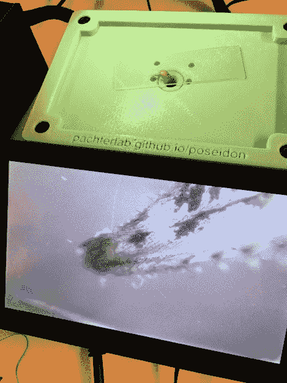

# 面向大众的开源生物装备

> 原文：<https://hackaday.com/2019/02/03/open-source-biological-gear-for-the-masses/>

恕我直言，Hackaday 的存在是因为人们在构建和记录开源小工具。如果建造一个特殊小发明的人愿意向世界展示他们是如何做到的，那就认为我们感兴趣。既然你在读这篇文章，我们假设你也在读。多年来，这种心态已经从相对小众的黑客社区蔓延到更大的工程世界，我们再高兴不过了。

 举个例子，[加州理工学院创造的海神号项目](https://github.com/pachterlab/poseidon)。由学生[Sina Booeshaghi]、[Eduardo 贝尔特拉姆]和[Dylan Bannon]以及研究人员[Jase Gehring]和教授[Lior Pachter]开发的 Poseidon 由开源数字显微镜和注射泵组成，可用于微流体实验。该系统不仅比商业产品便宜得多，而且没有这种硬件通常具有的苛刻的修改和使用限制。

当然，人们可以争辩说，主要实验室有足够的资金购买这种设备，而不必走 DIY 路线。确实如此，但是将这种设备仅限于已建立的机构有什么好处呢？和其他领域一样，让更多的人(从专业人士到业余爱好者)可以使用这些工具只会加速进步，推动技术的发展。

Poseidon 显微镜由 Raspberry Pi、触摸屏模块和商用数字显微镜组成，安装在 3D 打印的载物台中。这种装置提供了显微镜下物体的大而清晰的视图，本身就是一种极好的教育工具。但是当运行提供的 Python 软件时，它可以兼作注射泵的控制器，注射泵构成了海神系统的另一半。

这些泵几乎完全是 3D 打印的，使用常见的组件，如 NEMA 17 步进电机、线性轴承和螺纹杆来移动集成夹具中的注射器上的柱塞。这些泵由 Arduino 和 CNC 护罩控制，能够输送极其精确的液体量，这对于单细胞 RNA 测序等操作至关重要。总的来说，一个三泵系统的建造成本不到 400 美元，相比之下，人们可能要为市场上可买到的替代品支付数万美元。

波塞冬计划加入了一个相对较小，但非常令人兴奋的 DIY 生物学项目列表，这是我们多年来看到的。从几年前我们看到的[令人印象深刻的开源二氧化碳培养箱](https://hackaday.com/2015/07/25/get-biohacking-with-a-diy-co2-incubator/)到[进行聚合酶链式反应实验的快速而肮脏的设备](https://hackaday.com/2012/09/09/genetic-research-on-the-cheap/)，毫无疑问:[生物黑客正在慢慢成为现实](https://hackaday.com/2015/07/30/the-biohacking-movement-and-open-source-insulin/)。

 [https://www.youtube.com/embed/7YSiO6usR1M?version=3&rel=1&showsearch=0&showinfo=1&iv_load_policy=1&fs=1&hl=en-US&autohide=2&wmode=transparent](https://www.youtube.com/embed/7YSiO6usR1M?version=3&rel=1&showsearch=0&showinfo=1&iv_load_policy=1&fs=1&hl=en-US&autohide=2&wmode=transparent)

 [https://www.youtube.com/embed/Szg-vjukonA?version=3&rel=1&showsearch=0&showinfo=1&iv_load_policy=1&fs=1&hl=en-US&autohide=2&wmode=transparent](https://www.youtube.com/embed/Szg-vjukonA?version=3&rel=1&showsearch=0&showinfo=1&iv_load_policy=1&fs=1&hl=en-US&autohide=2&wmode=transparent)

