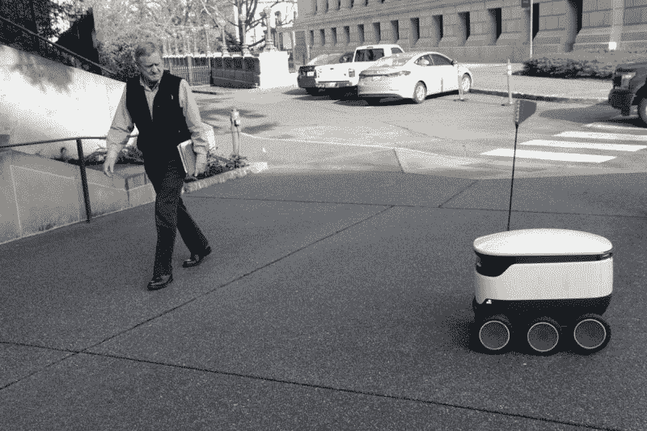

# 自动化货运:亚马逊用轮子解决最后一英里的问题

> 原文：<https://hackaday.com/2019/02/11/automate-the-freight-amazon-tackles-the-last-mile-problem/>

我们偶尔会探索自动驾驶汽车的杀手级应用:远程和本地的自动货运，以及一些特殊的用例。一些项目，如肯尼亚的无人机运送血液和医疗用品，已经起飞，变得既有利可图，又可能拯救生命。其他公司，如[无人驾驶长途货运](http://hackaday.com/2016/11/23/automate-the-freight-robotic-deliveries-are-on-the-way/)，最初引起了轰动，但似乎从那以后就沉寂了。这是意料之中的，因为市场在永无止境的追求投资回报最大化的过程中挑选赢家和输家。但最近整个领域似乎有点昏昏欲睡，很长一段时间没有值得注意的重大新闻。

上周，随着亚马逊宣布推出无人驾驶送货车 Scout T1，情况发生了变化。Scout 首先在亚马逊的博客上宣布，随后被大众和科技媒体转载，并几乎一字不差地重复了亚马逊的材料，乍一看，它似乎是亚马逊想要拥有“最后一英里”送货的认真尝试——目前由 UPS、联邦快递和各种邮政服务提供服务的当地路线。或者是？

## 过多的空驶

Scout 项目显然在亚马逊的管理层得到了很好的支持，由副总裁领导，[目前正在该公司的西雅图研究实验室雇佣一群开发人员和工程师来从事这项工作。他们甚至与斯诺霍米什县合作，在街道上测试自动送货机器人。斯诺霍米什县包括西雅图以北的社区，是许多亚马逊人的家园。](https://www.amazon.jobs/en/search?base_query=drpm&loc_query=&utm_source=gcaweb&utm_medium=dayone&utm_content=ops_murphy)

 [https://www.youtube.com/embed/peaKnkNX4vc?version=3&rel=1&showsearch=0&showinfo=1&iv_load_policy=1&fs=1&hl=en-US&autohide=2&wmode=transparent](https://www.youtube.com/embed/peaKnkNX4vc?version=3&rel=1&showsearch=0&showinfo=1&iv_load_policy=1&fs=1&hl=en-US&autohide=2&wmode=transparent)

尽管这一努力看起来严肃而耀眼，但 Scout 似乎有点乏味。伴随其介绍的视频是典型的企业产品，从产值的角度来看，它让我们想起了亚马逊宣布的 Prime Air 无人机送货服务。在 Scout 视频中，我们看到一辆相当不起眼的六轮电动汽车在可疑的废弃人行道和街道上行驶，驶向客户的家。车辆本身看起来就像每个人描述的那样——轮子上的冷却器。在到达目的地前，Scout 停在人行道上，等待收件人靠近，然后打开它的顶部，展示里面的亚马逊善良。接下来，该车辆可能会返回到某种配送设施，以提取下一个包裹。

不用对视频做过多解读，这个方案似乎有几个问题。抛开所有送货服务的困难不谈，无论是人工引导的还是自主的，都必须处理车辆及其内容的盗窃和破坏，Scout 模型似乎没有很好地扩展。如果 Scout 只能携带一个或多个目的地为单一地址的包裹，那么它将花费大约一半的时间返回其仓库。Deadheading 是任何快递公司的祸根，因为它除了重新定位设备之外什么都不做，而且没有盈利。除非覆盖的地理区域非常小，而且潜在客户非常密集，否则有这么多潜在客户的模式可能不会盈利。

## 星舰部队

有趣的是，Scout 与另一种自主交付服务 [Starship Technologies](https://www.starship.xyz/) 非常相似，后者一直在似乎是这种服务的完美环境中接受测试:大学校园。经过四年在世界各地不同地点的测试和大约 100，000 公里(62，000 英里)的自动驾驶记录，该公司最近宣布[向马里兰州乔治梅森大学](https://www2.gmu.edu/news/574036)推出 25 辆送货车。在那里，饥饿的学生和工作人员将能够使用智能手机应用程序吹哨子叫外卖，费用仅为 1.99 美元。与 Scout 不同，Starship 的车辆完全自主运行——亚马逊表示，六辆 Scout 测试车辆将由人类伴侣陪同，至少目前如此。

Autonomous lobbying? A Starship delivery vehicle shows off for Washington lawmakers at the capitol on Jan 24\. Source: [Peninsula Daily News](http://www.peninsuladailynews.com/news/lawmakers-ponder-rules-for-delivery-robots/)

奇怪的是，像亚马逊这样的大公司在最后一英里的送货自动化游戏中姗姗来迟。Starship Technologies 领先亚马逊五年，似乎已经开始实践亚马逊似乎仍在玩弄的大部分内容。据说 Starship 的车辆成本仅为 2000 美元左右，送货费为两美元一辆，用不了多久，这些东西就会开始为一家公司赚钱。相比之下，亚马逊似乎只是刚刚涉足其中。

但我认为这两种服务的真正问题在于它们的扩展性有多差。Starship 和亚马逊都表示，他们的服务依赖于当地的配送中心；考虑到车辆的行驶里程为 3 公里(2 英里),这意味着即使是一个普通的大都市地区也需要建设许多交通枢纽。诚然，城市环境是唯一具有人口密度的环境，使这些服务在经济上有意义，但所有这些服务正在将交付问题推低一个层次，因为这些枢纽可能无法像主要的配送中心那样大，而且必须经常自己补给。这很可能会由卡车来完成(至少目前是由人类司机来完成)，这种卡车可以廉价快速地运送大量物品。

别误会，我是自主货运的大力支持者。我仍然认为这是我们将看到自动驾驶汽车首次实际应用的地方，主要是因为它代表的节约。在这个世界上，沃尔玛每年为司机提供 9 万美元的报酬，对自动驾驶卡车的投资很快就能获得回报。但本地送货回路似乎更难攻克，尽管 Starship 似乎有合适的市场和技术来利用它，但亚马逊的努力似乎是一个失败的尝试，至少在目前的形式下。