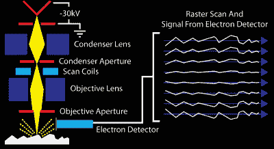

# 电子显微镜太棒了:你不知道的一切你都想知道

> 原文：<https://hackaday.com/2019/02/18/electron-microscopes-are-awesome-everything-you-didnt-know-you-wanted-to-know/>

电子显微镜曾经是研究实验室的地盘，它们可以支付购买和维护这类设备的巨额费用。但是旧的模型已经找到他们的方法到渴望的个人手中，他们给我们一个稀有设备的内部观察。在你开始搜索 Craigslist 之前，先上一堂你需要知道的速成课，看看 Adam McComb 的电子显微镜黑客指南。他在 2018 年 Hackaday 超级大会上发表了演讲，录音刚刚发表，你可以在下面找到它。

## 有两种方法可以让非常小的，大的

 [https://www.youtube.com/embed/Mam2kt0Dcvg?version=3&rel=1&showsearch=0&showinfo=1&iv_load_policy=1&fs=1&hl=en-US&autohide=2&wmode=transparent](https://www.youtube.com/embed/Mam2kt0Dcvg?version=3&rel=1&showsearch=0&showinfo=1&iv_load_policy=1&fs=1&hl=en-US&autohide=2&wmode=transparent)

关于这些仪器你首先要知道的是有两类:透射电子显微镜(TEM)和扫描电子显微镜(SEM)。

虽然这看起来很诱人，但你可能不想和 TEM 扯上关系。这些显微镜的工作原理是让电子穿过样品照射到荧光靶上；荧光粉发光，形成图像。有了 TEM，你可以获得难以置信的分辨率——在原子尺度上——并做一些事情，如给病毒拍照，甚至重建大脑中的神经连接。但所有这些都是以更高的复杂性为代价的。样品需要非常薄，大约 70-100 纳米，这意味着您需要使用专门的切割工具，如金刚石刀和离子束铣削。光路极其复杂，制备样品的化学物质可能相当危险。

Components of an SEM are relatively simple.

另一方面，扫描电子显微镜(SEM)就在家庭作坊附近。它们的作用是将电子探针对准样品，计算在每个离散位置反弹回来的电子数量，以判断亮度。这些是黑客们开始在他们的车库和工作室里拥有的工具。

## SEM 功能和工作流程

在他的演讲中，Adam 展示了 SEM 在检测集成电路方面的一些扩展功能——你可以用它来做比简单地制作图片更多的事情。初级电子束产生那些反弹回传感器的次级电子，以形成样品表面的图像。但是在更高的电压下，也会产生反向散射电子，这些电子可以用来推导出它的化学组成。使用适当的传感设备，当样品中的受激离子回落到基态时产生的特征 X 射线可用于确定样品材料。将这些结合起来意味着观察模具表面的下面，以判断存在什么材料以及它们去了哪里。实际上，您现在正在对 IC 设计中的各层进行逆向工程。

Adam 介绍了样品制备过程的细节，这比 TEM 简单得多，但仍然需要一些努力。样品需要是导电的，这样电子会反弹而不是被吸收，这通常涉及氩和金工艺中的溅射。因为它们将在真空中观察，所以样品必须具有非常低的水分含量，并且在他与我们分享的样品周围有一些黑客攻击。

你玩过 SEM 吗？在下面分享你的故事。我们知道本·克拉斯诺已经把一张 LP 唱片放进了 SEM。山姆·泽洛芙[在他家的实验室里有一个。在 Hackaday.io 上也有 SEM 项目，比如杰里·比勒(Jerry Biehler)为 80 年代的日立(Hitachi)所做的努力。这感觉像是一个疯狂的爱好，但无论是知识还是设备都不是遥不可及的！](https://hackaday.com/2017/06/11/scanning-electron-microscope-adds-to-already-impressive-garage-lab/)