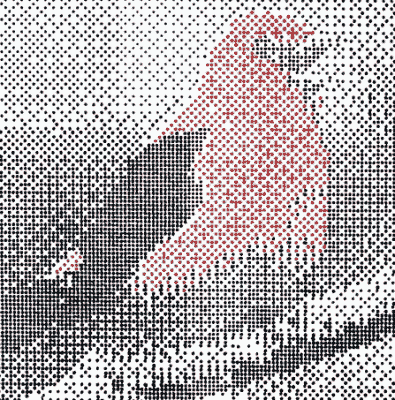

# 使用 3D 打印机重温点阵式打印机的辉煌岁月

> 原文：<https://hackaday.com/2019/02/21/relive-the-dot-matrix-glory-days-with-your-3d-printer/>

随着 3D 打印机的成本迅速下降，我们开始看到黑客将它们用于各种任务的趋势。这很有道理。关闭(或完全移除)热端和挤压机后，你就有了一台可以在二维或三维空间内极其精确地移动工具的机器。改装成带有激光、标记器，甚至偶尔带有旋转工具的打印机，正在成为我们 tip line 中的常见景象。

 去年【马修·雷菲尔德】在他的 3D 打印机上安装了一个标记，并让它勾画出一些图片，但最近他决定重新审视这个想法，并尝试给它加上一个独特的旋转。最终的结果是[使用绝对现代的硬件和软件](http://matthewrayfield.com/articles/dot-matrix-printing-with-a-3d-printer/)，回归到昔日的经典点阵打印机。不可否认，点阵打印的低保真度很有吸引力，当输入适当的图像时，这种设置能够产生一些我们不得不承认的近乎艺术的东西。

为了创建这些图像，[Matthew]创建了“像素到 GCode”，这是一种在线服务，任何人都可以使用它将任意图像转换为 Gcode，然后输入到他们的 3D 打印机中。有许多选项可供您选择，因此您可以拨入您想要的特定效果。点彩画图像可以使用紧密的点间距来创建，但是将它们加宽，最终的图像会变得越来越抽象。

这个项目的硬件部分主要留给读者练习。[Matthew]用橡皮筋把一支细尖笔固定在打印机的头上，但他承认这还远远不够理想。更强大的方法是某种 3D 打印设备，它允许你快速连接笔或标记，这样打印机就可以在 2D 和 3D 模式之间轻松切换。我们也很想知道，如果你用安装在打印机上的激光来烧点，会是什么样子。

回到 2012 年，我们看到有人[用软驱和光驱](https://hackaday.com/2012/07/09/tearing-through-floppy-drives-to-build-a-small-format-dot-matrix-printer/)的零件组装了一个非常相似的项目。这两个项目之间的差异，不仅在相对难度上，而且在最终结果上，都是一个很好的例子，说明黑客社区是如何从廉价 3D 运动平台的广泛可用性中受益的[。](https://hackaday.com/2018/09/29/turn-a-cheap-3d-printer-into-a-cheap-laser-cutter/)

 [https://www.youtube.com/embed/EKYnXWQF3iQ?version=3&rel=1&showsearch=0&showinfo=1&iv_load_policy=1&fs=1&hl=en-US&autohide=2&wmode=transparent](https://www.youtube.com/embed/EKYnXWQF3iQ?version=3&rel=1&showsearch=0&showinfo=1&iv_load_policy=1&fs=1&hl=en-US&autohide=2&wmode=transparent)

