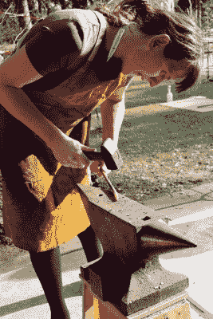
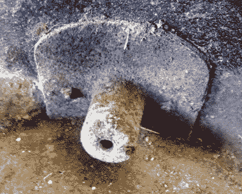
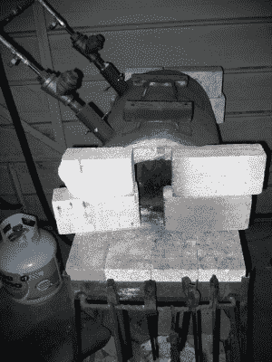

# 为门外汉锻造:什么是铁匠铺？

> 原文：<https://hackaday.com/2019/03/07/blacksmithing-for-the-uninitiated-what-is-a-forge/>

在工业革命获得动力之前，铁匠是制造业的高级技术专家。其核心是用金属制造任何所需工具或机械的艺术和科学。你使用的金属正确吗？该工具在需要的地方是否足够强大？你如何快速、高效、漂亮地完成一个项目？这些都是铁匠们从骨子里感受到的教训，很值得你自己去探索这个领域，去欣赏存在于任何使用良好的锻造厂的知识库。

前几天在荷兰[黑客酒店](https://hackerhotel.nl/)周末黑客营有一次意外的经历。在酒店旁边，我们在海牙 [RevSpace](https://revspace.nl/Main_Page) 的朋友搭建了一个便携式铁匠铺。有令人回味的煤火气味燃烧的焦炭从炉膛，铁砧，和锤打的声音。这对我来说非常熟悉，因为我是在它周围长大的。他现在可能退休了，但我爸爸是个铁匠，他的工作主要是高端建筑的铁制品。

Working the RevSpace forge at Hacker Hotel, in not the most appropriate clothing for the job.

问题是，尽管有这些教养，我并不认为自己是个铁匠。当然，我对锻造非常熟悉，可以用最好的方法敲打金属，但是我了解铁匠。我不能做我父亲能做的一切，而且我们会遇到一些金属艺术家。他们可以按照自己的意愿弯曲和塑造它，就像我可以塑造文字或随便焊接一个微小的表面贴装元件一样，这样做可以制作出漂亮的东西。我对金属的热情抨击可能带有某种铁砧经验的印记，但我不是其中之一。

当时看到 RevSpace forge 有点令人惊讶，我发现自己借了一个铁匠的围裙来保护我漂亮的工作服，还拿了一点钢筋。我动手做了一个非常简单的 dilletante 铁匠标准，一端有一个环的拨火棍。将钢筋的一端锤成一个点，将另一端切成略大于环直径 3 倍的方形，然后弯曲成直角，在铁砧的尖端形成环。在荷兰的阳光下享受十分钟左右的乐趣。在铁匠铺工作出乎意料地带来了一点启示。我可能不是一个高标准的铁匠，但我有一套技能，这是由于我所受的教育，而我在某种程度上忽视了这些技能。

其他人可能已经花了很大力气去学习它们，而我只是知道这些东西。也许我从来没有想到，也许我在这个社区的所有朋友都不是在他们长大的房子旁边的铁匠铺里学会的。如果我仅仅因为我的教养而拥有这方面的知识，也许我应该在一系列文章中分享一些，给我们社区中那些总是想去打铁场但不知道从哪里开始的人。

## 什么是铁匠铺？

[![A well-equipped forge, that of Finnish blacksmith Jesse Sipola. Wasapl [CC BY-SA 3.0].](img/799a41b79430ffb7748e91d25279edfd.png)](https://hackaday.com/wp-content/uploads/2019/02/1280px-0_typical_smithy_in_finland.jpg) 

一个设备齐全的铁匠铺，那是芬兰铁匠杰西·西波拉的。Wasapl [ [CC BY-SA 3.0](https://commons.wikimedia.org/wiki/File:0_typical_smithy_in_finland.JPG) 。所以，也许你希望我直接带你去铁匠铺，但不是。从最基本的开始，什么是铁匠铺？也许这仅仅是一个前字典雇员的词汇学究，但这是一个经常被误用的词。你会看到人们自称制造了一个熔炉，而事实上他们只制造了一个炉膛，一种加热金属的工具。一个铁匠铺实际上就是整个车间，如果一个金工车间有一个铁匠，它就是一个铁匠铺。所以我们将采取全店方法，从你可能在典型锻造厂找到的设备开始。也许我们会跳过大型操作的动力锤，它会有一种英国风味，因为这是我的经验所在，但如果你读了这篇文章，我希望你会更好地知道你可能需要在你的车间或黑客空间做这种工作。

锻造始于将一块金属加热到易于延展的温度，因此每个锻造厂都必须有某种形式的炉膛或熔炉来进行锻造。在这件事上，可以在固体燃料、气体甚至电感应之间做出选择。我们希望看到我们的社区证明我们在这一点上是错误的，但最后一个选项可能超出了大多数实验者的电源连接，所以假设你有足够的通风或烟道来安全运行一个，我们将看看实验者可能达到的固体燃料和气体炉膛。

## 气体燃料和固体燃料，哪个适合你？

A cast-iron tuyere, part of a small portable hearth. This would normally be surrounded by firebrick.

如果你想到一个传统的铁匠铺，你可能会想象一个宽阔的正方形或长方形的壁炉，上面有一个烟囱罩，上面放着明亮的焦炭火焰。(如果你对它不熟悉，可乐就是煤，通过加热去除了挥发性成分，只剩下大部分碳。这是高炉运转的燃料。)

在较老的建筑中，它们可能被建在墙的结构中，但更现代的建筑将更像一张钢桌。他们将有一个衬有耐火砖的凹穴，火就在里面，凹穴的一侧是一个被称为风口的铸铁喷嘴(最初是一个法语单词，在英语中读作“tweer ”),空气通过它被吹入以维持火。

乡村的传统熔炉可能有一套风箱来供气，但是现代的熔炉会有一个离心风扇或类似的东西。重要的是要注意，要求不是一股高压空气，而是一个恒定的气流，就好像你能够对它连续吹气一样。出于这个原因，风扇电机通常会有一些速度控制手段。

A gas hearth, showing fire bricks. This one appears to use two gas torches. tmib_seattle ([CC BY-SA 2.0](https://www.flickr.com/photos/tmib/2376523216/in/photostream/))

好消息是，你可以轻松制作自己的固体燃料炉膛。如果你不喜欢以商业锻造的方式制造一个大的金属板结构，还有很多其他的东西可以压入使用。经典的快速和肮脏的便携式灶台是一个内衬 firbrick 的卡车制动鼓，但快速互联网搜索会发现转换烧烤，汽车车轮，甚至宠物食品碗。虽然风口需要一些注意，除非你把它当作一个可以烧掉的祭品，否则它需要足够结实，不会太热。商业风口出奇的贵，但是应该有很多铸铁件可以适应。例如，多年来，我父亲的壁炉使用一个非常大的铸铁工业滑轮的中央凸台。

煤气炉同样容易建造，因为一个体面大小的丙烷喷灯将提供足够的权力，当它的火焰是包含在一个耐火砖结构，以遏制热量。在最简单的情况下，这可以是一套松散组装的耐火砖，就像我父亲需要去现场时使用的那样，但它可以很容易地成为一个组装更坚固的炉子。一个众所周知的 DIY 项目是所谓的咖啡罐炉膛，其中一个金属罐内衬耐火粘土。关于煤气灶的一句警告来自于处理瓶装煤气的安全性。一些较小的手持气体火炬可能没有足够的热量来发挥作用。

## 应该多热？

[![A good illustration of working temperature in terms of colour, the end of the piece is yellow rather than white-hot. fir0002 [GFDL 1.2]](img/b480615a6435b2bc5208f5e93ea131ec.png)](https://hackaday.com/wp-content/uploads/2019/02/1280px-removing_rust_with_sand.jpg) 

很好地说明了工作温度在色彩方面，作品的结尾是黄色而不是白热化。一旦你有了自己的壁炉，开始加热一点金属并尝试一下是很诱人的。但在此之前，有必要考虑一下加热金属的目的是什么，应该达到多高的温度。当加热一块钢铁时，判断它是否准备好工作的最好方法是看它的颜色，所以最好从延展性而不是温度来考虑。

如果你在一个固体燃料炉床上转动空气，它确实会变得非常热，以至于一块钢在里面放得太久会很高兴地熔化甚至燃烧。你要么在炉膛底部留下一滩铁，要么取出一块正在燃烧并像烟花一样发出火花的白热钢铁。这两件事都是年轻得多的我已经做到的，你只有在青少年时期通过经验才能学到一些东西。

你的目标应该是用足够的空气或气体运行熔炉，使金属达到工作温度，在这个温度下，它的颜色应该至多是不太浅的黄色，当然也不会产生任何火花。这是一个精细的判断过程，但我会将金属块推入煤炭表面下约 1 英寸(2.5 厘米)的地方，这样我仍然可以看到它，并在它的颜色与燃烧的煤炭的颜色相匹配的时候将其取出。然后，我在某个地方对一片轻钢进行了长达一分钟的加工，在此期间，它从黄色到橙色再到暗红色。

我们开始锻造工作的道路将是相当漫长的，因为要做到公正将需要涵盖许多主题。大体上讲了这个系列的起源，然后讲了炉边，我们将在这个系列的下一部分继续讲铁砧。这是最具代表性的铁匠工具，拥有令人惊讶的复杂性。下次见！