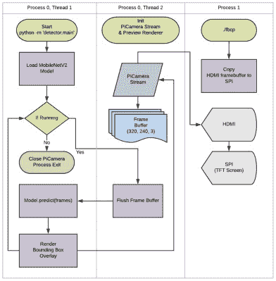

# 李·约翰逊的树莓派机器视觉指南

> 原文：<https://hackaday.com/2019/03/01/leigh-johnsons-guide-to-machine-vision-on-raspberry-pi/>

我们向让技术对新兴市场的人们有用的黑客致敬。当利·约翰逊接受挑战建造可离线工作的便携式机器视觉装置时，她加入了这个精选小组。对于硬件来说，一个带摄像头和屏幕的树莓 Pi 可以满足这个成本上限，而让它看得见的软件是她 2018 年 Hackaday 超级会议演示的重点。(视频也嵌在下面。)

这个演讲非常简洁，只有 13 分钟，所以 [Leigh](https://twitter.com/grepLeigh) 快速浏览了基本术语的定义，然后很快命名 TensorFlow 和 Keras 为她使用的工具。她在这里省下的时间都花在了解释什么是卷积神经网络，以及它们是如何工作的，刚好够让观众做好准备。但所有这些都只是背景，演讲的核心是利收集的独立例子，这些例子由[在网上发布。我喜欢看到这一点，因为这意味着你不仅仅是观看，而是亲自尝试。](https://github.com/leigh-johnson/rpi-vision)

## 产生更多更好的例子

当 Leigh 开始探索时，她没有在 Raspberry Pi 上找到足够满意的 TensorFlow 机器视觉端到端示例，所以她创建了自己的示例来分享和帮助未来发现自己在相同位置的人。她说，这是一项正在进行的工作，但鉴于该领域的快速发展，该免责声明也可以诚实地适用于其他任何东西。

 大多数机器视觉算法都需要庞大的硬件。示例项目使用了 [MobileNetV2](https://ai.googleblog.com/2018/04/mobilenetv2-next-generation-of-on.html) ，它针对普通手机处理器上的图像识别进行了优化，非常适合树莓 Pi。然而，这种适度的要求仅在使用已经训练好的网络进行识别时适用。训练过程仍然需要大量的计算，因此 Leigh 强烈推荐使用比 Raspberry Pi 更强大的东西。配备 GPU 的个人电脑会工作得很好，她也对谷歌云的[机器学习引擎](https://cloud.google.com/ml-engine/)有很好的体验。

## 训练神经网络

但是 Leigh 对训练一个神经网络并不感兴趣。不，她想帮助人们学习如何训练神经网络。这仍然是一门艺术，每个人都可能经历许多轮的试验和错误。为了改善这个迭代过程，她希望改善我们通过可视化工具 [TensorBoard](https://www.tensorflow.org/guide/summaries_and_tensorboard) 获得的反馈，并更好地了解 TensorFlow 网络内部发生的事情。Leigh 希望它能更有效地帮助用户跟踪他们所做的更改，并将它们与这些更改的效果联系起来。

 使深度学习机器视觉实验可重复的另一个重要部分是拥有相同的数据集进行训练。她提供了自己的一个例子:一组骰子的图像，以帮助教计算机阅读骰子，并向每个人介绍了其他在线资源，用于在广泛的问题领域中训练数据。所有上述资源都将帮助人们学习构建部署后将有效工作的神经网络，无论目标是高端视觉计算机还是新兴市场 100 美元的机器视觉盒子，这些概念都很重要。

如果你想看到额外的 TensorFlow 驱动的视觉应用在 Raspberry Pi 上运行，我们已经看到了[识别扑克牌](https://hackaday.com/2018/05/23/using-tensorflow-to-recognize-your-own-objects/)和[识别门旁等待的猫](https://hackaday.com/2018/12/21/neural-network-knows-when-cat-wants-to-go-outside/)的构建。如果你对机器学习感兴趣，但还没有掌握所有的术语，试试这个[关于机器学习基础的简单语言概述](https://hackaday.com/2019/02/22/foundations-for-machine-learning-in-english-or-russian/)。

 [https://www.youtube.com/embed/ahvtkUsyvbU?version=3&rel=1&showsearch=0&showinfo=1&iv_load_policy=1&fs=1&hl=en-US&autohide=2&wmode=transparent](https://www.youtube.com/embed/ahvtkUsyvbU?version=3&rel=1&showsearch=0&showinfo=1&iv_load_policy=1&fs=1&hl=en-US&autohide=2&wmode=transparent)

