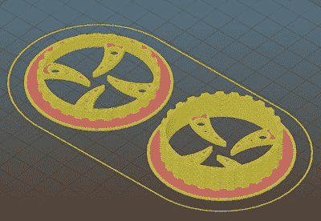

# 可打印的细丝线轴毂跳过轴承

> 原文：<https://hackaday.com/2019/03/16/printable-filament-spool-hub-skips-the-bearings/>

当你真正开始微调 3D 打印机时，你可能会开始注意到，即使是最微小的事情也会对打印产生明显的影响。一扇开着的窗户可以产生足够的气流，使你的印刷品从床上剥落，而廉价的地下室细丝稍微歪斜的直径可以打乱你的挤出速度。如果你不小心的话，可能会掉进一个很深的兔子洞。

一个经常被忽视的因素是灯丝轴；如果旋转不平稳，它对挤出机和打印头运动的阻力会导致难以诊断的问题。对于他的定制打印机，[【Marius tac iuc】开发了一个非常聪明的可打印的小工具，它只使用 PLA 本身的属性来帮助细丝卷旋转。虽然这个设计可能需要一点调整才能在你自己的打印机上工作，但他分享的文件应该可以让你大部分时间都做好。](https://hackaday.io/project/164237-smooth-spool-holder-with-no-bearing)

 你所需要做的就是打印出适合你特定的灯丝线轴的轮毂(当然，它们并不都是标准尺寸)，然后把它们扣上。轮毂的四个“爪”轻轻接触一根 8 毫米的杆，足以支撑线轴，同时尽可能限制表面积。PLA 的天然弹性有助于抑制力矩，如果你只是将无毂线轴挂在杆上，就会产生这种力矩。

[Marius]为他的低摩擦轮毂提供的 STL 文件对任何有兴趣尝试他的设计的人来说都应该很好，但你需要想出自己的方法来在一个方便的地方安装 8 毫米的杆。他包括的手臂是专门为他定制的 Prusa Mendel 设计的，这与当代的桌面 3D 打印机设计相去甚远。可以考虑在打印机上方悬挂一根 8 毫米的杆，有足够的空间可以放上几个卷轴，以便快速获取不同的颜色或材料。

黑客多年来一直试图解决线轴摩擦问题，正如你所料[我们在过去已经看到了一些非常聪明的设计](https://hackaday.com/2014/12/29/ingenious-filament-spool-holder-keeps-your-3d-printer-printing/)。但是我们特别喜欢【马里乌斯】做出的这个设计有多简单，[以及你不需要寻找轴承来建造它的事实](https://hackaday.com/2014/04/17/awww-shoot-my-spool-doesnt-fit-my-holder/)。如果你想尝试一下这个新设计，一定要留下评论，让我们知道它对你的效果如何。

 [https://www.youtube.com/embed/pyxolriGxsk?version=3&rel=1&showsearch=0&showinfo=1&iv_load_policy=1&fs=1&hl=en-US&autohide=2&wmode=transparent](https://www.youtube.com/embed/pyxolriGxsk?version=3&rel=1&showsearch=0&showinfo=1&iv_load_policy=1&fs=1&hl=en-US&autohide=2&wmode=transparent)

