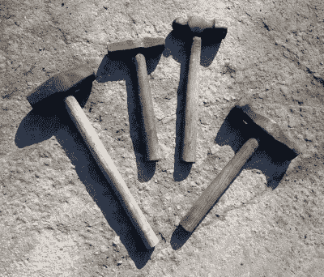
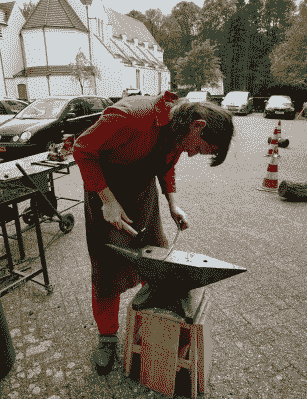

# 为门外汉锻造:锤子和钳子

> 原文：<https://hackaday.com/2019/05/09/blacksmithing-for-the-uninitiated-hammer-and-tongs/>

经常阅读的读者会认为这是探索锻造系列的第三部分，适合那些可能一直想尝试但不知道从哪里开始的人。这是从一个在工作的铁匠铺周围长大的不寻常经历的角度写的，我的父亲现在可能退休了，但他有一个专门从事建筑铁器的铁匠。

到目前为止，在这个系列中，我们已经详细地看了你可能在一个典型的锻炉中找到的炉膛和铁砧，并且提供了一些关于你可能在哪里找到或者甚至建造你自己的炉膛和铁砧的指示。这些是你会在铁匠铺里找到的标志性设备，但是仅仅有了它们，你仍然不能成为一名铁匠。

## 如果我有一把锤子…

An array of hammers of different weights and types.

给你一个铁砧、一个炉膛和一缸用来淬火热工件的水，你差不多准备好去锻造了，但还没有。现代铁匠铺的大部分都是标准的焊工和角向磨工的金属加工分类，但是有一套工具对于单独的铁匠来说仍然是必不可少的。你的锤子是把你和工作联系起来的东西，可以像铁匠自己的喜好一样个性化。对于你应该使用什么样的锤子这个问题，没有“正确”的答案，相反，你应该使用最适合你的那个。我本能地喜欢圆头圆头锤，因为那是我爸爸最常用的，但例如我的荷兰朋友使用方头十字锤。铁匠通常会自己制作锤子来满足自己的需求，例如，我父亲用汽车半轴的优质钢材制作了不止一把锤子。强化它们本身就是一项专业技能，我记得在他完善它之前做过不少实验。

这可能是显而易见的，但锤子的重量影响它能给予工作多少能量，进而影响能做的功的大小。看了一眼我爸爸的锤子，三个日常重量分别是 2 磅、3 磅和 4 磅(大约 1 千克、1.5 千克和 2 千克)，允许从精细工作到较大工件的较重击打。在最近的一个项目中，制作一个中世纪的钉子，我选择了一个普通的锤子来绘制较大的方形原料，和一个小得多的锤子来完成它，创建精细的点和相对较薄的头部。这些只是他可以使用的锤子的一部分，像大多数铁匠一样，他有各种各样的任务，甚至大锤。我经常轮流用钳子夹住一块肉，而他用大锤，或者我自己用大锤。

## 夹钳，用于热夹持瞬间

[![A selection of tongs, including some designed for very specific tasks. Our thanks to [Igor Nikolic] for making this picture possible.](img/1d0eaf2eacc3859a80b931e29cf1c2ff.png)](https://hackaday.com/wp-content/uploads/2019/04/tong-selection.jpg) 

一系列的火钳，包括一些为非常具体的任务而设计的。我们感谢[伊戈尔·尼科利茨]让这部电影成为可能。

铁匠的锤子永远的伴侣是一把钳子。这些可以从铁匠的供应商那里买到，但是制作一对对大多数铁匠来说是一件力所能及的事情。两个相同的边是由几块原料制成的，有细长的手柄，一个形成铰链的平板，以及任何需要的颚板。在钻床上而不是用冲头在铁砧上形成铰链孔感觉像作弊，但用一小段杆铆接是一个足够简单的过程。铁匠们将会有一大堆不同钳口的钳子，用于特定的工作，这些钳子是根据工作需要多年积累起来的。如果你回想一下这个系列的第一部[中的芬兰铁匠，你会发现几架钳子。本系列的下一集将介绍如何制作一套钳子，尽管我们不能提前保证成品的质量。](https://hackaday.com/2019/03/07/blacksmithing-for-the-uninitiated-what-is-a-forge/)

## 保持自己清洁、安全，不着火

My usual forging attire of steel toecap workboots, spark-resistant overalls, and blacksmith’s leather apron. The forge is outside Hack42 hackerspace, Arnhem, and the anvil is set up a bit too low for me. Photo: © [Martina Short](https://twitter.com/martina_photos), used here with permission.

今天的最后一刻应该花在保护设备的主题上。锻造的危害相对简单，但一些基本的防护服仍然非常值得拥有。最明显的危险是高温，你将在一个有炽热金属和火的嘈杂环境中工作。虽然你产生的火花会比你想象的少，但我有一件铁匠的皮围裙和一套防火工作服。这两者都可以从铁匠用品商店买到，非常值得投资。还涉及到许多沉重和尖锐的物品，更不用说地板上的热颗粒了。出于这个原因，我也有一套钢头工作鞋额定热粒子。它们不是最优雅的鞋类，但它们让我避免了一些糟糕的时刻。

我没有专门针对锻造的面部保护，但是根据手头的工作，可能会产生一些火花。可以从任何安全设备供应商处买到防高温粒子的聚碳酸酯面罩，价格不会太贵，如果你正在进行研磨或旋转钢丝刷作业，这是一件必不可少的东西。除此之外，还有为处理热金属而设计的皮手套。我不使用它们，因为我更喜欢直接使用锤子的感觉，并且很乐意使用一对钳子来夹住热的钢块。

在本系列的最后几集里，我们已经带你了解了铁匠的基本车间设备，现在你应该对你应该拥有的安全装备有了一个基本的概念。在这个基础上，我们接下来将带你进入锻造厂，开始学习一些锻造技术和简单的项目，在这个过程中，我们也会看到一些相关的材料。