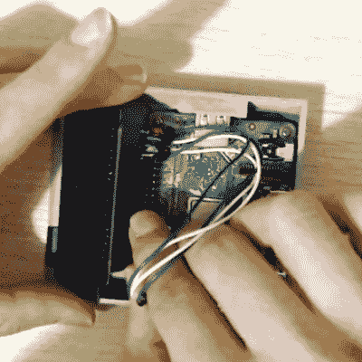

# RetroPie NES 时钟告诉你什么时候是游戏时间

> 原文：<https://hackaday.com/2019/03/15/retropie-nes-clock-tells-you-when-its-game-time/>

我们都见过经典游戏机的 3D 打印复制品，里面有一个树莓派；事实上，阅读这篇文章的一些人很有可能也有自己的手机。它们是为您的娱乐中心添加一些经典游戏仿真的绝佳方式，尤其是与仅在电视的 HDMI 端口上挂一个 Pi 的光秃秃的 PCB 相比。

【Victor Heid】喜欢这些微型游戏机的外观，但想挑战自己，设计出多功能且独特的东西。因此，他决定为树莓 Pi 3 A+设计一个受 NES 启发的盒子，它可以兼做 LED 矩阵钟，具有明显的复古感。坦率地说，即使它只是一个时钟，我们也会对最终产品印象深刻；但事实上，它也是一个功能齐全的复古版本，真的超越了这一点。

从成品来看，很明显[Victor]在打磨和完成 3D 打印外壳上下了很大功夫。但是我们不需要去想象这个过程，因为他很友好地详细描述了他使用的步骤和材料。正如你可能已经猜到的，简短的版本是大量的填充和大量的时间；但是如果你曾经考虑过让你自己的印刷部分看起来不那么…印刷的话，看看完整的文章是值得的。他用激光打印机在箱子正面刻字的方法，一些小技巧，和适度的耐心也是你可能想为未来的项目归档的东西。

这个项目的电子设备非常简单，因为[Victor]使用了 Pimoroni Scroll pHAT HD，而不是试图在如此有限的空间内滚动自己的 LED 矩阵。因此，这只是一个将电线连接到 Pi 的 GPIO 头，并让各种软件相互交谈的问题，他还为任何可能感兴趣的人详细介绍了这一点。

自从 Raspberry Pi 3 A+发布以来已经过去了几个月，我们终于开始看到利用新板更小尺寸的项目。像 A+这样的硬件能力，加上[制造商生产官方“迷你”系统](https://hackaday.com/2018/12/23/nintendo-does-sony-better-than-sony/)的乏善可陈，似乎已经为黑客再次超越商业产品奠定了基础。当然，我们不是在抱怨。