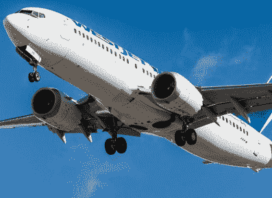
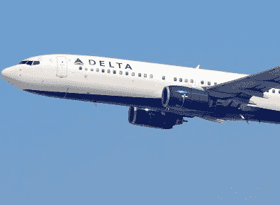
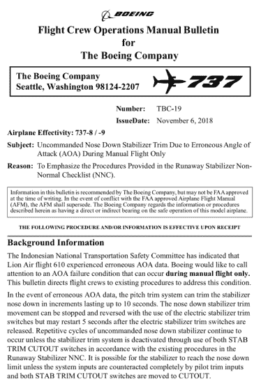
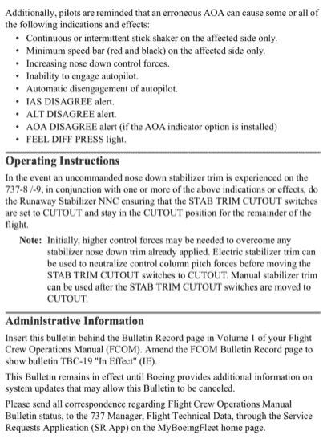

# MCAS 和 737:当小变化产生巨大后果

> 原文：<https://hackaday.com/2019/03/14/mcas-and-the-737-when-small-changes-have-huge-consequences/>

当第一架 737 MAX 于 2017 年 5 月服役时，它被认为是波音公司的一个重要里程碑。近十年来，这家航空业巨头一直致力于开发 1967 年首次上天的经典 737 的更省油版本。由先进的 CFM 国际 LEAP 发动机提供动力，并采用现代空气动力学改进，如独特的分裂翼尖，波音公司建造的新 737 的运营成本与空客的最新设计具有竞争力。不同的 737 MAX 型号之间的订单超过 5000 份，该飞机立即获得了成功。

但现在，为了应对夺走 346 条生命的两起事故，整个波音 737 MAX 全球机队停飞。虽然对这些悲剧的调查仍在进行，但初步调查结果太相似，不容忽视。在这两种情况下，尽管机组人员努力保持高度，飞机似乎还是进行了俯冲。虽然联邦航空管理局最初对暂停波音 737 MAX 的运营犹豫不决，但他们最终与世界各地的政府监管机构达成一致，呼吁暂时禁止运营这些飞机，直到这些事故的原因得到确定和解决。

对他们来说，波音公司坚持认为他们的飞机是安全的。他们说[停飞机队是出于“充分的谨慎”](https://boeing.mediaroom.com/news-releases-statements?item=130404)，而不是对飞机某个特定缺陷的直接反应:

> 波音公司继续对 737 MAX 的安全性充满信心。然而，在与美国联邦航空管理局(FAA)、美国国家运输安全委员会(NTSB)以及世界各地的航空当局及其客户进行磋商后，波音公司决定——出于充分的谨慎，并为了让飞行公众放心飞机的安全性——建议 FAA 暂时停止全球 371 架 737 MAX 飞机的运营。

在两起事故调查完成之前，没有人能完全肯定地说是什么导致了飞机和乘客的损失。但是，根据现有的关于 737 重新设计过程中发生了哪些变化的信息，以及波音公司自己对运营商的建议，业内人士已经开始指出飞机新的机动特性增强系统(MCAS)的故障可能是这两起事故的罪魁祸首。

尽管在开发这些极其复杂的飞机上花费了数十亿美元，并且它们的操作遵循了异常严格的标准，但现在有一个强烈的迹象表明，波音 737 MAX 可能受到两个常见问题的困扰，这两个问题我们在过去可能都经历过:软件故障和糟糕的文档。

## 无意的副作用

这可能有点违反直觉，但 737 MAX 上使用的更高效的 LEAP 发动机实际上比以前版本的飞机上使用的发动机大得多。为了让这些大得多的发动机安装在机翼上，它们不仅要安装得比前几代 737 更高，还要更靠前。即使对于外行人来说，发动机尺寸和位置的差异也是显而易见的:

  737 MAX 8  737-800

人们发现，发动机的这种新定位导致 737 MAX 在某些机动动作中轻微上仰，特别是当飞机已经处于[大迎角(AoA)](https://en.wikipedia.org/wiki/Angle_of_attack) 时。换句话说，当机头抬高以获得高度时，飞机将开始爬升到高于飞行员预期的高度。如果任其发展，这种趋势可能会导致灾难性的失速状态；飞机已经倾斜到无法产生升力的程度。为了抵消这种设计的怪癖，引入了 MCAS 系统。

简单地说，MCAS 检测到 737 MAX 何时存在这种上仰趋势的风险，并通过使用飞机的后部稳定器来补偿，以使机头向下。当按计划进行操作时，飞行员甚至不应该知道 MCAS 已经参战。它被设计成一个在后台运行的系统，自动为飞行员提供理想的飞机性能。

事实上，[据透露，737 MAX 操作人员并不了解 MCAS](https://www.seattletimes.com/business/boeing-aerospace/u-s-pilots-flying-737-max-werent-told-about-new-automatic-systems-change-linked-to-lion-air-crash/) ，也没有接受过操作培训。详细描述两代飞机之间变化的文件没有提到自动系统，因为波音公司认为飞行员不需要有意识地意识到这一点。因此，许多飞行员直到第一次致命事故发生后才知道 MCAS。

## 错误数据

取代机组人员控制输入的自动化系统算不上新的发展，在飞机上已经使用了几十年。麦道 MD-11 是一架于 1990 年首飞的客机，其特点是一个被称为纵向稳定性增强系统(LSAS)的系统，该系统与 MCAS 的 737 MAX 有直接的相似之处。但是当它们不能正常工作时会发生什么呢？

当飞机水平飞行时，无效的传感器数据足以与 MCAS 交战吗？这会不会迫使飞机无视飞行员拉起的命令，进行不必要的俯冲？如果没有接受过 MCAS 系统的训练，飞行员会明白发生了什么，并知道如何禁用系统来重新控制飞机吗？

这些正是调查人员目前试图回答的问题。维护记录显示，在第一次致命事故中涉及的 737 MAX 的机组人员此前报告了 AoA 传感器的问题。事故发生前，飞机已经进行了非指令潜水，在此期间，机组人员注意到左右传感器的读数相差 20 度。

坠机后仅一周，波音公司向 737 MAX 运营商发布了一份公告，解释说来自 AoA 传感器的[“错误数据”可能会使飞机进入非指令俯冲](https://theaircurrent.com/aviation-safety/boeing-nearing-737-max-fleet-bulletin-on-aoa-warning-after-lion-air-crash/)，并记录了禁用系统的程序:

    

批评者认为，如果波音公司更清楚地解释了 MCAS 系统的性质，机组人员就有机会提前熟悉超驰程序；有可能完全避免这场灾难。

## 悲惨的教训

对第二起坠机事件的调查才刚刚开始，所以现在就断言飞机坠毁的原因还为时过早。但随着地面雷达观察证实飞机的高度在撞击前有所波动，人们有足够的担心，这可能与 MCAS 有关，在没有彻底调查的情况下继续驾驶飞机是不负责任的。

在同意停飞之前，波音公司的立场是，机组人员只需要接受培训，了解如何在收到无效 AoA 数据的情况下禁用 MCAS。但很明显，这个解决方案对联邦航空局及其全球合作伙伴来说还不够好；必须解决系统中的明显缺陷。需要改进系统如何解释冲突的 AoA 数据，以及在系统不按照飞行员的命令操作的情况下自动覆盖系统的安全措施。MCAS 应该是防止飞机向上俯仰超过预期，而不是在飞机已经处于机头向下的位置时阻止飞机获得高度。

不幸的是，在发现这样的错误之前，往往要付出生命的代价。在 MCAS 的例子中，这些事件清楚地提醒我们在开发新功能时文档的重要性。在一个全新的系统中，导致意外行为的小故障并不令人惊讶，甚至完全出乎意料。但是，如果用户不知道系统应该如何操作，更不用说当它出现故障时该做什么，后果可能是灾难性的。飞行员需要了解他们的飞机是如何工作的。