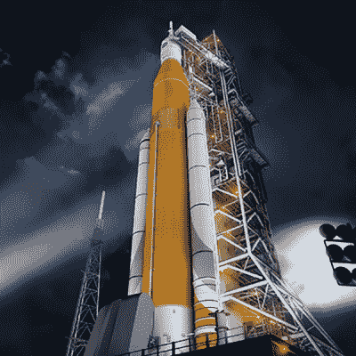

# 猎户座能骑猎鹰重型到月球吗？

> 原文：<https://hackaday.com/2019/03/25/could-orion-ride-falcon-heavy-to-the-moon/>

美国宇航局的太空发射系统(SLS)看起来情况不妙。偶尔被称为“参议院发射系统”，甚至不那么亲切地称为“不知去向的火箭”，超重型助推器长期以来一直是业内人士争论的焦点。作为核心航天飞机技术的发展，SLS 承诺重新利用现有的基础设施，提供比其臭名昭著的有翼前身更高的有效载荷能力和更低的运营成本。但是，面对商业发射供应商日益激烈的竞争和[提出的针对核心助推器](http://hackaday.com/2019/03/13/proposed-nasa-budget-signals-changes-to-space-launch-system/)未来升级和扩展的预算削减，这个明显超出预算和落后于计划的项目正处于一个非常不稳定的位置。

 这并不是说 SLS 看起来不令人印象深刻，至少在纸面上是这样。在其初始配置中，它将很容易成为世界上最强大的火箭，能够将近 105 吨的重量送入低地球轨道(LEO)，而 SpaceX 的 Falcon Heavy 为 70 吨。它仍然达不到强大的土星五号的 155 吨，但拟议的“Block 2”升级将把 SLS 的有效载荷能力提高到 145 吨的标志性阿波罗时代助推器的打击距离内。自 2011 年航天飞机退役以来，美国宇航局一直坚持认为，SLS 的力量是该机构完成更大、更雄心勃勃的月球、火星等任务的唯一途径。

或者至少，他们曾经是。3 月 13 日，美国国家航空航天局局长吉姆·布里登斯汀向国会作证说，为了避免进一步的延误，该机构正在探索用商业发射装置将猎户座飞船发射到月球的可能性。该声明震惊了航空航天界的许多人，因为它似乎对整个 SLS 计划的未来提出了质疑。如果商业火箭可以做 SLS 的工作，至少在某些情况下，为什么该机构需要它？

美国国家航空航天局目前正在准备一份报告，调查最初计划在 SLS 上飞行的任务需要进行哪些物理和后勤方面的修改；这份文件肯定会受到工党支持者和批评者的仔细审查。在报告发布之前，我们可以推测这次假设的登月飞行会是什么样子。

## 替换的下降

管理员 Bridenstine 在国会作证时没有具体提到他们正在寻找的商业车辆，但由于猎鹰重型飞机在目前运营的发射平台中具有最高的有效载荷能力，它几乎肯定会成为美国宇航局报告的重点。看起来猎鹰重型运载能力相当低可能是一个问题，但实际上，猎户座计划的月球试飞从一开始就没有充分利用 SLS 的能力。

在“探索任务 1”期间，SLS 只负责将猎户座、它的服务舱和临时低温推进级(ICPS)送入环绕地球的轨道；它实际上在仅 157 公里的高度与航天器分离。从那时起，猎户座独立运行，而 ICPS 实际上是推动飞船向月球前进的动力。

 [https://www.youtube.com/embed/XcPtQYalkcs?version=3&rel=1&showsearch=0&showinfo=1&iv_load_policy=1&fs=1&hl=en-US&autohide=2&wmode=transparent](https://www.youtube.com/embed/XcPtQYalkcs?version=3&rel=1&showsearch=0&showinfo=1&iv_load_policy=1&fs=1&hl=en-US&autohide=2&wmode=transparent)

猎户座和服务舱的总重量约为 57，000 磅，ICPS 本身的重量约为 66，000 磅。因此，至少在理论上，任何能够将大约 125，000 磅重物送入轨道的助推器*都应该能够代替 SLS 执行第一次任务。这完全在 Falcon Heavy 的能力范围之内，即使我们假设为辅助硬件和任何将所有东西栓在一起的适配器额外增加几千磅。一个新的整流罩需要被设计和制造来封装如此大的有效载荷，但是考虑到所有的事情，看起来这将是一个相当简单的过程。*

## 乘坐猎鹰快车

有趣的是，一些信封数学的快速返回似乎表明桌子上还有另一个选项。假设美国宇航局愿意对最初的任务参数进行一些实质性的偏离，看起来猎鹰重型飞机可能会在完全不使用 ICPS 的情况下将猎户座推向月球本身。这不仅可以使猎户座硬件更容易集成到猎鹰重型上，而且可以节省不可重复使用的 ICPS 用于未来的任务。

根据 SpaceX 公司的说法，猎鹰重型能够将超过 58，000 磅的重量送入地球同步转移轨道(g to)。[您可能还记得我们在](http://hackaday.com/2019/03/18/hitchhiking-to-the-moon-for-fun-and-profit/)的最后一课“初级轨道力学”，GTO 轨道是从低地球轨道到地球同步赤道轨道(GEO)高度 35，786 公里的轨道转移的前半部分。一旦航天器被猎鹰的上面级放入地球同步轨道，机载推进器将提升其近地点，使其环绕轨道并完成转移。

这意味着猎鹰重型应该能够将猎户座及其服务舱送入地球同步轨道。当然，这不会让你到达月球，但也不会太远。为了从地球轨道到达地球同步轨道，宇宙飞船必须以大约每秒 2.5 公里的速度加速。相比之下，对于月球注射，它需要加速约 3.2 公里/秒。那么，我们如何获得最后 700 米每秒的加速度？来自猎户座本身。

根据设计规格，猎户座服务舱能够提供 1.8 公里/秒的 delta-v，理论上，它应该能够在储备足够推进剂的情况下完成跨月注入机动，以执行任何必要的航向修正。在这个理论场景中，可能没有足够的推进剂来实际减速并进入最初计划的月球轨道。在这种情况下，猎户座可以简单地绕着月球的远端转一圈，然后返回地球。这种“自由返回”的飞行路线以前被用作早期阿波罗任务的应急措施；如果宇宙飞船不能执行月球轨道插入操作，它将允许机组人员基本上“漂移”回家。

## 美国宇航局谨慎行事

这些都是有趣的思想实验，但不幸的是，现实可能并不那么令人兴奋。一些人认为，对国会的陈述实质上是对航天发射系统的主要承包商波音公司的威胁。这是一个不那么微妙的信号，表明该机构已经厌倦了拖延和成本超支。事实上，就在他作证两天后，管理员 Bridenstine 在推特上说，波音团队正在努力加快 SLS 时间表。

> 好消息: [@NASA](https://twitter.com/NASA?ref_src=twsrc%5Etfw) 和波音团队正在加班加点加速 [@NASA_SLS](https://twitter.com/NASA_SLS?ref_src=twsrc%5Etfw) 的发射进度。如果可以实现的话，这是我们第一次探索任务的首选，这次任务将把 [@NASA_Orion](https://twitter.com/NASA_Orion?ref_src=twsrc%5Etfw) 太空舱送上月球。还在考虑选择。
> 
> —吉姆·布里登斯汀(@吉姆·布里登斯汀)[2019 年 3 月 15 日](https://twitter.com/JimBridenstine/status/1106564571358248960?ref_src=twsrc%5Etfw)