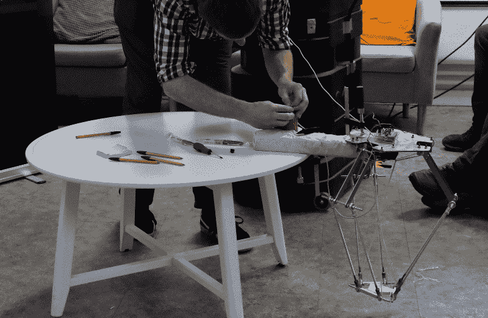
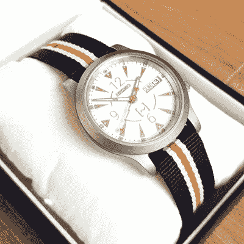
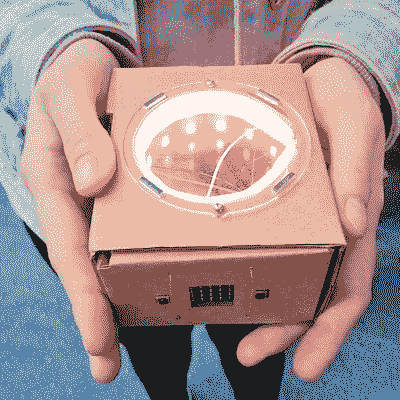
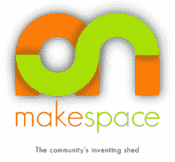

# 剑桥迷你 Uncon:机器人、灯箱、PCB 手表、复古电脑

> 原文：<https://hackaday.com/2019/04/05/cambridge-mini-uncon-robots-light-boxes-pcb-watches-and-retro-computers/>

在 Hackaday，没有我们的社区，我们什么都不是。我们在会议、演出和野营中相遇，但我们最喜欢的聚会方式之一是无会议形式。在这个活动中，你可以站起来做八分钟的演讲，谈谈什么对你来说是重要的，以及你正在做什么。

感谢剑桥制造空间主办我们最近的一次小型会议。让我们来看看当天精彩的演讲和演示吧！

## 实际有效的现场演示！

我们做了介绍后，首先出场的是极客侯爵，他给我们带来了他的 [Alexa 技能的消息，该技能可以识别电阻颜色代码和逻辑 IC](http://marquisdegeek.com/code_alexa#makerbot)。您可能认为这是一项简单的任务，但请花点时间考虑一下，有多少种方法可以描述一个 100 千欧的电阻。他解释说，在采取勇敢的步骤尝试在观众面前进行现场演示之前，创建一个不只是完成简单任务的 Alexa 技能会有多大的语言问题。他的大胆得到了回报，技巧奏效了。

A successful delta robot demo from Xan O’Shea.

成功的演示成了时尚。Xan O'Shea 展示了一个他制作的 delta 机器人，它为大众提供了完美的表现。他的方法是使用现成的零件，用模型伺服系统和橡皮筋来帮助它恢复形状。控制来自 MATLAB 中开发的 Raspberry Pi 运行代码，为了便于携带，他在演示中使用 6V 手提电池供电。

史蒂夫·哈里森展示了 Makespace 自己的气候控制 3D 打印细丝容器。史蒂夫是 tinamous.com 物联网平台的幕后推手，他用粒子光子来监控湿度传感器，并控制装有灯丝的塑料箱中的风扇。黑客空间一直在努力保持他们的细丝处于最佳状态，似乎 Makespace 的人已经破解了这个难题。

Marcel Van Kervinck 是 Gigatron TTL RISC 计算机的创始人，这是我们过去在这里介绍过的，他带了一台 Gigatron 来告诉我们它的起源和一些功能。我们听到了所有关于它的哲学，尽可能在软件而不是硬件上做更多的事情，然后被迅速地对待它的工作，然后又是另一个完美的赛车游戏演示。房间里绝对没有现场演示给我们看！

## FR4 表盘、发光二极管盒和不可靠的传感器

You would never guess that this gold-and-white watch face and hands were pieces of ENIG-finished FR4!

斯潘塞·欧文向我们有趣地讲述了他的 RC2014 改装电脑背后的故事，以及他在第一个 PCB 订单上投资 16 美元，而这个订单当时只是一个个人项目，后来却变成了一笔生意和一大堆测试设备。接下来是一位化名为 Operaptor 的演讲者，他给我们做了一个精彩的演讲，讲述了 FR4 作为一种媒介的用途，而不仅仅是电路板。你可能记得他是我们在[我们的黑客酒店综述](https://hackaday.com/2019/03/15/mid-winter-hacker-camp-in-civilised-surroundings/)中向你展示的那个有用的 Otter 傻逼插件适配器背后的人，但他在这里向我们展示的项目是[一款精工机械腕表的新面孔](https://tilde.industries/watch-dial/)。不是每个人都会撬开一块 200 美元的手表，放进一张自制的脸，但他做到了，并取得了惊人的效果。

接下来是罗伯特·卡尔平斯基(Robert Karpinski)，讲述了他不断发展的 Sinclair C5 电动汽车的简要历史。这是一个在之前就已经在这些页面上出现的版本，他带我们经历了一个处理最初 Sinclair 版本的相当不充分的工程的悲惨故事。这就像驾驶 C5(大概是在剑桥 Z88 便携式电脑上打字的时候)一样，但它肯定不是一个为胆小的人准备的项目。

Micro:Bit light box via [@kitkat_marshall](https://twitter.com/kitkat_marshall/status/1066713839947980800)

凯蒂·马歇尔(Katy Marshall)是 Makespace 的成员，也是全职的数码制作人，在过去几年里，她的部分工作是与西诺福克的小学生一起工作，并在一个微型比特供电的灯箱项目(T1)的帮助下获得编码。这对年轻人来说是一件非常酷的事情，一排排可寻址的 led 安装在一个小纸板盒的圆形井中，它们可以编码各种令人印象深刻的照明效果。她的演讲详细介绍了制造 300 个这种设备的过程，这听起来可能很简单，但事实证明，即使利用 Makespace 令人印象深刻的设施，这也是一个重大的物流和制造挑战。

有时候，来自海外的廉价元件看起来好得令人难以置信，阿伦·莫里斯带来的距离传感器无疑就是这种情况。他有超声波和激光设备，在一次有趣的演示中，他向我们展示了在相同的距离上选择不同的读数时，这些设备是多么的无用。他的结论是，这些廉价设备几乎肯定是已经进入灰色市场的制造品，但如果有一点可以借鉴的话，那就是我们不能总是相信我们买的东西。

在我们继续赶路之前，我们以比萨饼和对所有技术事物的冗长讨论结束了这一天。剑桥精致而古老的酒吧吸引着我，因为这是一个下雨的晚上，所以利用他们的好客是有意义的。

Cambridge Makespace’s logo

在我们离开你之前，有必要分享一下我们的位置。剑桥是英国一所古老大学的所在地，在过去的一个世纪里，它已经成为科技创新的领导者，类似于美国的硅谷。你可能最熟悉的出口产品是 ARM 处理器，它位于你拥有的大多数电子产品中，但这只是它周围塑造我们世界的众多技术之一。正如你可能想象的那样，一个在科技领域有如此辉煌记录的城市一定有一个令人敬畏的黑客空间，在这方面，我们的东道主剑桥创客空间肯定不会让你失望。

尽管我是我的两个本地空间的成员，它们都做了自己很酷的东西，但我访问的大多数黑客空间都让我羡慕，但 Makespace 将它带到了一个新的水平。除了举行会议的教室之外，他们还有两个大型车间，里面有机床和常用的电子设备、激光切割机和 3D 打印机，作为一名文字学家，我很高兴看到他们还有一个设备齐全的纺织区。我不住在剑桥，所以我不是会员，但你可以肯定，如果我住在剑桥，我会是会员。

我们在剑桥的小型会议取得了巨大的成功。我们肯定会以同样的方式看待未来的事件，所以请关注 Hackaday！