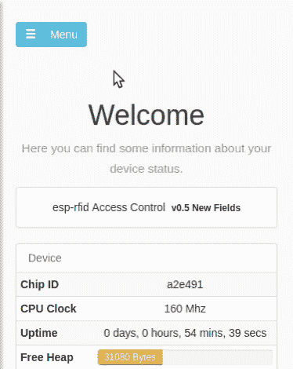

# 一种鲁棒的 ESP8266 RFID 门禁系统

> 原文：<https://hackaday.com/2019/04/15/a-robust-esp8266-rfid-access-control-system/>

到目前为止，我们已经看到很多项目使用 ESP8266 作为一种基本的访问控制形式:点击智能手机上的一个按钮，你公寓的门就会解锁。凭借 ESP 的强大功能和灵活性，只需增加最少的硬件，就能轻松完成这个项目。但是如果你想变得更严肃一点，并且需要支持许多用户呢？

 与其重新发明轮子，你可能想[去看看令人印象深刻的 ESP-RFID 项目](https://github.com/esprfid/esp-rfid)。它仍然基于我们都知道和喜欢的 ESP8266，但它将支持 WiFi 的微型微控制器与一个漂亮的定制 PCB 和一些非常光滑的软件相结合，以创建一个非常专业的门禁系统，而不会打破银行。顾名思义，该系统面向 RFID 认证，支持 MFRC522、PN532 RFID 或 RDM6300 等阅读器。添加一堆 Mifare Classic 1KB 卡，您的黑客空间就可以获得新的门禁系统了。

ESP-RFID 的官方硬件[可以通过 Tindie](https://www.tindie.com/products/nardev/esp-rfid-relay-board-12v-for-esp8266-board/) 购买，安装或不安装 ESP-12F 模块，但由于它是一个完全开源的项目，如果你愿意，你也可以自由构建自己的版本。无论哪种情况，该板都允许您轻松地将 ESP 连接到您选择的 RFID 阅读器、门传感器，当然还有门锁本身。

在软件方面，ESP-RFID 应该能够处理大约 1000 个不同的用户和他们的 RFID 卡，然后 ESP 相对有限的 RAM 和存储才能跟上它。但是如果你的黑客空间里有那么多人进进出出，也许是时候开始更新你的系统了。顺便说一句，该项目没有保证 ESP-RFID 代码的安全性，并表示该系统不应用于安全场所。也就是说，您可以在没有互联网连接的情况下运行 ESP-RFID 来减少您的攻击面，代价是失去 NTP 时间同步。

如果你没有管理几百个用户和他们的 RFID 卡，[一个更简单的 ESP8266 门锁可能更适合你](https://hackaday.com/2019/03/25/wifi-your-door-lock-with-an-esp/)。我们已经看到[也用粒子光子](https://hackaday.com/2016/05/26/keyless-apartment-entry-with-relatively-little-effort/)完成了类似的把戏，以防[你有一个在零件箱](https://hackaday.com/2018/09/07/photon-door-lock-swaps-keys-for-a-post-request/)周围嘎嘎作响的粒子光子。