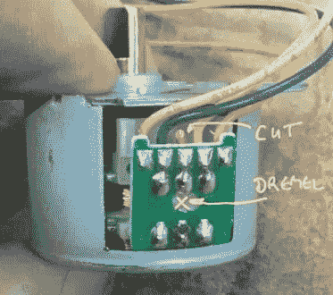

# Arduino 小心翼翼地驱动十七个步进电机

> 原文：<https://hackaday.com/2019/04/09/arduino-drives-seventeen-stepper-motors-carefully/>

公平地说，现在制造电子产品比过去任何时候都要容易。有了低成本的模块化组件，在你的想法和功能原型之间通常只有几十行代码和几根跳线。驱动步进电机是一个完美的例子:你可以抓住一个便宜的控制器板，将其连接到一个微控制器上，其余的基本上只是软件。但是最近 [[mechatronicsguy]甚至怀疑*是否比技术上完成任务所需的硬件还要多*](https://tinkerings.org/2019/04/06/unwisely-driving-17-stepper-motors-from-a-bare-arduino/)*。*

 * 当然，这并不是说他故意想把事情弄得更复杂。他的理由完全是经济上的；如果你想驱动十几个或者更多的步进电机，即使是“便宜”的控制器也会增加成本。因此，他开始考虑是否可以完全跳过控制器，将步进电机直接连接到 Arduino 的数字引脚上。总的来说，这是一个坏主意，但是如果你小心并且愿意冒这个险，[机电一体化]就是一个活生生的例子，证明这是可能的

那么，直接从 Arduino Mega 的数字引脚运行 17 个独立的步进电机有什么诀窍呢？好吧，首先你不会像在 3D 打印机里那样运行健壮的 NEMA 17 发动机。[mechatronicsguy]正在使用小型的(非常便宜的)28BYJ-48，这是一种用于许多消费产品的轻型步进器。即使是这种相对较小的电机，您也需要打开外壳，在 PCB 上切割一条走线，将其从单极切换到双极。

除此之外，你需要小心。[mechatronicsguy]报告说他已经成功地同时运行了十个，但是实际上同时运行的越少越好。由于 28BYJ-48 电机的相对较差的规格，这实际上变得更容易；它巨大的 11 度步长意味着它不会像 NEMA 17 断电时那样容易打滑。这意味着你可以切断所有的电源，除了主动运动的马达，并相当确定它们都将停留在你离开它们的地方。

尽管 28BYJ-48 步进机很受欢迎，但这种“快速而肮脏”的接口方法可能适用于几个项目。这个小小的“谷仓门”星际追踪器就是一个明显的例子，但是我们也[看到了一些非常好的机械臂](https://hackaday.com/2016/05/02/simple-robot-arm-with-steppers-has-pleasingly-smooth-motion/)用这些低成本的马达建造的[可以从这项技术中受益。](https://hackaday.com/2018/01/22/stepper-motor-robot-arm-has-smooth-moves/)*