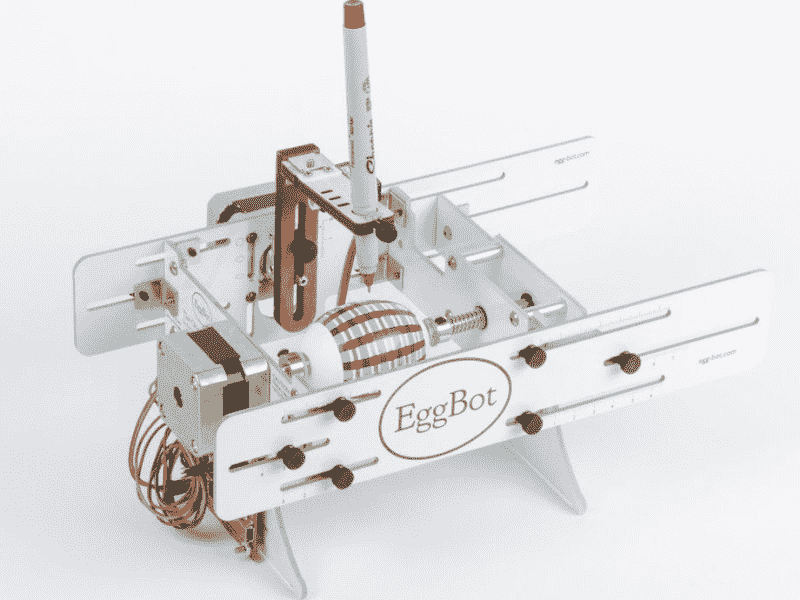
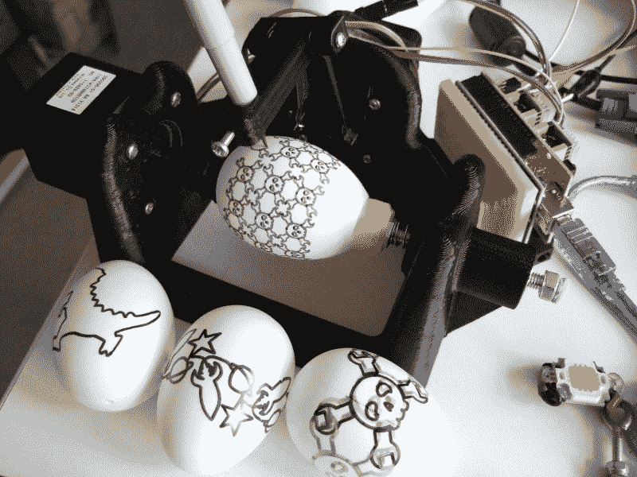
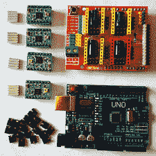
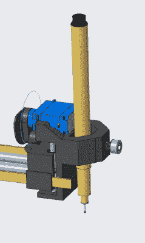
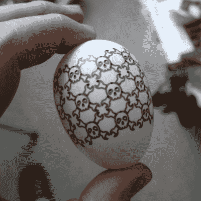
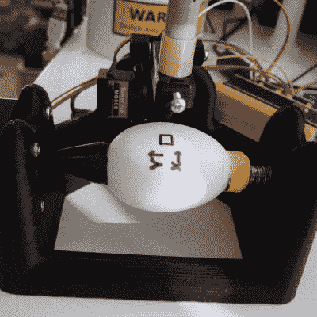
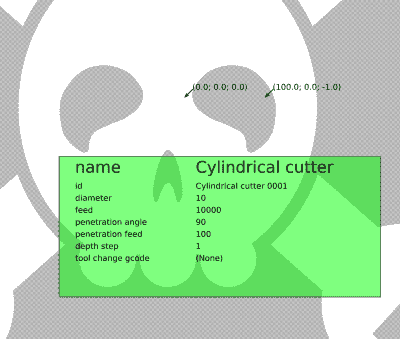

# 你能从蛋机器人身上学到什么？

> 原文：<https://hackaday.com/2019/04/17/what-can-you-learn-from-an-eggbot/>

eggbot 可能是你可能希望的最简单的 CNC 机器入门，至少在物理构造方面。但与此同时，eggbot 可以让你接触所有的概念、固件和工具链，这些都是你将 CNC 游戏提升到下一个水平所需要的，无论那将是什么。因此，如果你一直想制造任何一种步进电机移动、切割、跟踪、显示或只是旋转的机器，你可以用蛋机器人得到便宜的介绍。

我们提到复活节了吗？显然是这个周末。对于拖延者来说，季节性项目是最糟糕的。如果你等到 31 号才开始做你的超级牛逼的新年投掷激光球-o-tron 3000，它不会在午夜前完成。我听说是这样。而且我们在这个季节这么晚才发布这个教程，肯定是于事无补的。很抱歉。另一方面，如果你现在开始，你将在 2020 年拥有世界上最精细的蛋机器人。拖到明天！

这个项目我有两个主要目标:快速完成和轻松完成。这是我完成任务的最好机会。次要目标包括做出令人敬畏的设计，学习一些新的软件工具链，以及以低廉的成本完成所有的事情。我在所有方面都取得了成功，这就是为什么我在这里鼓励你为自己建立一个。

## 什么是蛋机器人？

蛋机器人第一次进入我的意识是通过[邪恶疯狂科学家的蛋机器人工具包](https://shop.evilmadscientist.com/productsmenu/766)。这是我们见过的最精致的，如果你正在制作自己的机器，值得看看 EMSL 在他们的设计中包括可调性的地方。但正如承诺的那样，即使是这样一个花哨的东西也没有太多的硬件方面的事情。你的裸机版本只需要两个步进电机，一个微型伺服电机来提升笔，也许一个滑板轴承和一些螺纹杆来使它可调和平滑。当然，你需要电子元件来驱动它。

从概念上讲，一个步进器绕着蛋的对称轴旋转蛋，另一个步进器旋转笔的轴，这样笔就可以从北到南移动，伺服机构在两次敲击之间提起笔。

对于发动机，我使用了我手头上的东西，你可能也可以。我从一家德国当地供应商那里买了一大把打折的 NEMA 17 步进器，虽然它们很便宜，但对于一个扭矩为 0.34 牛米的鸡蛋机器人来说，它们可能超出了规格。我见过[使用便宜得离谱的 28-BYJ48 型齿轮马达](https://www.thingiverse.com/thing:1461709)的机器，所以即使是那些也可以工作。步骤的数量是关键，越多越好，所以你可能不想使用你找到的任何旧的煎饼步进器，因为担心你会得到一个低步骤的变种。对于笔来说，伺服是伺服，但你想要一个小的。

我最终得到的特殊框架是这个 3D 模型的变体，但是[被重新设计成不需要支架就可以打印](https://www.thingiverse.com/thing:2291884)。它可能没有原来的灵活，但在 3D 打印机上扔别人的设计绝对是一种低麻烦的方式:下载，切片，打印，然后在十个小时内回来。如果你有很多螺纹杆，想要额外的灵活性，我会考虑[这种久经考验的框架](https://www.thingiverse.com/thing:20398)或它的衍生物之一。

但是，即使你没有 3D 打印机，鸡蛋机器人对房屋建筑商的要求也很低。所有马达都是直接驱动的，所以不用担心传动装置。鸡蛋很轻，不需要为扭矩流汗。钢笔工具几乎没有侧向负载，因此您不必特别担心框架的刚性。看看【Zaggo】的用 MDF 边角料做的 [SphereBot](https://www.thingiverse.com/thing:7656) ，或者【derwassi】的用薄胶合板做的[数控 Eggbot](https://www.instructables.com/id/CNC-Eggbot/) 来获得灵感。

 电子设备包括两个步进电机驱动器和一个微控制器来运行表演。我在网上寻找 Pololu 风格的 A4988 步进驱动器，因为很久以前我在建造 3D 打印机时用过它们。我记得它们每个大约要 10 美元，所以我在看 20 美元和一些 DIY 作品。反而找到了一个*完整套件*带“Arduino”，盾，四个(4！)步进驱动器，甚至还有为€15 附送的 USB 线。搜索“arduino grbl cnc shield”，不收$200，不通过 Go，直接前往结账。也许买两个吧，因为它们非常便宜，而且花在电子方面的开发时间是无与伦比的。如果没有“Arduino ”,你可以为€7 买一个，并使用你身边的任何微开发板，但你必须自己布线。

我挥霍了。毕竟，最大限度地减少我在项目上花费的时间和精力是首要的指示。除了焊接兼容头到我的伺服电机，一切都是即插即用。如果你没有买过奇怪的伺服系统，你甚至不需要加热熨斗。然而，不幸的是，挥霍意味着等待，我坐了一周半，书架上放着一个打印组装好的 eggbot，等待电子产品，诅咒我的懒惰。人类在这个项目上花费的总时间不到两个小时，其中大部分时间是在网上浏览 3D 打印的框架，并重新设计一些 3D 打印的部件，以便在我古怪的伺服系统周围工作。所以我想等待是值得的。

## 商品:坚硬和柔软

"剩下的就是简单的软件问题了."虽然采购所有部件和构建机器人花了两个小时，但我至少花了那么长时间来寻找驱动这个东西的软件和固件的正确组合。学习使用工具链花了四五年的时间。我会尽可能地给你省点学习时间。

计划是用简单的 g 代码进行 eggbot 交易，因为它是数控机器的通用语。这就是我们与邪恶的疯狂科学家分道扬镳的地方，因为他们使用了~~专有的~~定制协议用于 EiBotBoard，即使它*是*开放的，有据可查的，坦率地说是经过深思熟虑的。如果你只想马上吃鸡蛋，那是个好办法。但是如果你想把你在这里学到的东西应用到任何其他的数控机器上，从 DIY 3D 打印机到最先进的多轴工业铣床，你将会想要处理 g 代码。我需要一个 ATmega328 G 代码解释器。

 因为我买的非常便宜的电机驱动板是设计来运行 [GRBL](https://github.com/grbl/grbl) 的，这是一个容易的选择。作为奖励，我所有的 3D 打印机都使用马林[和](http://marlinfw.org/docs/basics/introduction.html)，所以我开始学习新的东西。唯一的问题是，GRBL 想独家驱动步进电机，我们有一个伺服混合。实际上已经有很多黑客攻击 GRBL 来[启用 CNC 主轴速度命令来控制伺服位置](https://github.com/DWiskow/grbl1-1g-Servo)，如果我需要精确的位置控制，这将是有用的，但对于 eggbot，简单的上下控制就足够了，从概念上来说，将它与 Z 轴高度联系起来会更好。[黑客好友](https://hackaday.com/2018/09/16/drawbot-badge-represents-the-cnc-world-in-badge-design/)、[buildlog.net 创始人](http://buildlog.net/)以及所有围绕[好家伙的事情 CNC](https://www.youtube.com/watch?v=YmVLV-ozmmM)【Bart Dring】已经[就这么一个固件已经一起黑了](https://github.com/bdring/Grbl_Pen_Servo)。

要自己构建 Bart 的固件，您可以下载最新的 GRBL，然后下载 Bart 的修改并将其复制到原始文件中。或者只是下载[这个库](https://github.com/hexagon5un/elliot-s_eggbot)，我已经为你做了。你*将*想要改变`spindle_control.c`中的`PEN_SERVO_DOWN`和`PEN_SERVO_UP`线，以调整伺服系统为提笔和下笔命令移动的距离。在 0-255 的范围内，127 是一半。完成此设置后，您只需一个`make flash`就可以安装了。Arduino 乡亲们，也可以在 Arduino IDE 中编译。

随着机器上的固件，是时候玩了。插入计算机后，eggbot 显示为一个串行端口(8N1，115200 波特)，你可以打开任何终端并在其上键入 g 代码。当它准备好一个新的命令时，它会回显“ok ”,并且它似乎会在“Arduino”上排列一些命令。您将需要在一两分钟内调整固件配置，所以您最好习惯与机器对话。`G0 X 3.14 Y 0.50 Z 5`将同步移动所有轴，提起笔。

 最后一步是将任意图稿转换成 g 代码。也许最简单的方法是使用 [Inkscape](https://inkscape.org/) ，它捆绑了一个“Gcodetools”扩展，可以做你想做的事情。这是我现在用来做事情的。

但是如果你以后想玩更好的数控机床，你可能想研究一下像 [PyCAM](http://pycam.sourceforge.net/) 或 [dxf2gcode](https://sourceforge.net/projects/dxf2gcode/) 这样的东西。我喜欢前者，但对于这种简单的东西来说，它太过了。虽然我们自己的(乔希·瓦斯奎兹)非常肯定，但我无法让它运行起来。关于 GUI 库版本的一些事情。呸。

坦白地说，工具链中的最后一步是我最薄弱的地方，所以如果你有任何好的 CAM 解决方案是针对简单雕刻的，请在评论中告诉我。理想情况下，我想要一些可脚本化的东西，我可以只传递一个 SVG 文件和一个缩放，以便图形到绘图是一行。

您可能还需要一个简单的脚本来向 eggbot 发送 g 代码。这里是[我一直用的那个](https://gist.github.com/hexagon5un/b2fc76c7168994153ab1f36340b39bbd)。注意，控制 eggbot 就像在串行端口上写一行代码，然后等待“ok”信号返回来发送下一行代码一样简单。

## 调整，优化，以及尸体埋在哪里

你完了！至少理论上是这样。与项目的所有子部分一起工作很有趣，尽管我已经通过 DIY 3D 打印机获得了大量 CNC 式的经验，但我还是学到了很多。这里是“其他一切”。

[机器配置和 GRBL 校准](https://github.com/gnea/grbl/wiki/Grbl-v1.1-Configuration)大概是第一步。GRBL 的设置(`$100-$130`)定义了机器在现实世界中每毫米要走多少步。印在鸡蛋上充其量是奇怪的。当你从北向南移动时，鸡蛋周围的半径会改变，所以当你从鸡蛋的顶部移动到底部时，“每毫米的 x 步数”也会改变。*是*常数，每次旋转 200 步，16 微步，每次旋转 3200 步。这里的一个简单选择是将“x-steps/mm”设置为 1，这样一个鸡蛋正好是 3200 步宽，这对于处理图形来说很容易—只需将图像宽度设置为 3200 像素或毫米。

y 轴是另一个故事。鸡蛋不是完美的球体，所以靠近顶部的角形台阶与中间或底部的略有不同。我打印出一堆方块，调整“y 步/毫米”,直到它正好在赤道附近。顶部和底部都被夹住了，但这就是生活。制图师花了几个世纪的努力也没有解决这个问题，反正地球也没有鸡生出来的东西那么蛋形。最后我得到了 0.7 y 步/毫米。

与默认值相比，我刚刚将台阶降低了大约 1000 倍。我需要相应地提高最大速度和加速度参数，以使马达能够移动。这是我的配置。20000 步/分钟大概是 6.25 转。你想推多快取决于你的蛋托有多紧，你的笔有多软。

现在你可以算出鸡蛋在 y 轴上的总行程。我的大约是 1000 像素。邪恶的疯狂科学家标准彩蛋看起来是 3,200 x 800 像素。现在你知道在艺术品中寻找什么了。

说到蛋托…我的踏步机没有正常的 6 毫米扁平轴，所以我不得不自己设计蛋杯。拿鸡蛋的标准方法是使用一点弹簧张力和儿童玩具的吸盘。这是*而不是*可选的——如果鸡蛋没有被粘性的东西固定住，当你改变方向时，鸡蛋会滑落。我不能把我儿子的玩具拆开，所以我用强力胶粘了一些旧的自行车内胎，橡胶表面似乎抓得很紧。

让机器正确对准很重要。鸡蛋需要放在杯子里，这样它才能真正旋转。用手旋转轴几次，直到它不再摆动。因为蛋不是球体，所以您会希望将 y 轴的中心降低到蛋的中心以下，以便它描绘出相对于蛋的弦而不是圆，以便最小化从赤道到蛋的顶部或底部的落笔差异。在这里获得最佳的钢笔高度也是一个反复试验的问题(但见上面的橙色 Sharpie 衣领),因为是将鸡蛋南北居中。我们冰箱里的一个样本表明，你可能想为形状特别奇怪的鸡蛋调整设置。我知道我再也不会以同样的方式看待一打了！

 最后，如果你要走 Inkscape 路线，有几件关于`Gcodetools`的事情是很难找到的，即使你遵循在线教程。第一，你(显然？)想从“路径”入手。如果你有一个图像，使用“路径…跟踪位图”来获得路径。如果您键入了字母或任何其他本机 Inkscape 对象，“路径…对象到路径”。从这里开始，使用`Gcodetools`是一个三步操作:

1.  选择“扩展…gcode tools…方向点”,点击应用并关闭。这将通过在图片上叠加两个箭头来设置 g 代码原点和输出比例。你可以移动这些来定位图像。我喜欢把(0，0)原点放在图像的中心。请注意，默认宽度是 1 毫米/像素。我为 GRBL 选择这些值不是巧合。
2.  选择“扩展…gcode Tools…工具库”，选择圆柱体，点击应用并关闭。这将在图形中添加一个绿框，用于控制机器速度的某些方面。我们在这里假装雕刻，笔尖足够接近 10 像素或步长的圆柱体，所以那些默认值是可以的。不过，你*会*想要改变进给速度。这是它的绘制速度。10，000 步/分钟是对的，但这取决于你的笔和你的蛋。默认的 400 非常慢。使用文本工具(F8)编辑该值。
3.  现在你已经准备好“扩展…Gcode tools…Gcode 路径”了。在首选项选项卡中，确保“Z 安全高度”有一个正值:1.0 足够了。还要注意它将文件输出到哪里。然后点击返回“Gcode 路径”选项卡(强制！违反直觉！)并单击应用。

## 建立今天，拖延明天！

eggbot 是对 CNC 世界的一个很好的介绍。比纯粹的“你好世界”更难，但也更有意义。你能行的。

制造这台机器可能花了我€25 年的时间，其中只有€15 易贝的订单不在我库存充足的壁橱里，而且只花了几个小时的人工时间加上十个小时的打印时间和两个星期(！)的等待。我花了*更长的时间*来选择合适的固件和寻找合适的软件工具链。但是大部分时间是*在学习*，这对其他项目有用的时候，从来不会浪费时间。见鬼，这是重点的一部分！最后，Eggbot 项目的苦工/学习比率非常低，当然是以我的家人对有趣鸡蛋的欣赏程度来衡量。

然而，随着 2019 年复活节即将到来，蛋机器人的日子屈指可数了。我对软件方面的东西仍然不是 100%满意，但我可以下载图像，将它们转换成路径和 g 代码，并在几分钟内让它们在鸡蛋上运行，所以足够好了。我会接受你在评论中得到的任何帮助。我也可能会把伺服换成第三个小型步进器，顺便提一下，不需要 GRBL 的一个分支。没什么大不了的，真的，但是我讨厌笔尖落在鸡蛋上的样子。可控着陆会更优雅。

当复活节结束时，蛋机器人将完成它作为一个普通的 2.5 自由度机器的真正使命。一旦我打印完鸡蛋，我就拧开马达和电子设备，把相框藏在壁橱里，直到明年。然后，我将不得不建立另一个有趣的数控机器。我对固件、工具链和硬件都很满意。剩下的就是创意了。

那么下一步是什么？也许是一个[墙壁绘图仪机器人](https://hackaday.com/2018/10/08/another-drawbot-uses-a-pi-and-web-sockets/)？我喜欢让这东西无线化的想法，所以我要去看看巴特德林的 [ESP32 GRBL 端口](https://github.com/bdring/Grbl_Esp32)。或者，我可能会玩 STM32 GRBL 端口，只是为了好玩。这些机器真正缺乏的是一个酷的、交互式的、实时的控制器。也许我需要一个墙壁绘图仪的草图接口。也许用平衡板和加速度计。你会建造什么？

如果你认为今年的复活节太晚了，你可能是对的。但是蛋机器人本身就很棒，而且它是进入普通数控混乱的最快的第一步。而且那总是当季的！