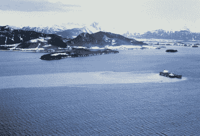
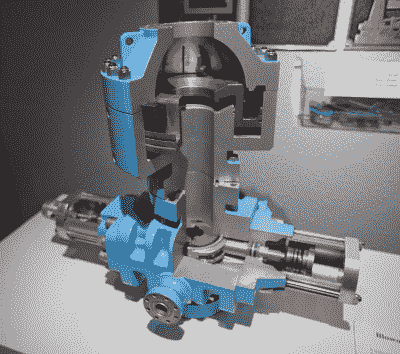
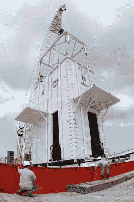

# 阻止石油泄漏的令人费解的事情

> 原文：<https://hackaday.com/2019/11/05/the-murky-business-of-stopping-oil-spills/>

在 2010 年 4 月“深水地平线”爆炸的六年前，飓风“伊万”的力量将一个海上钻井平台从支架上吹落，坠入墨西哥湾。在过去的 14 年里，长期埋在泥浆和碎片中的油井管道每天都在向墨西哥湾泄漏石油。这是历史上持续时间最长的漏油事件。十四年来的每一天。让那件事过去一段时间。

泰勒能源公司的平台距离海岸仅 10 英里，比深水地平线更靠近路易斯安那海岸。自飓风袭击以来，泰勒尝试了许多不成功的方法来阻止泄漏。到目前为止，他们只能堵住 25 条破裂管道中的 9 条。其余的被深埋在泥土和瓦砾中。你以前怎么没听说过这个？泰勒花了六年时间掩盖真相。如果不是讨厌的监督组织在深水地平线爆炸后对墨西哥湾进行调查，他们也可能逃脱了惩罚。

那么，如何阻止石油泄漏呢？答案取决于很多事情。最直接的问题是，答案取决于泄漏是发生在陆上还是海上，以及引发泄漏的事件。由于海洋的重量和存在，水下石油泄漏更难阻止。在泰勒能源公司的案例中，泥泞的海湾床已经成为破裂和掩埋管道的黑暗坟墓，这使得它更加混乱。

Oil plume from the wreck of the Exxon Valdez. Image via [The Atlantic](https://www.theatlantic.com/photo/2014/03/remembering-the-exxon-valdez-oil-spill/100703/)

## 漏油的方式不止一种

石油泄漏有很多原因，从纯粹的事故到战争行为，不一而足。1989 年，埃克森·瓦尔迪兹号油轮因雷达损坏和船长缺席而搁浅。管道破裂，地下储存罐泄漏。偶尔，油轮会在海里相撞。

迄今为止最大的漏油事件是海湾战争期间伊拉克士兵故意造成的，他们试图阻止美国海军陆战队登陆海滩，但没有成功。英国石油公司的深水地平线钻井平台爆炸的原因很多，[包括天然气的激增](https://www.britannica.com/event/Deepwater-Horizon-oil-spill)。

泰勒能源平台被飓风掀翻。似乎是天意，对吧？是的，但事情远不止如此。首先，平台的墙壁被埋在几百英尺深的泥里。如果你认为这听起来是个坏主意，那你就对了。同样的风险使得在那里建造平台变得不明智，也使得处理漏油变得不安全和困难。

路易斯安那州立大学法学教授埃德·理查兹认为，这种风险是众所周知的。然而，许多钻井平台分布在路易斯安那州的沿海地区。当飓风伊万肆虐墨西哥湾时，海浪的力量将钻井平台的基础变成了水下泥石流。

Cutaway view of a blowout preventer. Image via Ed Schipul [[CC BY-SA 2.0](https://creativecommons.org/licenses/by-sa/2.0)], [via Wikimedia Commons](https://commons.wikimedia.org/wiki/File:Blowout_Preventer_(BOP)_Cut_Away.jpg)

## 如何止血

油气井配备了[防喷器](https://archive.nytimes.com/www.nytimes.com/interactive/2010/06/21/us/20100621-bop.html)作为第一道防线。这些阀门由特殊类型的阀门组成，可以通过切断管道来压井。防喷器本应该拯救深水地平线。爆炸时，几名船员试图启动防喷器，但防喷器未能自动启动。

The four-story containment dome that failed to stop the BP oil spill. Image via [gcaptain](https://gcaptain.com/bps-containment-dome/)

英国石油公司的工程师试图使用水下机器人来触发防喷器，但一个关键的阀门被卡住了，无法工作。然后他们试图降低一个四层楼高的钢制圆顶来覆盖整个建筑。这个想法是捕获滚滚的石油，然后用真空吸尘器将它们吸走。但是石油的烟雾引起了结晶，这产生了保持圆顶漂浮的气体。他们还尝试钻减压井，最终目的是将泥浆和水泥注入泄漏的油井将其封堵。

深水地平线是一个热门话题，所以工程师们尝试了除核武器之外的一切。是啊，那是一件事。俄罗斯人已经成功地做到了至少三次，尽管所有的泄漏都是在岸上发生的。[基本上，你钻一个倾斜的邻井，然后在里面扔一枚核弹](https://www.military.com/video/nuclear-bombs/nuclear-weapons/soviet-nuke-plugs-leaking-gas-well/664169062001)。冲击波移动并融化了周围的岩石，压扁了管道并封闭了油井。

任何给定的堵漏方法的可行性取决于具体情况。像泰勒能源公司和深水地平线这样的水下漏油比陆上漏油更难监测和修复。如果你想深入而舒适地潜水，深入到长达数月的阻止深水地平线漏油的巨大努力中，那么看看《纽约时报》的这篇精彩报道吧。

Many were displeased by the junk shot idea. Image via [Los Angeles Times](https://www.latimes.com/nation/la-na-oil-rig-20100423-pictures-photogallery.html)

## 垃圾射击和三观射击

一些阻止泄漏的技术有着五颜六色的名字。大多数都不环保，但是当你处理以惊人的速度涌入海洋的石油时，你会尝试几乎所有的方法。工程师们尝试了所有这些以及更多的方法来阻止英国石油公司的泄漏。

垃圾射击包括向防喷器中发射垃圾，即高尔夫球、网球、碎轮胎和旧的打结的绳子。这个想法是暂时堵塞它，然后开始喷射泥浆和水泥来永久阻止它。这听起来像是浪费和再利用的奇怪组合，但它有效阻止了 1991 年科威特的石油泄漏。

介于四层钢盒子的想法和垃圾射击操作之间，那些与深水地平线打交道的人尝试了一种叫做“灭顶法”的东西。这包括通过防喷器将重泥浆泵入油井，以克服上升的石油压力。

他们后来尝试了静态压井，这基本上就是以较慢的泥浆速度进行顶部压井。由于泥浆更重，它将迫使石油返回到油藏中。然后就该开始泵水泥封堵了。

最后，我们来到底部杀死。这一个应该有一个不同的名字，因为它远比其他杀死更优雅。虽然事情变得有点棘手，但最终阻止深水地平线的是海底压井。首先，工程师将磁力计放入减压井。这在油井的钢套管中感应出电流，并产生磁场，这有助于工程师精确定位泄漏油井的准确位置。然后，他们钻入泄漏油井的外壳，通过减压井向下泵入泥浆和水泥来堵塞泄漏。

## 处理青少年石油泄漏事件

没有两起漏油事件是相同的，即使是深水地平线和泰勒能源公司也不例外。深水地平线很快泄漏了大量的石油，石油在表面上非常明显。泰勒泄漏的原油在海面上相当于每天不到一加仑，但是在海面下估计每天有 100 桶。

2008 年，泰勒设立了一个 6.66 亿美元的信托基金来处理漏油事件，并在不久后被两家韩国公司收购。[从那时起，泰勒能源公司的存在只是为了监控事件响应](https://mc20response.com)。海岸警卫队进行的研究确定，剩余的 16 条管道几乎不会造成环境风险，因此泰勒起诉政府，要求收回他们的余款。自然，政府做了一项新的研究，他们确定泰勒少报了泄漏。根据对石油储量的估计，他们认为如果没有人能够阻止泄漏，泄漏可能会持续 100 多年。

几个月前，海岸警卫队决定尝试泰勒泄漏事件的控制圆顶解决方案。泰勒能源公司已经破产，只有一名员工，该公司认为这将使问题变得更糟，因此他们决定起诉海岸警卫队。

无论泰勒漏油事件能否被阻止，所有的石油污染海洋的问题仍然存在。不过，有一个希望，那就是食油细菌。处理泄漏的一种方法是向水中释放分散剂。这些物质分解油滴，这样它们就可以被以碳氢化合物为食的某些种类的细菌消耗掉。这可能不是最巧妙的解决方案，但这是一个开始。