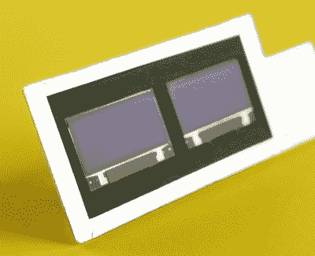

# 老式相机闪光灯转向有机发光二极管座钟

> 原文：<https://hackaday.com/2019/04/19/vintage-camera-flash-turned-oled-desk-clock/>

至此，在介绍了他的一些构建之后，我们认为非常清楚的是，[Igor afanasev]有着敏锐的眼光，能将陈旧硬件的随机碎片变成功能和华丽并重的东西。他保留了原作的各个方面，赋予了它那种不会被误解的复古外观，同时非常巧妙的融合了现代元素和特色。他的作品非常接近成为某种新的艺术形式，但我们当然不会抱怨。

 他的最新作品[采用了一个老派的“Monopak”电子闪光模块，并将它变成了一个座钟](https://imgur.com/a/mQLIaO0)，不知何故*也*设法看起来像一台老式电视机。有机发光二极管显示器发光背后的原始闪光扩散创造了一个可怕的视觉效果，真正出售整个外观；好像显示器是某种迄今未被发现的谢妮变种。

在技术方面，这个特别的版本真的没什么特别的。利用 3D 打印支架中两个极其常见的 SSD1306 有机发光二极管显示器以及一个 Arduino 来驱动它们，电子设备非常简单。边上有一个旋转编码器来设置时间，尽管如果能在混音中添加一个 RTC 模块来提高精确度会更好。或者甚至切换到 ESP8266，这样时钟就可以从互联网上进行自我更新。但在这个版本中，我们得到的印象是[伊戈尔]更感兴趣的是玩弄最终作品的美学，而不是摆弄内部，当它看起来如此酷时，很难反驳。

注意到闪光灯有一种经典电视机的感觉，[Igor]花时间 3D 打印了一些细节，真正完善了外观。底部的支脚不仅能以舒适的视角支撑时钟，还能完美呼应五六十年代消费电子产品的复古未来主义外观。他甚至不辞辛苦地打印了一个小天线，以适应热靴的顶部，并配有一个从钥匙链上回收的金属环。

去年年底，我们对[Igor]投入[的努力印象深刻，他用一件合法的 1970 年实验室设备](https://hackaday.com/2018/12/05/1970s-lab-equipment-turned-retro-pi-terminal/)创造了一个复古的树莓 Pi 终端，最近他对这个不起眼的卡带播放器的[现代演绎引起了很多争论](https://hackaday.com/2019/04/02/the-only-cassette-player-worth-owning-in-2019/)。我们迫不及待地想看看他接下来会想出什么。

 [https://www.youtube.com/embed/KK6MtMq5hHo?version=3&rel=1&showsearch=0&showinfo=1&iv_load_policy=1&fs=1&hl=en-US&autohide=2&wmode=transparent](https://www.youtube.com/embed/KK6MtMq5hHo?version=3&rel=1&showsearch=0&showinfo=1&iv_load_policy=1&fs=1&hl=en-US&autohide=2&wmode=transparent)

