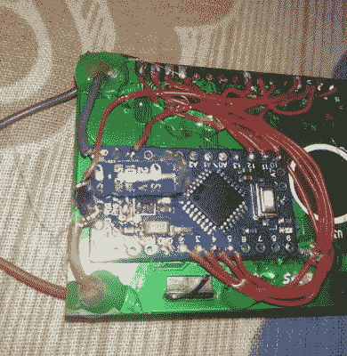

# 用电压调制驱动 16×2 液晶显示器

> 原文：<https://hackaday.com/2019/04/27/driving-a-16x2-lcd-with-voltage-modulation/>

基本的 16×2 LCD 是一个非常受欢迎的组件，我们已经看到它被用在更多的项目中。部分原因是因为现代微控制器使得它很容易使用；如果你有一个 I2C 版本的显示器，只需要四根线来驱动它。这使得在这些液晶显示器上打印一行文字比在初级电子项目的层次上闪烁数字引脚上的 LED 高出一两步。

 那是什么？四根线也太多了吧？在这种情况下，你可能会对来自[Vinod]的这个黑客感兴趣，其中的[展示了如何在同一对电线](http://blog.vinu.co.in/2019/04/16-x-2-lcd-controlled-via-power-line.html)上用数据*和*电源驱动经典的 16×2。你仍然需要一个用于 LCD 的微控制器“背包”来解释调制电压，但如果你有一个简单的远程显示应用，这绝对值得一试。

基本思想是快速“闪烁”5 V 线，以便 LCD 侧的电容器可以使电子设备在电压下降时浮动。只要微控制器的一个引脚在电容器之前连接到 5 V 线路*，当线路变低时，它将能够拾取。有了足够高的数据速率和足够大的电容作为缓冲，你就可以对要显示的数据进行编码了。*

对于传输端，[Vinod]在他的计算机上使用 Python 脚本，通过标准的 USB 到 UART 转换器将文本发送到 LCD。它被馈入一块 perfboard 上的小电路，触发 UART TX 线路的 MOSFET 关断。

我们几年前就已经讨论过这种技术背后的理论，但是看到有人把现实世界的例子放在一起总是很有趣的。在充斥着 I/O 的极其廉价的微控制器的[时代，这个技巧可能没有太多的实际用途，但它可能会在你的黑客空间里开个玩笑。](https://hackaday.com/2018/06/14/general-purpose-i-o-how-to-get-more/)

 [https://www.youtube.com/embed/SK7alDsmaMU?version=3&rel=1&showsearch=0&showinfo=1&iv_load_policy=1&fs=1&hl=en-US&autohide=2&wmode=transparent](https://www.youtube.com/embed/SK7alDsmaMU?version=3&rel=1&showsearch=0&showinfo=1&iv_load_policy=1&fs=1&hl=en-US&autohide=2&wmode=transparent)

