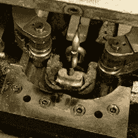

# 逆向工程:制造链条

> 原文：<https://hackaday.com/2019/05/27/retrotechtacular-making-chains/>

我们认为工程中的日常材料是理所当然的，是无处不在的组件，而不是本身就很复杂的物品。当然，我们知道集成电路代表了电子领域一百年发展的顶峰，但对我们来说它只是一个有一些电线的黑盒子。即使是更基本的材料，也很容易忘记制作过程中的工作，例如休息时间下面的两个视频。他们都从一个非常不同的角度看待同一个产品的创作:金属链。然而，由于这两个例子相隔了大约一个世纪，并且使用了非常不同的技术和材料，所以这两种方法的差别不能再大了。

第一部电影讲述了链和锚的制造过程，这种东西在二十世纪初的一艘船上被发现。其中一个文字框架提到了尼瑟顿的作品，让我们可以确定它是在 [N .辛利&父子](https://en.wikipedia.org/wiki/N._Hingley_%26_Sons_Ltd)拍摄的，这是一家专业的锚和链条制造商，位于被称为黑乡的英国城市伯明翰以西的地区。这是一个已经完全消失的制造业世界的窗口，因为大群人手工完成过程中的几乎每一项任务，几乎没有自动化步骤。在搬运巨大的炽热金属块时，很少考虑健康和安全，而且所涉及的材料不是我们今天所用的钢，而是熟铁。执行一些步骤所需的技能，如在蒸汽锤下锻焊大型锚固件，非常重要，单靠电影无法传达。更多关于中国工厂类似场景的视频做得更好。

另一个视频是当代的，一个*它是如何制造的*看看链条制造。这里所涉及的链条要小得多，一切都是由自动化机器完成的，一旦我们对工艺的复杂性惊叹不已，我们就可以看到对冶金的重视程度要高得多。在链条形成之前，金属丝被硬拉，然后通过一对感应加热器和水浴在连续的过程中被硬化和退火。我真的很努力地避免对大众市场娱乐的倾向发出轻微的咆哮，比如这种掩盖部分过程的行为。敏锐的眼睛会注意到每个环节都已焊接，但我们看不到执行任务的机器。

我们大多数人永远不会有机会一窥连锁工厂，所以 YouTube 工业电影和视频的媒介是强迫性观看。这两种关于本质上相同的过程的观点有着天壤之别，但是认为一个过程取代了另一个过程是错误的。当第一部电影制作完成时，小型链条已经实现了机械化生产，如今大型链条仍然可以用更少的工人，用弧焊钢而不是熟铁制作。像内瑟顿的欣格利工厂可能在 20 世纪 80 年代就关闭了，但对链条和锚仍有需求。

 [https://www.youtube.com/embed/k_LA_R4ifYk?version=3&rel=1&showsearch=0&showinfo=1&iv_load_policy=1&fs=1&hl=en-US&autohide=2&wmode=transparent](https://www.youtube.com/embed/k_LA_R4ifYk?version=3&rel=1&showsearch=0&showinfo=1&iv_load_policy=1&fs=1&hl=en-US&autohide=2&wmode=transparent)

 [https://www.youtube.com/embed/T5DFD--Vkv8?version=3&rel=1&showsearch=0&showinfo=1&iv_load_policy=1&fs=1&hl=en-US&autohide=2&wmode=transparent](https://www.youtube.com/embed/T5DFD--Vkv8?version=3&rel=1&showsearch=0&showinfo=1&iv_load_policy=1&fs=1&hl=en-US&autohide=2&wmode=transparent)

