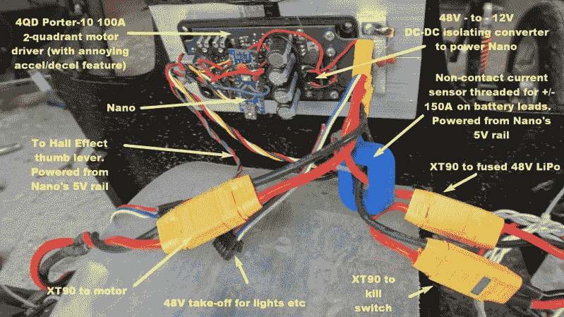

# 廉价的 DC 电机控制器的战斗测试电流限制器

> 原文：<https://hackaday.com/2019/05/11/battle-tested-current-limiter-for-cheap-dc-motor-controllers/>

在泥泞或多尘的环境中运行有刷电机会对控制器造成损害，会产生严重的反电动势和高失速电流。这解释了欧洲 Hacky Racer 系列中的一个挑战，它显然比美国的 Power Racing 系列更越野。

在将这些小型电动汽车推向极限的过程中，许多建筑商使用无刷中国踏板车电机，因为它们既容易获得又便宜。其他人走刷 DC 路线，如果他们足够幸运地获得一个电机，那么挑战就变成了在不烧毁控制器的情况下获得最大性能。为了解决这个问题，[MechanicalCat]已经为廉价的 DC 电机控制器设计了[限流器。](https://github.com/MechanicalCat/HackyRacerPID)

完整的文字记录在[所包含的 PDF 文件](https://github.com/MechanicalCat/HackyRacerPID/blob/master/PIDwrapper.01.pdf)中，描述了位于油门和控制器之间的 Arduino Nano 的设置，并从电流传感器获取反馈。问题中的控制器是一个 [4QD Porter 10](https://www.4qd.co.uk/product/porter/) ，所以一个额外的组件是一个直流到 DC 转换器，为 Arduino 提供一个浮动接地。然而，同样的设置也有可能被廉价得离谱的中国电机控制器使用。还有关于安装反激二极管的建议，这可能会在去年节省一个控制器。

这将对 Hacky Racer 的竞争力产生什么影响还有待观察，但它的应用远远超出了这一领域，进入了任何需要廉价可靠的小型 DC 电机驱动的地方。与此同时，如果你不确定这些粗糙的赛车材料来自哪里，[你可以从这里开始](https://hackaday.com/2018/06/25/the-electric-vehicles-of-emf-camp/)。