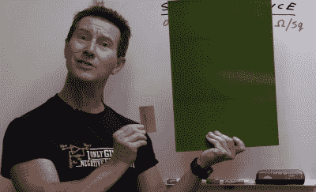
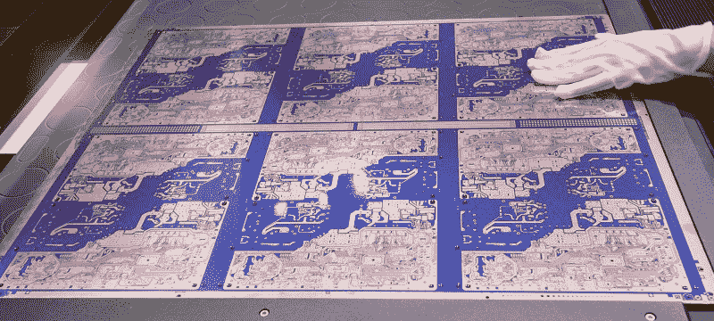

# PCB 上的方形走线是怎么回事

> 原文：<https://hackaday.com/2019/06/26/whats-the-deal-with-square-traces-on-pcbs/>

设计印刷电路板时，有一定的规则。应该在每个芯片的电源引脚附近放置去耦电容。你的接地层应该是一个巨大的铜填充；由单条走线连接的两个接地层更好地称为天线。模拟部分应与数字部分分开，如果处理高电压，则该部分需要隔离。

我经常听到的一个观点是，千万不要在走线上放置 90 度角。一些人担心，仅仅看到 PCB 上的 90 度角就告诉所有人你不知道自己在做什么。但是真的没有比电路板上的 90 度走线更大的罪过了吗？

这种避开 90 度走线的传统智慧融入了我们对电路板设计的所有了解。这是你学到的第一件事，也是当你发现一块有 90 度痕迹的板时，你要批评的第一件事。方形痕迹真的重要吗？简而言之，答案是否定的，但我们不这么做还是有原因的。

## RF 和电容影响

当你问别人为什么印刷电路板上的 90 度走线不好时，给出的第一个原因是射频干扰。

关于为什么不应该在走线上使用方形拐角，最常引用的理由是电子会聚集在拐角上。以我们目前对物理学的理解，这是不可能的，而且会打破宇宙。对每个人来说幸运的是，你可以租用测试设备来测试 20 千兆赫的电路。如果你真的很棒，你可以在垃圾桶里找到测试设备。今年早些时候，[Bil Herd]通过测量一条看起来像方波的轨迹的阻抗来测试方角。在 20 千兆赫时，方角的影响是最小的。在较低的频率下，这种影响会更小。不要担心你的痕迹上有方角。

A younger Dave Jones, holding two boards with the same end-to-end resistance.

就 RF 干扰而言，使用 90 度走线的影响很小，但由于走线的直角性质，我们确实会遇到走线电阻。这个电阻是轨迹形状的函数，这就是所谓的薄层电阻。[【达夫·琼斯】做了一个关于薄层电阻](https://www.youtube.com/watch?v=ME4Xe53TMxI)的精彩视频，重点是走线的电阻是以欧姆每平方来衡量的。那是欧姆每平方，没有任何其他的量纲；一个边长为 2 毫米的铜正方形与一个边长为 10 毫米的铜正方形具有相同的电阻。这是反直觉的。

也就是说，如果用 45 度角来代替，90 度角对走线电阻的影响很小。这就是三角形的工作原理。它确实会影响走线的电容，尽管这种影响非常小。[这一点已经被【Bil Herd】在他的高速 PCB 设计技术测试](https://hackaday.com/2019/01/24/video-putting-high-speed-pcb-design-to-the-test/)中涉及到，并且已经被[写在 EDN 中作为高速设计的经验法则](https://www.edn.com/electronics-blogs/all-aboard-/4438573/When-to-worry-about-trace-corners--Rule-of-Thumb--24)。要点是，方角确实会影响电容，但除非电路的上升时间极低，否则这不是一个问题。官方的经验法则是，当以密耳为单位的线宽大于以皮秒为单位的上升时间的五倍时，方形拐角会影响电路。除非你处理的是相对高速的信号 100 MHz 左右的 RF 或 SPI 总线的魔力，否则没关系。

## 电路板蚀刻过程中的酸陷阱

酸陷阱不仅仅是我的声音云的最新前沿，它也是你在制造电路板时必须考虑的事情。

A modern PCB undergoing fabrication. Acid traps are not a problem for the modern PCB manufacturer.

大多数电路板最初都是由一片玻璃纤维或覆盖着一层铜的其他基板制成的。这是每个板房的原材料，尽管基板、应用于电路板的铜量以及制造 PCB 的任何中间过程都有所不同，但一切都始于铜与某种非导电材料的结合。为了将这种原材料变成板，一部分铜被掩蔽掉并且铜被去除。这可以用激光打印机墨粉或紫外线固化光掩模来完成，然后用铁氯化物、过硫酸钠或氯化铜来蚀刻铜。制作 PCB 有许多不同的方法，但它们都惊人地相似。

蚀刻电路板时，有可能在迹线的角落聚集一滩酸性溶液。如果发生这种情况，酸可能会侵蚀光刻胶下面的铜。这反过来又会减小走线的有效宽度，有可能使走线完全断开。

对于第一次电路板设计的所有提示和技巧，“酸陷阱”的解释是为什么不应该使用 90 度走线的隐含原因。 [The Eagle blog](https://www.autodesk.com/products/eagle/blog/top-10-pcb-routing-tips-beginners/) 为新的 PCB 设计师提供了十大布线技巧，酸性陷阱是你不应该使用 90 度角的原因。“易于制造”是许多文章中不使用 90 度走线来介绍 PCB 设计技巧的原因。

然而，这个避免酸陷阱的技巧已经有几十年的历史了，PCB 制造背后的技术也在这些年里有了很大的改进。如果你的 PCB 工厂在一个角落里有酸蚀铜的问题，你可能应该另找一个板房。

## 那么，这有什么关系呢？

设计 PCB 的诀窍很像驾驶汽车。任何有驾照的人都可以上车，开几英里，然后买些杂货。你可以把一些饮料放在冰箱里，然后进行一次 200 英里的公路旅行，没问题。驾驶汽车的基本知识对于你在路上 99%的时间都绰绰有余。

在驱动和 PCB 设计中，大多数都有例外。开着克莱斯勒 Sebring 去 Dollar General 和开着你最喜欢的超级跑车在纽伯格林兜风是完全不同的。同样，构建一个数千兆赫的电路比将蓝牙模块和有机发光二极管显示器连接在一起制作一个智能手表要困难得多。

我们在大多数 PCB 设计中看不到方形走线的原因仅仅是因为美学惯例。如果看起来不对，那就是不对的。没有具体的理由为什么每个电路板设计都应该避开走线上的 90 度角，这只是你不应该做的事情，因为它看起来不对。