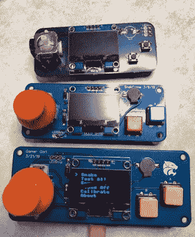

# 用 MicroPython 构建 ESP8266 游戏系统

> 原文：<https://hackaday.com/2019/05/16/building-an-esp8266-game-system-with-micropython/>

在看到 ESP8266 开门或报告当前温度的项目似乎层出不穷之后，人们很容易忘记这个支持 WiFi 的小微控制器到底有多强大。事实上，你可以说大多数黑客甚至没有触及硬件实际能力的表面。但对来自肯塔基乡村日校的布莱恩·瓦格纳和他的学生来说，情况并非如此。

 他们的项目 [GamerGorl 是一个完全定制的掌上游戏系统，运行在 Wemos D1 迷你](https://hackaday.io/project/165405-gamergorl)开发板上。该团队的 PCB 是经过多次迭代开发的，本质上是一个分线板，允许他们轻松连接外围设备。鉴于 GamerGorl 的总组件成本较低，构造相对简单，它看起来像是年龄较大的 STEM 学生的非凡项目。

除了 ESP8266 板，GamerGorl 还配备了一个 SSD1106 1.3 英寸有机发光二极管显示器、一个音效蜂鸣器、两个触觉按钮和一个最初用于 Xbox 控制器的模拟操纵杆。在背面有一个 WS2812B RGB LED 灯条，至少部分用于装饰，但它也在一些游戏中被积极使用，如该团队与 *Simon 的较量。*

即使你不在便携式游戏系统的市场上，GameGorl 也确实为 Wemos D1 Mini 上的 MicoPython 应用程序提供了一个有趣的案例研究。如果你想扩展你的 ESP8266 编程技能，浏览团队的源代码以及[Brian]给出的关于启动和运行软件环境的有用提示会很有用。我们也很乐意看到这个设备[运行我们最近报道过的“ESP 小游戏引擎”](https://hackaday.com/2019/03/11/esp8266-gets-its-game-on-with-open-source-engine/)。

 [https://www.youtube.com/embed/kp6AmevdGuc?version=3&rel=1&showsearch=0&showinfo=1&iv_load_policy=1&fs=1&hl=en-US&autohide=2&wmode=transparent](https://www.youtube.com/embed/kp6AmevdGuc?version=3&rel=1&showsearch=0&showinfo=1&iv_load_policy=1&fs=1&hl=en-US&autohide=2&wmode=transparent)

