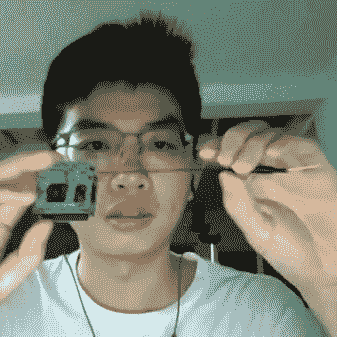
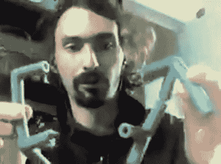
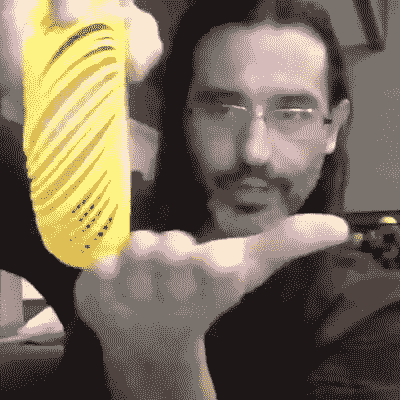

# Hackaday 奖导师会议:Giovanni Salinas 的产品工程

> 原文：<https://hackaday.com/2019/05/23/hackaday-prize-mentor-session-product-engineering-with-giovanni-salinas/>

今年，我们在 Hackaday 的奖品组合中加入了一些新的令人兴奋的东西。导师会议将硬件团队与有背景的专家联系起来，有助于推动他们的产品开发。我们已经组建了一个导师的[梦之队，今天我们很兴奋地发布第一次导师会议](https://hackaday.io/contest/164621-supplyframe-designlab-2019-hackaday-prize/log/163248-mentor-sessions)的[视频，你可以在下面找到。这是一个很好的机会来了解每个项目的工程设计，并从这些有助于推进工作的来回对话中学习。我们鼓励您](https://www.youtube.com/watch?v=ftKpg1-bVK8)[报名参加即将到来的课程](https://docs.google.com/forms/d/e/1FAIpQLSebsF7kT9FWRJs2MKrPvRZv5bx2eYmpc3N3aMSffP5Lk1tEcQ/viewform)！

Supplyframe 设计实验室的产品开发工程师 Giovanni Salinas 是本次会议的导师。他在产品开发方面有着丰富的经验，在今天的文章中，他将与四个不同的产品团队一起工作。

首先出场的是凯文·哈灵顿(见上图)，他领导着一只可爱的动态导向机器猫 SmallKat 的团队。对于机器人来说，动态行走是一个难题，这也是该团队正在努力解决的问题。他们的具体目标是通过设计一个可用于深入研究该主题的硬件平台来解决先有鸡还是先有蛋的问题。目前，该团队正试图解决转向注射成型的问题——何时放弃 3D 打印并承担模具加工成本最有意义？

  Yihui Xiong  David Troetschel

熊正在为制造商开发一款智能音箱，他希望这是一款完全开源的设计。他目前用激光切割纸板制作箱子，这被认为是一个潜在的弱点，但也是巧妙的平面设计使其成为优势的机会。

David Troetschel 与基于 3D 套件的空间设计工具[geometry](https://hackaday.io/project/161645-geometer)。这是一个有趣的联锁套件概念，旨在降低创建 3D 形状的障碍。他的例子是一把椅子；制造一把椅子所需的技能非常重要，而且很难掌握。但是用他工具箱里的原始工具一把椅子来装备你自己，你就可以在更少的准备下成功。当你了解到它的目标之一是使用它来塑造模型，有效地从原型转移到大规模生产时，这就变得特别有趣了。所需套件的规模被确定为一个问题，并提供了一些关于优化注塑塑料生产的技巧。

Daren Schwenke

Daren Schwenke 正在开发 [FilaMecanum](https://hackaday.io/project/165330-filamecanum) ，使用 3D 打印机细丝作为原型制作介质的 Mecanum 轮子。对于与潮湿环境接触的柔性平台的更好材料提出了一些建议，因为他使用的 PLA 是吸湿性的。有更多的关于注射成型的讨论，然后提到了另一个实验者，他在同一个轮子的原型中使用了尼龙拉链。

Giovanni 最后推荐了一本书，Rob Thompson 的《面向设计专业人士的*制造流程》，他将其描述为一门完整的产品设计材料课程。*

 *我们已经录制了一些其他的辅导课程，您将在未来几天看到，还有更多计划中的课程。为了取得成功，我们需要您的参与！只需将你的项目输入 [Hackaday 奖](https://prize.supplyframe.com/)(如果你还没有的话)，然后[注册](https://hackaday.io/contest/164621-supplyframe-designlab-2019-hackaday-prize/log/163248-mentor-sessions)！

 [https://www.youtube.com/embed/ftKpg1-bVK8?version=3&rel=1&showsearch=0&showinfo=1&iv_load_policy=1&fs=1&hl=en-US&autohide=2&wmode=transparent](https://www.youtube.com/embed/ftKpg1-bVK8?version=3&rel=1&showsearch=0&showinfo=1&iv_load_policy=1&fs=1&hl=en-US&autohide=2&wmode=transparent)

*