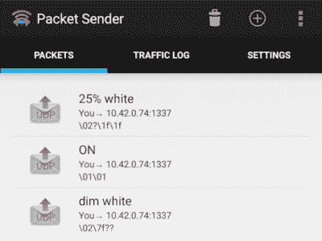

# ESP8266 升级赋予宜家 LEDs UDP 超能力

> 原文：<https://hackaday.com/2019/05/27/esp8266-upgrade-gives-ikea-leds-udp-superpowers/>

抵制购买的冲动可能很难。你看到一些有趣的东西，价格合适，尽管你*知道*你应该先做研究，但你最终还是把它放进了你的购物车。这就是为什么[Tobias Girstmair]最终成为宜家 LEDBERG RGB LED 灯的不那么自豪的所有者，也是为什么最终[推动他用 esp 8266](https://gir.st/blog/esp8266-ledberg.htm)取代了 wimpy 原装控制器。

那么最初的控制器有什么问题呢？如果你能相信，它不可能产生白光。当宜家说 LED 是多色时，他们显然是指只有*多种颜色。对网上评论的快速检查似乎表明，白色版本是作为一个不同的 SKU 出售的，从外表看起来似乎是一样的，并迷惑了不少购买者。*

 【托拜厄斯】决定用一个 ESP-03 代替原来的控制器，而不是非选其一，希望这能给他足够的粒度来控制 led，让它们发出合适的白光。他不想完全从零开始，所以他首先做出的决定之一是重用现有的 PCB 和 MOSFETs。PCB 上一些方便的测试点使他能够将 ESP 的数字引脚直接连接到红色、蓝色和绿色 LED 通道。

接下来的问题就是开发软件了。为了保持简单，[Tobias]决定创建一个“哑”控制器，它只需根据通过简化的 UDP 协议接收的命令来设置 LED 的颜色和强度。除此之外的任何东西，如随机的颜色或特殊效果，都是通过在他的计算机上运行并发出适当的 UDP 命令的脚本来完成的。这也意味着他可以手动控制他新升级的 LEDBERG 条带，基本上可以从任何可以生成 UDP 包的东西，比如他的 Android 手机上的应用程序。

它[可能不是我们见过的最强大的实现](https://hackaday.com/2018/07/27/esp8266-internet-controlled-led-dimmer/)，但从各方面考虑，看起来这种修改可能是一种很好的方式[在你的生活中获得一些便宜的网络控制 RGB 照明](https://hackaday.com/2015/10/03/a-thousand-led-lights-for-your-room/)。