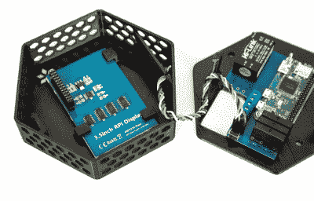

# HestiaPi:一款时尚的开放式硬件恒温器

> 原文：<https://hackaday.com/2019/06/11/hestiapi-a-stylish-open-hardware-thermostat/>

对开放硬件和软件的一个常见抱怨是，项目的美学方面经常有所欠缺。这并不完全令人惊讶，因为构建这些东西的黑客类型往往更关心它们工作得如何，而不是它们看起来如何。但是，对一个设计良好的系统稍加修饰肯定没有错，尤其是如果你想让“普通”人对此感到兴奋的话。

 一个完美的例子，[莫过于赫斯提触摸](https://hackaday.io/project/165865-hestiapi-touch-open-smart-thermostat)了。2019 年 Hackaday 奖的参赛作品承诺提供类似谷歌 Nest“智能”恒温器的所有家庭自动化优势，而不会有数据被卖给最高出价者的风险。但是，即使我们把锡纸帽从等式中去掉，从功能和视觉的角度来看，它也是一个非常光滑的硬件。

正如你可能从名字中猜到的那样，恒温器由 Raspberry Pi Zero 供电，它连接到一个定制的 PCB，其中包括一对继电器和一个用于 BME280 环境传感器的连接器。3D 打印外壳的巧妙设计意味着，当一切就绪时，前面的 3.5 英寸触摸屏 LCD 可以直接连接到 Pi 的 GPIO 接口。

当然，硬件只是等式的一半。为了让 HestiaPi Touch 与你生活中的所有其他智能设备进行对话，它利用了广受欢迎的 OpenHAB 平台。正如休息后的视频所展示的那样，这允许你使用 HestiaPi 及其移动配套应用程序，不仅可以控制你家的供暖和空调系统，还可以控制你能想到的几乎任何东西。

HestiaPi Touch 已经超过了其在大众供应方面的资金目标，团队正在努力完善产品的硬件和软件元素；包括寻找利用 3D 打印外壳的独特蜂窝形状将其连接到其他附加模块的方法。

 [https://www.youtube.com/embed/HD0gqBtB2GY?version=3&rel=1&showsearch=0&showinfo=1&iv_load_policy=1&fs=1&hl=en-US&autohide=2&wmode=transparent](https://www.youtube.com/embed/HD0gqBtB2GY?version=3&rel=1&showsearch=0&showinfo=1&iv_load_policy=1&fs=1&hl=en-US&autohide=2&wmode=transparent)

The [HackadayPrize2019](https://prize.supplyframe.com) is Sponsored by:     