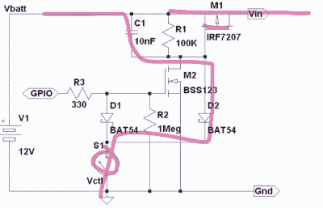

# 抛弃开关:软锁存电路综述

> 原文：<https://hackaday.com/2019/06/24/ditch-the-switch-a-soft-latching-circuit-roundup/>

对于我们中的一些人来说，没有什么声音比高品质拨动开关砰地一声到位的低沉共鸣声更令人满意了。在使用电子产品时，没有太多的本能体验，所以只要有机会，我们就喜欢细细品味。但是，当然，味道是无法解释的，我们*假设*甚至有这样的情况，沉重的物理开关可能不是最好的解决方案。那你是做什么的？

 进入闭锁电源电路，通常称为“软”开关。[【Chris Chimienti】最近制作了一个有趣的视频](https://www.youtube.com/watch?v=7D9L9oS4AJM)，它带领观众通过五个不同的电路，可以用来将这些所谓的软电源开关添加到你的项目中。每个电路都经过解释、绘图、注释，最终甚至在物理试验板上演示。你唯一要做的就是挑选你最喜欢的一个。

实际上，有很多很好的理由让这些电路放弃传统的拨动开关。但是最大的一个，有点违反直觉，是成本。即使是“便宜”的拨动开关也可能是物料清单中最贵的部件之一，尤其是在小批量生产时。相比之下，构建一个锁存电路所需的几个晶体管和几个无源元件只需花费你几分钱。

即使你不在市场上寻找一种新的方式来关闭你的项目，这种电路综述也是一种神奇的提醒，提醒你分立元件可以多么强大。在一个大多数项目似乎都是由预制模块组装而成的时代，[偶尔回归基础会让人耳目一新](https://hackaday.com/2019/06/17/modeling-the-classic-555-timer-on-a-breadboard/)。

 [https://www.youtube.com/embed/7D9L9oS4AJM?version=3&rel=1&showsearch=0&showinfo=1&iv_load_policy=1&fs=1&hl=en-US&autohide=2&wmode=transparent](https://www.youtube.com/embed/7D9L9oS4AJM?version=3&rel=1&showsearch=0&showinfo=1&iv_load_policy=1&fs=1&hl=en-US&autohide=2&wmode=transparent)

