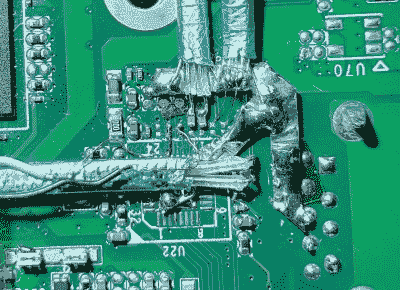

# 如何在 Atomic Pi 上获得 PCI-E？非常小心。

> 原文：<https://hackaday.com/2019/06/26/how-do-you-get-pci-e-on-the-atomic-pi-very-carefully/>

至此，你几乎肯定听说过原子圆周率。曾经作为一个失败机器人的内脏的小板子现在作为一个强大的 x86 SBC 以低价出售。你能买多长时间，以及当最初的库存用完时会发生什么完全是另一回事，但不可否认的是，人们已经在用它们做有趣的事情了。

其中之一是[Jason Gin]，他最近完成了一项史诗般的任务，为他的 Atomic Pi 添加了一个 PCI Express (PCI-E)插槽。事情并没有完全按照计划进行，这个故事可以说是低谷多于高潮，但最终他取得了胜利。他不一定建议您在自己的 Atomic Pi 上尝试同样的修改，但是他确实认为这为将来开发更精细的升级打下了基础。

【Jason】解释说，主板的以太网控制器已经通过 PCI-E 与英特尔凌动 x5-Z8350 SoC 通信，因此根本不存在修改是否可行的问题。理论上，你所需要做的就是禁用以太网控制器，并加上一个外部 PCI-E 插座，这样你就可以插入任何你想要的东西。诀窍是完成这种修改所需的极细间距焊接，特别是考虑到 PCI Express 标准是多么挑剔。

实际上，在[Jason]能够让原子 Pi 真正识别插入其中的东西之前，用不同类型的线进行了几次尝试。在这个过程中，他设法破坏了以太网控制器，但这并不是一个很大的损失，因为他计划禁用它。最终获胜的组合是 40 号磁线，连接在 PCB 和一根细 SATA 电缆之间，电缆通过一片金属机械固定在电路板上，以防止任何东西弯曲。

在这一点上，[Jason]已经测试了足够多的外部设备连接到他被入侵的端口，知道修改是有希望的。但是他做这件事的方式显然有点喜怒无常，而且对大多数人来说独自完成这件事太难了。他认为前进的方向可能是定制 PCB，可以在以太网控制器上对齐并焊接到位，尽管他承认这样的项目目前超出了他的舒适水平。有读者对合作感兴趣吗？

像你们大多数人一样，当我们第一次听说π原子时，我们对它抱有很高的期望。但自从董事会是另一家公司清算的产物这一点变得清晰后，社区中出现了一些可以理解的恐慌。没有人确切知道原子圆周率的未来会是什么样子，但这显然没有阻止黑客的潜入。