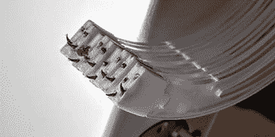

# 嵌入机器人脚趾的鱼钩让它们像蟑螂一样攀爬

> 原文：<https://hackaday.com/2019/06/28/fish-hooks-embedded-in-robot-toes-make-them-climb-like-cockroaches/>

取一打左右的鱼钩，用 3D 打印机逐步将它们嵌入塑料中，并将其连接到你的六足动物的脚上，你就得到一只巨大的蟑螂了！

卡尔纳基梅隆大学的一组研究人员想出了这个巧妙的方法，任何人只要有一个 hexpod 和一台 3D 打印机就可以轻松复制。这里你可以看到嵌入腿末端的钩子。这种“微爬技术”使他们的 T-RHex 机器人能够以略低于 55 度的角度爬上墙壁，但也赋予了*在严重悬壁上抓住*的能力。

我们对这些结果的解释是，机器人需要以一种更加可控的方式释放和放置每只脚，以防止它向后摔倒。但是研究人员确实有计划在不久的将来帮助改善这种行为。

> 传感和闭环控制:截至目前，T-RHex 以完全开环、脚本化的步态移动。我们相信，通过为腿部和尾部执行器添加扭矩传感，可以提高性能，这将使机器人能够适应墙壁中的大规模表面不规则性，在灾难性脱离之前检测腿部滑动，并在爬墙过程中自动使用尾部保持平衡。这种设计路径将需要一个平台大修，但提供了一个有前途的控制为基础的解决方案，我们的步态设计的缺点。

毫无疑问，我们现在都想造出能胜过 T-RHex 的蟑螂。将鱼钩嵌入塑料是一次一个完成的。在制造过程中，打印机停止工作，用人手小心地放下一个钩子。打印机再次打开，并铺设另一层塑料以完全封装钩子。一遍又一遍重复！

你的机器人将需要前述的传感和闭环控制，以及传感器和摄像机的“正常”阵列，以实现自主评估前方地形的能力。祝你好运，不要忘记发布你的项目(如果你需要这样做的话，请访问 Hackaday.io)并[向我们透露相关信息](https://hackaday.com/submit-a-tip/)！我们已经看到了很多，有时[恐怖的六足项目](https://hackaday.com/2014/02/25/hexapod-robot-terrifies-humans-and-wallets/)，但是要注意项目预算不会完全失控(以后会有更多关于这方面的内容)。

 [https://www.youtube.com/embed/p0fiIAuesIA?version=3&rel=1&showsearch=0&showinfo=1&iv_load_policy=1&fs=1&hl=en-US&autohide=2&wmode=transparent](https://www.youtube.com/embed/p0fiIAuesIA?version=3&rel=1&showsearch=0&showinfo=1&iv_load_policy=1&fs=1&hl=en-US&autohide=2&wmode=transparent)

[感谢 Qes 的提示]