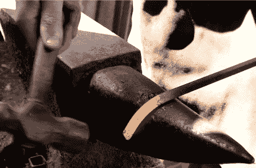
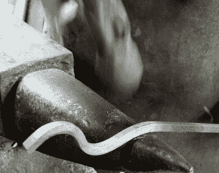
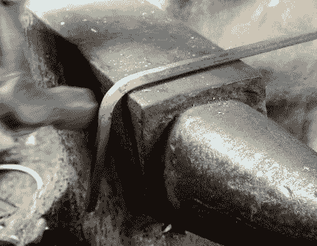
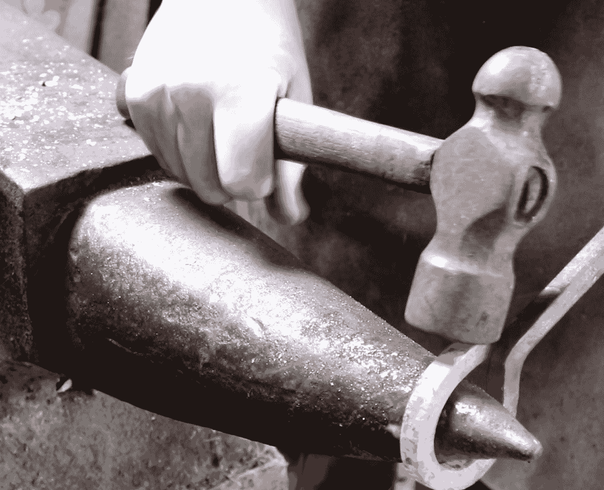
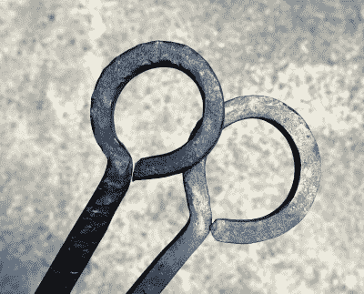

# 外行人的锻造:曲线和圆环

> 原文：<https://hackaday.com/2019/07/18/blacksmithing-for-the-uninitiated-curves-and-rings/>

你知道铁砧有趣的一面吗？这就是最好的曲线的来源。它被称为铁砧角，是铁匠弯曲钢铁并将其塑造成曲线的朋友。

弯曲一根钢材的原理很容易理解。把它加热到一定温度，用锤子把它敲成想要的形状。与塑造金属相比，需要更轻柔的触摸。这是因为其目的是弯曲金属而不是变形。我们来看看吧！

## 曲线基础

  The first curve is formed over the horn of the anvil.  Have a bit of fun with those curves!

像以前一样在你的壁炉上生火，拿一块钢。我建议，如果你能得到一个更小的尺寸，以便于工作，8 毫米(3/8 英寸)，如果它是可用的，超过 500 毫米(20 英寸)长，给你足够的空间进行实验。你需要把它放在高温下，使 150 到 200 毫米(6 英寸到 8 英寸)达到通常的橙黄色温度。

在铁砧上，将钢的加热部分以直角横过焊头，沿焊头长度的一半在弯曲部分锤打。曲线的深度通过沿喇叭移动来控制。越靠近砧面，曲线越平缓，越靠近尖端，曲线越陡峭。

当塑造金属[时，你就像我们上次做的那样锤打铁砧的正面](https://hackaday.com/2019/06/12/blacksmithing-for-the-uninitiated-your-first-time-at-the-anvil/)。但是对于曲线，你不是在铁砧上锤打，因为这会改变工件的形状。取而代之的是，在你的钢处于自由空间的地方，用锤子敲打远离喇叭的地方。很快你会开始形成一条曲线，除非你非常幸运，你可能会看到它也开始形成一个螺旋。这是直截了当的纠正，简单地锤发展中的螺旋再次平坦的砧面。

一旦你掌握了曲线的窍门，这就是你可以开始实验和享受乐趣的地方。如果你喜欢，可以尝试 S 形、复合曲线甚至卷轴。撤销你的实验并尝试其他东西是很容易的，只需在铁砧上把它们锤平，然后重新开始。慢慢来，发挥创造力，感受铁砧上的钢铁是如何工作的。

## 最好戴上戒指

At first your right angle will look more like a tight curve, you’ll need to put in some extra hammering to tighten it up.

掌握了弯曲金属后，试着在一根直钢的末端做一个环。你们应该很熟悉圆周率和圆周率之间的关系。估计长度大约是你想要的环半径的 3.141 倍。这个 3:1 的比例比想象一个完整曲线的长度要容易得多。

制作戒指的第一步是在钢上弯一个直角，为戒指的底部做一个“L”形。

制作一个直角很容易，只需加热你想要看到弯曲的位置两侧约 25 毫米(1 英寸)的区域，将原料放在砧面上，然后在砧面上锤下。你必须在弯曲处做一些锤平，使它成为一个尖锐的 90 度，因为它首先会试图成为一个尖锐的曲线，而不是一个点。它也可以在角上向外“挤压”,甚至稍微向外弯曲远离直角，简单地在砧面上锤平。

## 绕着合恩角的旅行

Forming the loop on the horn of the anvil.

加热“L”的底部，注意不要加热超过直角的钢材。您可能希望仔细淬火任何其他部分已被加热，只留下脚的“L”的温度。然后将热的部分放在铁砧的角上，直角的冷的一边与角成 90 度，并在角周围锤出一条曲线。继续旋转，直到碰到正确的角度。您可能已经创建了一个椭圆形或螺旋形，但这无关紧要。你可以在铁砧的表面上展平任何螺旋趋势，下一步将把它渲染成一个完美的圆。

你的不完美的戒指现在应该被再次加热，再一次尽可能地保持热量不上升。然后把它放在喇叭的末端，用锤子敲成一个圈。你可能需要几个周期锤平任何螺旋趋势，或轻轻锤合一个缺口，如果一个缺口打开了，但你最终应该能够在你的一块酒吧结束了一个相当不错的圆环。

A pair of slightly rough-and-ready rings made in this way.

这应该为曲线和环的实验提供了足够的空间，但这绝不是全部。例如，你可能想以超过 100 毫米(4 英寸)左右的锥度减小坯料的尺寸(见[上一篇](https://hackaday.com/2019/06/12/blacksmithing-for-the-uninitiated-your-first-time-at-the-anvil/)在坯料上放置新的轮廓或提出你如何做的想法)，然后创建一个半径递减的曲线。举例来说，以这种方式创造传统的牧羊人弯钩设计并不太困难，或者朝着你可能在铁匠制作的门和栏杆上看到的那种装饰性的涡形结构前进。

在铁匠铺有很多有趣的东西可以学习，我计划帮助揭开这门手艺的神秘面纱，并鼓励读者尝试一下。也许几十年后，你们中的一些人会将它传递给一批新的感兴趣的硬件黑客。我很快会带着另一篇文章回来，我正在考虑解决硬度这个棘手的问题，通过加热改变一块钢的性质。下次见！