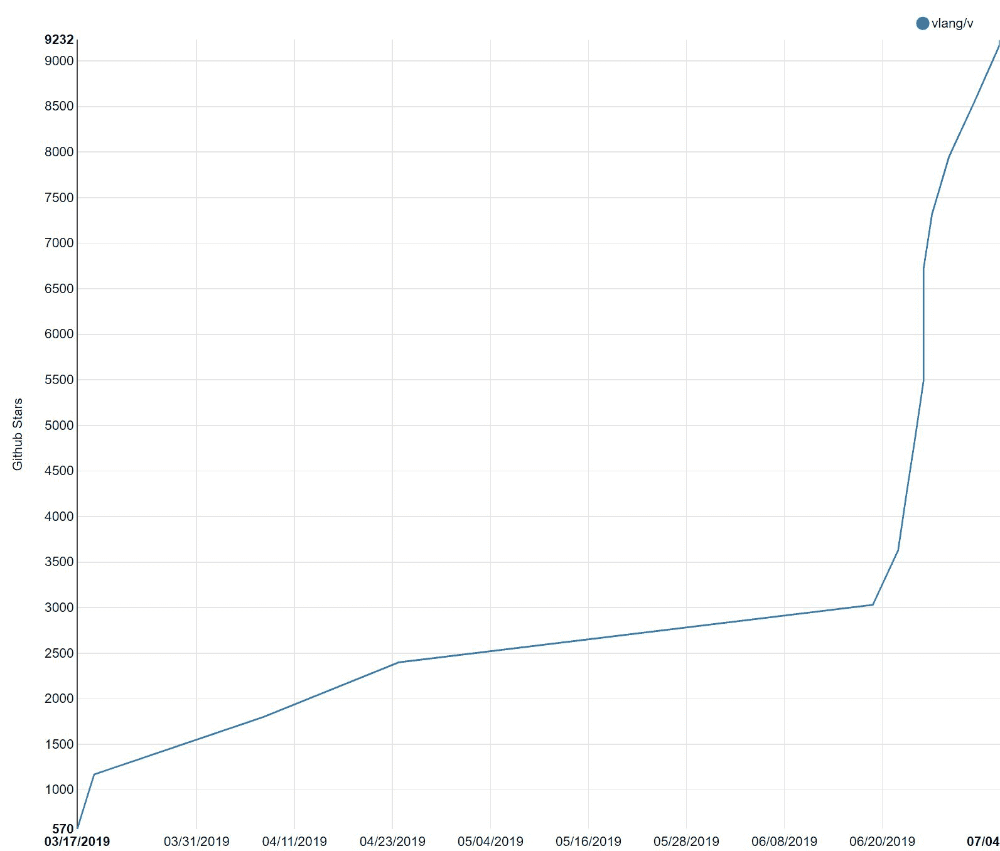

# V 编程语言:虚荣还是善良？

> 原文：<https://hackaday.com/2019/07/23/the-v-programming-language-vain-or-virtuous/>

如果你一直关注利基软件新闻，你的耳朵可能最近在一种新的编程语言发布时抽动过:v .新的业余爱好项目编程语言一直在发布，你会正确地争辩；是什么让这个与众不同？答案是许多提高速度和安全性的设计选择:V 很小，非常快。它还处于自称的 alpha 状态，尽管它已经被用于构建一些有趣的项目，但仍处于早期阶段。

## 告诉我更多

v 的网站， [vlang.io](https://vlang.io/) ，声明这是一个

> 用于开发可维护软件的简单、快速、安全的编译语言。

这些关键词中的每一个都是 V 哲学的基石，贯穿本文。

“可维护的软件”暗示了 V 非常谨慎的设计选择，这迫使开发人员采用特定的思维方式。在许多方面，V 与 Go 相似，做出了一些大胆的设计选择。(例如，没有异常，没有传统的类/继承。)

v 自称受围棋启发，受奥伯龙、Rust、Swift 影响。

## 那么到底有多快呢？

v 的头条事实是，它可以在每个 CPU 内核(i5-7500 的)上每秒编译大约 120 万行代码。

因为 V 编译器本身很小，只有 400 kB，所以作者让 V 在不到一秒的时间内编译自己。对于任何试图用 V 写东西的人来说，这个事实不仅仅是一个噱头吗？不——但它证明了关于简单的一点。

[Git 克隆 V](https://github.com/vlang/v) 然后运行`make`首先使用 C 编译器编译 V，然后使用生成的 V 可执行文件编译自身。我在 Linux 上运行它没有问题，但是要在 Windows 上得到一个没有错误的版本，我还得再努力一点。实际的直接机器代码生成目前仅适用于 x64/Mach-O。但是，到 2019 年底，V 1.0 应该会发布，并支持所有 x64，鉴于目前的开发速度，我可以相信这一点。

## 特性和设计选择

v 非常热衷于强迫你写出好的代码；如此热切以至于有些人可能会说它有时会很有进取心——我会让你来决定。例如，未使用的变量会导致编译错误，而不是警告。

由于 V、[的简单性，文档](https://vlang.io/docs)非常短。事实上，据说有可能在半小时内阅读它们并吸收整个语言。我不完全确定这是值得夸耀的事情，因为这个项目还处于非常早期的阶段，文档显然还不成熟。但尽管如此，阅读它们仍然凸显了一些有趣的特征:

### 安全

为了让 V 尽可能的安全，我们制定了严格的策略，特别是在线程方面。这些政策包括:

*   没有全局变量或全局状态(包括模块级)
*   变量必须总是用初始值来声明
*   默认情况下，变量被定义为不可变的。您必须使用`mut`来明确指定其他方式。
*   父作用域中没有已使用名称的变量

### 记忆

v 不进行垃圾收集，这是与 Go 的一个显著区别，甚至不进行引用计数。相反，它更类似于 Rust，在编译时管理内存。不幸的是，这目前只适用于基本情况；对于更复杂的情况，需要手动管理，这是另一个 WIP。

v 的创造者[medvedenikov]很快承认内存管理还不够安全，但它正在不断改进。这当然是需要努力的事情，以增加语言的“安全”特性的可信度。如果说我们从过去三十年的计算机安全中学到了什么，那就是内存管理漏洞比比皆是。

### 错误处理

v 没有例外，很像围棋。我们认为[戴夫·切尼]很好地解释了为什么。

相反，有一个组合的选项/结果类型，使用起来很简单，只需将`?`添加到返回类型中，并可选地返回一个错误。这里有一个例子来说明它是如何工作的:

```

fn find_user_by_id(id int, r Repo) ?User { 
	for user in r.users {
		if user.id == id {
			// V automatically wraps this into an option type  
			return user 
		} 
	} 
	return error('User $id not found') 
}

```

该函数返回类型`?User`，可能是用户，也可能是错误。当调用函数时，这可以通过调用`find_user_by_id(id, repo)?`传播到下一级(在这种情况下，父函数必须有一个可选的作为其返回类型)。这意味着传播错误仍然很容易，并且不需要使用 try-catch 异常模型。

### 即将推出的功能

*   内嵌汇编代码支持
*   热重新加载–代码更改无需重新编译(编辑:现已实现！)
*   包装经理

这些看起来都是可以快速实现和发布的重要特性，但是项目的开发速度非常快。

## 使用 V 构建的项目

v 的创造者[medvedenikov]已经用它建立了许多项目。

v 的创建实际上是为了开发一个 300KB 的桌面消息客户端，能够无延迟地处理/滚动数千条消息。有趣的是，V 充分利用了其现有的交叉编译能力，并声称很大程度上是跨平台的，但 Volt 目前仅适用于 Mac。

Vid 是一个 200KB 的跨平台代码编辑器，另一个旨在轻量级和快速的项目。这将在 7 月份开源，现在任何一天都可以。

Vtalk 是一个论坛/博客软件，用于支持 V 博客，也将很快开源。

## 将来的

这是 GitHub 恒星相对于 [V](https://github.com/vlang/v) 时间的曲线图。



Img courtesy of star-history.t9t.io

GitHub 之星不是一个价值指标，但它们肯定是一个兴趣指标，这*可以*带来来自开源社区的高质量输入。网站和文档中散布着大量标有“正在进行中”的功能，我不得不说其中一些看起来真的很棒；大多数人预计将在 12 月前获释。

很容易声称你的语言是轻量级的，当它缺乏特性并且有大量的 bug 需要修复的时候；平均来说，开源项目中的每一个拉请求和 bug 修复都会增加代码，而不是删除代码。但是，如果 V 能够保持其零依赖性和小尺寸，同时忍受正在进行的开发，它可能会在未来占有一席之地。

## 结论

人们很容易忘记，直到最近，V 的所有发展都是一个人的成果:[梅德韦杰夫]。在玩了一会儿这种语言之后，这位作者不会觉得在当前的状态下用 V 写一个新项目很舒服。但是，如果(梅德韦杰夫)能够保持目前这个项目飞速发展的速度，很快就会有令人兴奋的事情发生。我还没准备好加入这股潮流，但肯定会保持一定的距离。