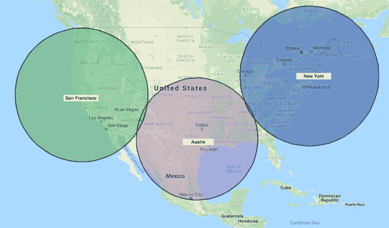

# 自动化货运:当货物是人时

> 原文：<https://hackaday.com/2019/08/01/automate-the-freight-when-the-freight-is-people/>

在我拿到驾照和汽车之前，往返于高中是一种折磨。长达一小时的公共汽车之旅是可怕的，正如人们所预料的那样，60 名青少年挤在一起，几乎没有人监督。逃避发生在我周围的现实是一项持续的杂务，并伴随着频繁的精神旅行。一次这样的徘徊让我得出结论，我们高中生只不过是为人们设计的送货卡车上的货物。这是一个令人愉快的事实，在一天的开始要面对。

对一辆载满学生的公共汽车来说是真的，对你看到的每一辆城市公共汽车、电车、地铁或长途汽车来说也是真的。人们可以运货，就像半拖车里的一托盘杂货，或者棕色平板卡车里的一堆微笑的盒子和信封。我们一直坚持的同样的经济因素将使自动驾驶汽车更有可能渗透到货运市场，然后我们才会看到自动驾驶乘用车与人们一起移动。《自动化货运》这一集:当货物是人的时候会发生什么？

## 害怕逃跑

投资游戏里有句话:趋势是你的朋友。投资者有很多类似的说法，主要是为了说服自己，他们对某家公司的股票将会发生什么有一点点线索，而在缺乏内幕信息的情况下，这一切都取决于运气。不过，投资模式的趋势仍然有用，因为它们往往会指出人们的思维方式。这对投资者和非投资者来说都是一个方便的工具。

因此，我饶有兴趣地偶然发现了一篇关于自动驾驶汽车对航空业的潜在影响的文章。从表面上看，你可能会认为汽车不会给航空公司带来风险，尤其是在美国。但文章指出，像西南航空这样的美国国内航空公司依赖于平均 757 英里(1218 公里)和持续约两个小时的航线。人们乐于为这些航班付费，忍受现代航空旅行的侮辱，这种侮辱在起飞前几个小时就开始了，并可能在着陆后几天以时差的形式结束。他们这样做恰恰是因为另一种选择更糟糕——至少对大多数人来说是这样；我个人更喜欢长途驾驶而不是飞行。我就是那样的怪异。

但快进到未来，完全自动驾驶的汽车已经成为日常用品，电池容量已经增加到足以让电动汽车行驶的距离与美国西南航空公司的普通航班相同。事实上，我们现在离这个目标不远了——[一辆特斯拉汽车一次充电可以行驶 670 英里。或者，忘记电池，考虑一个内燃自动驾驶。无论哪种方式，行驶在公路上的车辆显然不会在速度上超过喷气式客机，但也没必要，因为它可以整夜行驶。乘客们，没有开车的需要，可以简单地睡一觉，就像变魔术一样在早上到达，精神饱满，相对无忧无虑，至少与他们在机场被 TSA 探测的同行相比。](https://www.theguardian.com/technology/2017/aug/07/tesla-drivers-claim-model-s-distance-record-of-670-miles-on-one-charge-elon-musk)

不相信航空公司高管应该在无人驾驶的未来颤抖？然后看看这张地图:

New York to Chicago, while you sleep: areas covered by a theoretical 12-hour overnight trip by a self-driving vehicle. Source: [Towards Better Questions](https://betterquestions.blog/why-the-autonomous-revolution-will-give-southwest-airlines-no-luv/)

每个圆圈代表一个人可以从旧金山、奥斯汀或纽约连夜驱车多远——大约 11-12 个小时。是的，在海洋中开车很困难，而且这些都是不考虑高速公路位置的直线距离。但是，它仍然显示了一次合理的夜间驾车旅行可以覆盖这个国家的多少地方。而且，承诺在整个过程中睡觉，而不是被密封在一个充满不快乐的人和他们的细菌的铝管中，这可能只是地区航空公司公司套房恐慌的一个原因。

## 夜班车

旅行时睡觉的想法听起来可能需要等待真正的自动驾驶汽车，但实际上这是一项已经可用的服务。一项名为 Cabin 的通宵巴士服务于 2017 年推出，提供优质的通宵旅行体验，在乘客睡觉时在旧金山和洛杉矶之间穿梭。这个想法是使用传统的人力驾驶的汽车车厢，配备有介于舒适和幽闭恐惧之间的卧铺车厢，这取决于你的倾向。你会在晚上很晚的时候上公共汽车，在你的行李架上打盹，然后在早晨像雏菊一样精神饱满地跳下公共汽车。

 [https://www.youtube.com/embed/WRTzEJ8znL0?version=3&rel=1&showsearch=0&showinfo=1&iv_load_policy=1&fs=1&hl=en-US&autohide=2&wmode=transparent](https://www.youtube.com/embed/WRTzEJ8znL0?version=3&rel=1&showsearch=0&showinfo=1&iv_load_policy=1&fs=1&hl=en-US&autohide=2&wmode=transparent)

任何一个经历过美国几乎所有主要城市勉强维护的道路的人都可以想象，它并不十分成功。整夜伴随着大马力柴油机的轰鸣声颠簸前行的经历并不轻松，而且[小屋被迫停止运营](https://sf.streetsblog.org/2019/01/17/cabin-sleep-bus-is-in-hibernation/)来重组它的卧铺车厢。但他们没有完全放弃的事实表明，对低成本的地区交通选择仍有需求，提供过夜旅行对足够多的人来说是有吸引力的，使这个想法值得投资。

## 人们按需移动

至于未来完全自动驾驶的客舱版本，我想说的是，在地区路线上搭载大量乘客的自动驾驶汽车不太可能流行起来，至少在美国是这样，原因和公交线路和客运铁路在这里从未流行起来一样:缺乏灵活性。被困在公交车站的特定时间去搭乘困倦的公交车，与在 90 分钟的航班起飞前两个小时去机场没有太大区别。如果飞机提供起飞和到达时间的选择，人们很可能会选择飞行而不是睡眠驾驶。

但是，想象一下更小的自动驾驶汽车，也许有一辆大型货车那么大，有四个左右的铺位和一个小而舒适的座位区，可以按需预订旅行。企业可能会抓住机会，让团队安全地连夜开会，或者利用出差时间工作。家庭可能喜欢有一辆自动驾驶的货车停在车道上，穿着睡衣去迪斯尼世界旅行。大学生可以组队进行一次便宜的春假旅行，在假期里一起骑车回家，或者只是去一次没有后果的酒后驾车的公路旅行。

尽管如此，从乘客的角度来看，车辆是由计算机还是由人驾驶并不重要。他们所知道的是，他们不在开车，他们可以自由地打盹、阅读或工作。但对于提供服务的公司来说，消除与雇佣大量人类司机相关的成本可能是投资自动驾驶汽车的一个很好的理由。在旅途中提供睡觉、工作或聚会的自由只是增加价值和吸引客户的一种方式，以证明自动化人员货运的费用是合理的。