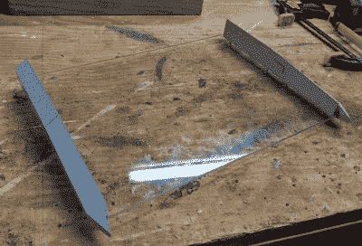

# 灵感来自稀有的 MSX

> 原文：<https://hackaday.com/2019/07/16/raspberry-pi-cyberdeck-inspired-by-rare-msx/>

当我们看到这些 cyberdeck 构建时，目标通常是做一些足以让威廉·吉布森骄傲的复古未来主义的东西。真的没有固定的公式，但偏移屏幕加上大键盘和模糊地坚持 20 世纪 80 年代的设计语言似乎是最重要的原则。

尽管[lewisb42]最近的设计仍然严重依赖这些常见的比喻，但至少有一个清晰的谱系:他的树莓派复古一体机是根据索尼在日本发布的 MSX 的一种特别罕见的亮红色变体设计的。被称为热门的 HB-101，一些爱好者认为这部大约 1984 年的机器是 MSX 风格的巅峰。由于无法得到一台真正的电脑进行改造，他别无选择，只能尝试从头开始重新创造电脑的一些独特设计元素。

 多面的侧面是一块块 3D 打印出来的，粘在一起，然后贴在 1/4”厚的聚碳酸酯制成的背板上。对于键盘下面的“鼻子”部分，[lewisb42]实际上使用了一块用台锯切割成适当角度的木头。他称之为 FLIPT-BIT 的电脑的上表面实际上是由一块块泡沫聚氯乙烯板组成的。

如果这一切听起来像一个大拼图，那是因为它基本上是。为了消除不协调的表面，他结合使用了木质油灰、身体填充物、污点油灰，以及比我们想象中更多的打磨时间。对于 3D 打印的表面细节，如屏幕边框和人造墨盒插槽，他使用了[一层 Smooth-On 的 XTC-3D 和更多的打磨](https://hackaday.com/2017/11/15/visual-3d-print-finishing-guide/)。虽然[lewisb42]说整体的完成没有他希望的那么好，但考虑到隐藏在光滑的红色油漆下的建筑技术的组合，我们认为整体的外观是非常棒的。

至于电子设备，真的没有什么惊喜。FLIPT-BIT 使用 Perixx 的键盘和触摸板，7 英寸 TFT 显示屏，当然还有 Raspberry Pi 3。显示器在 12 V 下运行，所以[lewisb42]使用了一个普通笔记本电脑式电源和一个 5 V 降压转换器的组合，让每个人都满意。虽然它目前没有电池，但如果他想移动，外壳内似乎有足够的空间来添加电池。

如果这个造型不能很好地挠你的痒，不要害怕。看看这个[明显不太友好的建筑，它甚至包括一个虚拟现实耳机](https://hackaday.com/2018/07/28/a-mobile-computer-to-make-william-gibson-jealous/)，可以让你正确地进入母体。