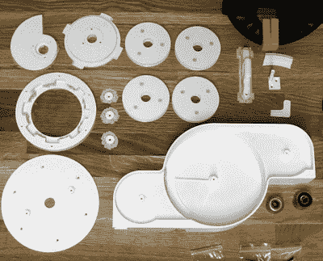

# 外部缓冲增强调色板 2 上的 3D 打印机灯丝拼接

> 原文：<https://hackaday.com/2019/07/21/external-buffer-boosts-3d-printer-filament-splicing-on-the-palette-2/>

曾经有一段时间，我们大多数人认为桌面 3D 打印的下一个合理步骤是添加额外的挤出机和 hotends，允许机器以多种颜色或材料打印。不幸的是，这种安排很快变得笨拙，即使只有两台挤出机，校准也是一场噩梦。正因为如此，系统的发展趋向于只使用一个加热装置，并简单地交替供给灯丝。但是这样的系统有自己的问题。

可以说，最大的问题是转换灯丝需要多长时间。Palette 2 使用一个拼接灯丝的物理缓冲区来试图保持领先于打印机，但正如[Kurt Skauen]所展示的那样，[通过构建一个更大的缓冲区可以获得相当大的性能增益](https://www.thingiverse.com/thing:3548274)。他说，仍然有一些校准问题要解决，但从休息后的视频来看，我们可以说他肯定是在正确的轨道上。

 缓冲器是必要的，以便让拼接的细丝在被送入打印机之前有时间冷却和粘合，但按照目前的设计，机器根本无法存储足够的缓冲器来跟上高打印速度。库存缓冲区容纳 125 毫米的拼接灯丝，但[Kurt]设计的改造在此基础上增加了 280 毫米，达到库存容量的三倍以上。

他成功地用升级后的缓冲区测试了高达 200 毫米/秒的打印速度，这比他在原始缓冲区看到的情况有了很大的改善。尽管 Mosaic(生产调色板的公司)声称原来的缓冲区大小已经足够了。似乎我们已经发现自己处于 Mosaic 和一些非常直言不讳的社区成员之间的辩论中，虽然我们不想偏袒任何一方，但很难忽视[Kurt]的发现。

想自己做吗？[Kurt]已经发布了其他人复制他的工作所需的所有信息，包括所有打印零件的 STL 以及组装零件所需的轴承、弹簧和紧固件的列表。这看起来是一个相当大的事业，但由于有如此可观的速度提升潜力，我们不怀疑其他人会愿意冒险。一个打印并组装了早期版本的缓冲升级版的人报告说，他们使用 0.8 毫米喷嘴的打印速度提高了一倍多。

从 2016 年我们第一次看到它以来，[调色板已经走过了漫长的道路，从那以后，Prusa 用他们自己的灯丝开关升级](https://hackaday.com/2016/06/20/mosaic-palette-single-extruder-multi-color-and-multi-material-3d-printing/)将他们的橙色帽子扔进了戒指[。这两款机器都存在一些小问题，但它们可能仍然是我们将桌面 3D 打印提升到下一个水平的最佳选择。](https://hackaday.com/2018/03/26/cutting-edge-of-3d-printing-revealed-at-last-weekends-mrrf/)

 [https://www.youtube.com/embed/SwURXKg5PdQ?version=3&rel=1&showsearch=0&showinfo=1&iv_load_policy=1&fs=1&hl=en-US&autohide=2&wmode=transparent](https://www.youtube.com/embed/SwURXKg5PdQ?version=3&rel=1&showsearch=0&showinfo=1&iv_load_policy=1&fs=1&hl=en-US&autohide=2&wmode=transparent)

