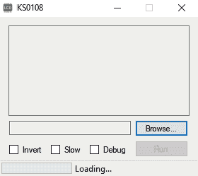

# 你不知道你需要的蓝牙 LCD 嗅探器

> 原文：<https://hackaday.com/2019/07/29/the-bluetooth-lcd-sniffer-you-didnt-know-you-needed/>

我们都曾因使用一台无法将数据导出到另一台设备的设备而遭受痛苦。无论是它太旧了，无法提供这样的细节，还是制造商将这种能力锁定在一些升级之后，盯着发光的 LCD 显示屏上滴答作响的数字，并希望有一种实用的方法来清除我们眼睛看到的东西，这种痛苦对黑客来说是众所周知的。

这正是 DoMSnif 的灵感来源，DoMSnif 是[Blecky]一直在研究的点阵式 LCD 探测器。最初，该项目是为了记录他的 BRTRO-420 回流炉的温度，但意识到这样一个设备可能对其他硬件黑客有广泛的吸引力，他理所当然地决定将其纳入 2019 年 Hackaday 奖。如果完善的话，这可能是一个将数据捕捉功能植入你的旧设备的好方法。

 该项目的第一阶段是找出如何捕捉和解析进入设备的 KS0108 LCD 的信号。获取数据当然很容易，他只需[在显示器和设备的主板](https://hackaday.com/2017/08/01/using-a-logic-analyzer-to-generate-screenshots-from-a-game-boy/)之间连接一个逻辑分析仪。当然，弄清楚这一切意味着什么是一个不同的故事。

在用分析器记录运行烤箱一会儿后，[Blecky]有足够的数据开始解码。幸运的是，这种相当常见的 128×64 像素显示器的布局有很好的文档记录，很容易理解。只需做一点工作，他就能创建一个工具，导入捕获的数据，并在虚拟 LCD 上显示出来。

不幸的是，蓝牙部分是事情变得棘手的地方。最终，[Blecky]想要抛弃逻辑分析仪，使用 Adafruit Feather nRF52 Bluefruit 来捕捉进入 LCD 的信号，并通过蓝牙将其传输到一个等待的设备。但是他的测试发现 nRF52 的无线电太慢了。显示器每 14us 接收一次数据，但收音机发送一个数据包至少需要 50us。

[布莱基]正在寻找解决这个问题的方法，我们相信他会解决这个问题。解决方案可能是在发送数据之前对其进行缓冲和压缩，尽管你会失去实时监控显示的能力。即使他不得不完全放弃蓝牙方面，让设备有线化，我们仍然认为一个易于使用的硬件和软件解决方案来抓取 LCD 数据是有市场的。

The [HackadayPrize2019](https://prize.supplyframe.com) is Sponsored by:     