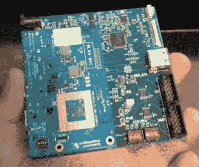

# 开源智能显示绕了一大圈

> 原文：<https://hackaday.com/2019/07/31/open-source-smart-display-takes-the-long-way-around/>

由于树莓 Pi 和高分辨率 LCD 屏幕的成本相对较低，“智能显示器”已经成为那些希望清理零件箱的人最喜欢的项目。只需将 Pi 连接到屏幕上，安装一些软件，你就为自己的家准备了一个数字公告板，可以显示你的日程安排、天气等。把它做成一面镜子，你至少可以获得双倍的网络积分。

但是当[约翰·巴西斯塔]开始规划他自己的智能显示器时，他决定走一条人迹罕至的道路。[他将由此产生的开源项目加入了 2019 年 Hackaday 奖](https://hackaday.io/project/166185-open-source-smart-display)，我们非常期待看到它将何去何从。即使在早期，他已经取得了很大的进步，甚至连一个覆盆子都没有。

 【约翰】并不反对在这些智能显示器上使用 Raspberry Pi，事实上，它有许多特性使它特别适合这项任务。但对他来说，问题是它只支持 HDMI，他一心想要使用嵌入式显示端口(eDP)屏幕的。即为笔记本电脑设计的 17.3 英寸 IPS LCD inno lux n 173 hce-E31。

他试图找到一个兼容 Linux 或 Android 的具有 eDP 功能的 SBC，但发现这是一个挑战。有一些 x86 选项，但我不想走这条路。最终，他选定了 Dragonboard 410c，它配备了一个运行频率为 1.2 GHz 的四核高通 APQ8016E CPU 和 1GB 内存。该板也没有 eDP，但它*有*显示串行接口(DSI ),他可以用德州仪器 SN65DSI86 IC 将其转换为 eDP。

从那时起，他开始开发一种可以容纳 Dragonboard 410c 和 SN65DSI86 的 PCB。该板还分解了 I2C 和 UART，以便他可以将其连接到其他各种传感器和设备，并包括所有必要的电源调节以驱动一切。整个东西可以放在你的手掌里，根据[John]已经完成的渲染来判断，当一切完成时，应该会很好地放在 3D 打印外壳的背面。

这个项目还有很多工作要做，但是[约翰]有足够的时间来完成这些细节。目前关于软件方面的信息很少，但正如你在休息后的视频中看到的，它现在运行 Android，这应该使事情相对容易。

 [https://www.youtube.com/embed/ugq6rv1rf4U?version=3&rel=1&showsearch=0&showinfo=1&iv_load_policy=1&fs=1&hl=en-US&autohide=2&wmode=transparent](https://www.youtube.com/embed/ugq6rv1rf4U?version=3&rel=1&showsearch=0&showinfo=1&iv_load_policy=1&fs=1&hl=en-US&autohide=2&wmode=transparent)

The [HackadayPrize2019](https://prize.supplyframe.com) is Sponsored by:     