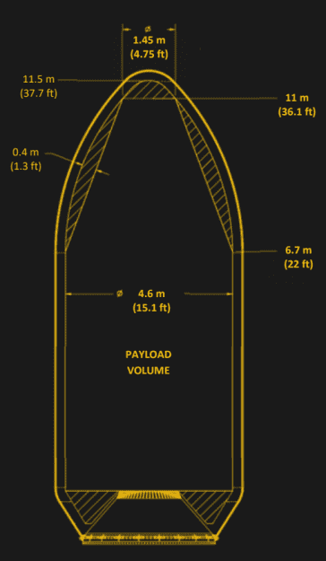
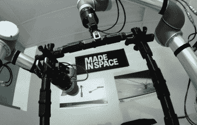
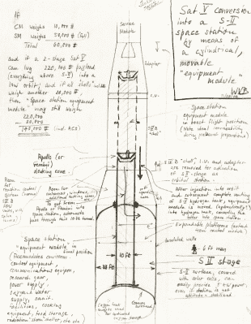
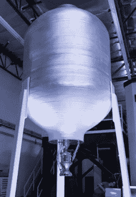

# 为什么未来的宇宙飞船会被挤压

> 原文：<https://hackaday.com/2019/08/06/why-spacecraft-of-the-future-will-be-extruded/>

自从人类第一次登上月球已经过去了 50 年，但是尽管自阿姆斯特朗迈出标志性的第一小步以来，技术取得了令人难以置信的进步，我们还没有比阿波罗计划期间更深入地探索太空。许多人认为登月后会自然发生的巨大飞跃，如载人飞越金星，从未发生。从那以后，我们一直被困在低地球轨道(LEO ),重返深空永远是几年后的事了。

Falcon Heavy Payload Fairing

但是为什么呢？简而言之，太空旅行当然是极其昂贵的。这也是危险和复杂的，但与任何敢于将人类送到地球表面数百公里以上的国家都会产生的令人难以置信的账单相比，这些问题都显得微不足道。如果我们有任何机会离开这块岩石，将一公斤物体送入轨道的成本需要大幅降低。

幸运的是，我们终于开始看到这方面的一些积极进展。商业发射提供商目前正在削减将有效载荷送入太空的成本。在其全盛时期，航天飞机可以携带 27，500 公斤(60，600 磅)到 LEO，每次发射的成本约为 5 亿美元。如今，SpaceX 的猎鹰重型(Falcon Heavy)可以将 63，800 公斤(140，700 磅)的物体送入相同的轨道，成本不到 1 亿美元。这仍然不是零花钱，但你也不会完全称之为革命性的。

不幸的是，这里有一个陷阱。SpaceX 和其他商业公司生产的火箭相对较小。猎鹰重型可能能够举起两倍于航天飞机的重量，但它的内部体积要小得多。如果我们试图将铅块抛向太空，这不成问题，但任何为人类乘客设计的航天器必然会相当大，并包含相当多的空白空间。例如，国际空间站最大的模块太长，无法装入猎鹰重型整流罩，但它在发射时只有 15，900 公斤(35，100 磅)的质量。

为了最大限度地发挥体积受限的助推器的能力，我们需要改变载人航天器的设计和建造模式。尤其是用于长期任务的。碰巧的是，令人兴奋的研究正在进行中。与其将组装好的宇宙飞船送入轨道，不如寄希望于我们最终能在太空中发送原材料并打印出来。

## 需要一些组件

花费了 20 多年的时间和 36 次航天飞机发射才组装成目前形式的国际空间站，但加在一起，所有模块的质量只有 40 万公斤左右。如果我们只需要处理总质量，也就是说，如果有可能以某种方式液化空间站，并以更密集的形式将其送入轨道，像猎鹰重型或蓝色起源的新格伦这样的商业火箭可以在少数几次飞行中完成这项工作。

显然，没有任何技术能让我们用装满粘性物质的有效载荷整流罩来重建一个功能正常的空间站或火星转移飞行器。但是，即使使用当前的熔融沉积成型(FDM) 3D 打印技术，研究人员认为我们应该能够创建大型轨道结构。想象一下，发射一枚装满有效载荷的火箭，火箭上储存着原料和机器人打印机，可以从中挤压和组装结构部件。

Robotic arms are used to assemble the 3D printed beams

有了这样的安排，一枚重型火箭就有可能容纳足够的原材料来打印一个桁架结构，比人类曾经送入太空的任何东西都要大得多。一旦打印框架完成，随后的发射可以为机组人员运送和安装太阳能电池板和生活模块等设备。虽然该设计仍需要在地球上进行大量组装，但能够在轨道上自主构建航天器的“骨架”将会大大节省时间和成本。

这听起来可能像科幻小说，但这正是加州山景城太空制造的能力，最近从美国宇航局获得了近 7400 万美元的合同进行演示。该公司计划在未来几年内发射一颗名为 Archinaut One 的卫星，该卫星基于他们在 2014 年在国际空间站上开创的 3D 打印技术。一旦进入轨道，它将从飞船两侧构造出两条延伸 10 米(32 英尺)的光束。如果成功的话，Archinaut 一号的“翼展”将可与航天飞机相媲美；尽管乘坐在[火箭实验室电子](https://hackaday.com/2018/01/29/smaller-and-smarter-the-electron-rocket-takes-flight/)的 1.2 米小整流罩内进入太空。

 [https://www.youtube.com/embed/DCLD-ilfdUE?version=3&rel=1&showsearch=0&showinfo=1&iv_load_policy=1&fs=1&hl=en-US&autohide=2&wmode=transparent](https://www.youtube.com/embed/DCLD-ilfdUE?version=3&rel=1&showsearch=0&showinfo=1&iv_load_policy=1&fs=1&hl=en-US&autohide=2&wmode=transparent)

## 印刷湿车间

Original “Wet Workshop” Sketch

在阿波罗计划的巨型土星五号火箭的开发过程中，韦纳·冯·布劳恩有了一个非凡的想法。与其在推进剂耗尽后丢弃火箭的第二级，不如将它用作独立的空间站？

他推断，其巨大的液氢罐将为宇航员提供足够的空间生活和工作，他们需要做的只是将剩余的气体排放到太空中。发射第二枚火箭的工作人员将打开坦克顶部的舱口，插入一个大型“设备模块”，其中有固定装置、设备和对接端口。

这个假想的空间站被称为“湿车间”，因为它将前往充满液态氢的空间，不幸的是，它从未离开过绘图板。最终，美国宇航局选择在土星五号仍在地面上时，将它的第三级装备为独立的空间站，并将其直接发射到太空。这个所谓的“干燥车间”最终成为了 [Skylab，美国第一个空间站](https://hackaday.com/2015/10/14/hacking-when-it-counts-much-space-station-hacking-saved-skylab/)。

 尽管 3D 打印可能不像韦纳·冯·布劳恩多年前想象的那样“潮湿”，但它最终可能允许我们利用类似的原理建造空间站。像洛克希德·马丁公司和相对论空间公司已经在地球上 3D 打印火箭推进剂罐。如果“太空制造”在轨道上打印桁架结构的尝试成功，这种坦克制造技术的空间优化版本可能是合乎逻辑的下一步。

如果有足够强度和直径的空心圆柱体可以在太空中打印出来，那么它们的两端都可以安装舱口，并被加压。在检查它们的泄漏后，人类工作人员可以安装必要的内部设备和固定装置，将它们变成空间站或深空运载工具的功能模块。这些打印模块可以制成任意长度，以适应预定的任务，包括远远大于任何正在运行或拟议中的火箭的有效载荷整流罩所能容纳的长度。

## 月亮，以及更远的地方

在轨道上打印的 3D 结构很可能在人类重返月球，并最终走向火星的过程中发挥作用。能够发射装满原材料的火箭所节省的潜在成本太大了，不容忽视。未来肯定会有技术上的挑战，但考虑到已经在国际空间站上进行的 FDM 印刷研究，没有什么是不可克服的。

但无论人类如何到达我们最近的天体邻居或红色星球，他们几乎肯定会发现 3D 打印是一种无价的工具。虽然我们[仍在学习太空打印的诀窍](https://hackaday.com/2017/12/18/3d-printing-the-final-frontier/)，但我们已经有了几十年的固体增材制造经验。月球或火星重力的降低不会从根本上改变 FDM 的物理性质，[当地的材料甚至可能成为融合成大型结构的合适“细丝”](https://hackaday.com/2016/01/03/32c3-3d-printing-on-the-moon/)。

因此，无论是用来建造他们训练的空间站，他们离开地球的交通工具，还是他们进行表面研究的结构，有一件事似乎是绝对肯定的:3D 打印将成为人类未来世界的无价工具。