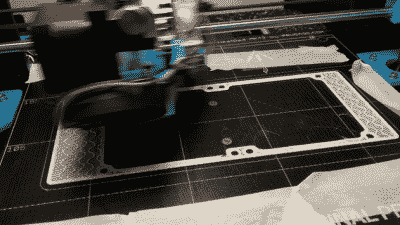

# 3D 打印扇形滤镜从服装场景中汲取灵感

> 原文：<https://hackaday.com/2019/08/03/3d-printed-fan-filter-takes-cues-from-costume-scene/>

由[Kolomanschell] 创建的这个[定制扇形过滤器是一项技术的巧妙应用，该技术用于创建可穿戴的 3D 打印“织物”，该织物由嵌入像尼龙编织一样的精细网格中的打印对象组成。程序本身没有改变，但在这种情况下，它不是将 3D 打印对象嵌入到网格中，而是将网格嵌入到 3D 打印对象中。](https://www.reddit.com/r/functionalprint/comments/chdfe2/pc_fan_filter/)

基本想法是开始 3D 打印，然后在几层后暂停。然后，一个精细的织物网(像*薄纱*，通常用于新娘面纱)在印花床上被拉紧，印花重新开始。如果一切顺利，结果是 3D 打印元件嵌入到一个灵活、可穿戴的薄片中。

这项技术的美妙之处在于，3D 打印机不需要被告知任何事情，因为除了暂停和恢复，3D 打印没有什么不同寻常的。你也不需要羞于提高速度或图层高度设置，使这成为一个相对快速的打印。这种技术既便宜又容易获得，已经在服装和角色扮演领域得到了一些关注。

正如[Kolomanschell]所展示的，这个概念非常适合创建定制的滤镜，最终的效果看起来非常专业。不要因为缺少适合你的粉丝的 3D 模型而停止尝试，我们已经[分享了一个可定制粉丝封面的伟大资源](https://hackaday.com/2018/04/13/customize-all-the-fan-covers-you-never-knew-you-needed/)。因此，如果你有一台 3D 打印机和一点薄纱，你就有了一个下午快速完成项目所需的一切。