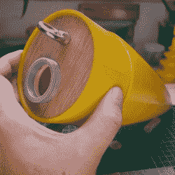

# 3D 打印为模型火箭制造模块化有效载荷

> 原文：<https://hackaday.com/2019/08/09/3d-printing-makes-modular-payload-for-model-rocket/>

将有效载荷放入模型火箭可能比简单地将东西推到一个开放的地方更复杂，所以[concretedog]投入了一些工作来为他目前的火箭制作模块化有效载荷管。他的火箭头锥相当大，所以他选择给它一个安全的有效载荷区域，不会损害或干扰任何结构或操作部分，如降落伞。

有效载荷容器是一个空心管，一端附有 3D 打印的螺纹适配器。有效载荷进入管子，管子插入隔板上的一个孔，拧紧。结果是一种简单的方法来发送类似 GPS 追踪器的东西，可能附有一个 LoRa 模块。这种组合在高空气球中很受欢迎，像火箭一样，也需要人们在不完全可预测的着陆后收回它们。LoRa 无线通信的范围很大，但是如果在你和发射机之间有一个像小山一样的障碍物，那就没用了。在这种情况下，[一个简单的洛拉中继器](https://hackaday.com/2019/05/02/simple-self-contained-lora-repeater-in-about-an-hour/)附在风筝、长杆或无人机上就可以拯救这一天。

我们以前见过[concretedog]的工作，当时他设计了[可堆叠的 PCB，旨在轻松安装在模型火箭体](https://hackaday.com/2018/02/24/these-small-pcbs-are-made-for-model-rocketry/)内，允许轻松集成微控制器驱动的功能，如延迟点火或高度计触发器。更好的开发工具、硬件和 3D 打印确实帮助业余爱好者更容易获得更智能的火箭。