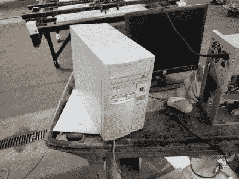

# 在快速发展的数控世界中，这个修复的路由器是一个古董

> 原文：<https://hackaday.com/2019/08/11/in-the-fast-moving-world-of-cnc-this-restored-router-is-an-antique/>

大型机床通常能使用很长时间，因此发现一台 19 世纪制造的车床仍能可靠工作并不罕见。尽管现代车床比百年前的同类车床有更多的功能，但车床的基本工作在这几年中并没有显著的变化。

 数控机床就不是这样了。当计算机数字控制与老式铁机床结合在一起时，控制硬件注定会很快变成古董或古董。从用户界面到控制电路，在电子世界中，新功能很快就会过时。[Evan]有一台 20 世纪 90 年代中期的 ShopBot CNC 木工雕刻机，他称之为古董，而[他修复它的故事](https://abzman2k.wordpress.com/2019/08/07/reviving-an-antique-cnc-router/)既是对小规模 CNC 控制 20 年来变化的迷人审视，也是任何考虑进行类似升级的人的入门读物。

控制器是一对米黄色的电脑机箱，上面写着“我爱 90 年代！".一个包含运行 Windows 95 的 socket-7 PC，另一个包含 ShopBot 控制器；一个带有 ShopBot 固件的 80c32 开发板，耦合到一组电机控制器板，与当今的控制器不同，它需要原始正交输入。他的目标是用现代的替代品取代老式的硬件。运行 grbl 的 Arduino Mega 通过一小块电子设备与商店机器人控制器进行对话，以调节来自其提供的步进和方向线的正交数据。结果可能不如 2019 年的路由器，但它确实让这个老化的工具免于退休。