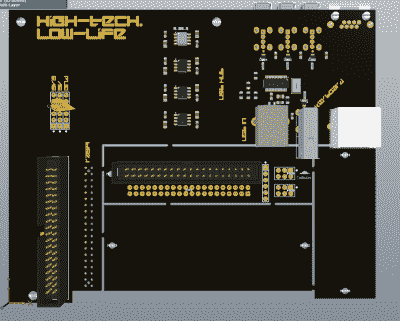

# 你需要一个网络平台，这个板会帮助你

> 原文：<https://hackaday.com/2019/08/16/you-need-a-cyberdeck-this-board-will-help/>

1984 年，威廉·吉布森的小说《神经漫游者》帮助开创了赛博朋克风格，从那以后，许多黑客都很喜欢这种风格。在蒂姆·伯纳斯·李创建万维网的几年前，Gibson 就在想象全球计算机网络和无所不在的人工智能。他最著名的虚构作品之一是 cyberdeck，这是一台功能强大的移动电脑，用户可以在全球网络中导航；尽管今天我们可能称它们为智能手机。

 虽然我们口袋里可能有*功能*的等价物，但像【蒂洛】这样的黑客一直在致力于[构建看起来更符合*神经漫游者*的粉丝们想象的](https://hackaday.io/project/161611-cyberdeck)硬件样子的网络平台。他的项目几乎不是第一个，但这里特别值得注意的是，他试图让其他人更容易跟随他的脚步。

有一种趋势是将 DIY 电脑平台建立在 20 世纪 80 年代的老式电脑硬件上，其逻辑是这将更接近吉布森当时的想法。同样重要的是，一些早期计算机的野兽派棱角设计不仅看起来比我们今天得到的任何东西都酷，而且提供了适合现代硬件输血的巨大内部空间。这些电脑平台通常由 Raspberry Pi 驱动，配有一个相对较小的 LCD，并充满了可充电电池，使曾经固定在桌子和电视上的东西变得可以移动。

[Tillo]他的电脑平台以 Commodore C64c 的剩余部分为基础，重新使用原来的键盘以获得复古的感觉。这意味着他需要让键盘适应树莓派能理解的东西，一些商业上可用的选项已经存在了。但是，为什么不把这个想法推广到那些想创建自己的 C64c 网络平台的人呢？

他目前正在研究一种新的印刷电路板，这种电路板是专门为用树莓派改装这些经典机器而设计的。该板包括像 USB 集线器这样的细节，一旦你移除原始电子设备，应该可以填补一些留在机箱中的漏洞。[Tillo]已经发布了他的开源板的第一个版本，所以希望我们能很快得到更新。

与此同时，你可能想看看[我们在过去几年里](https://hackaday.com/2019/07/16/raspberry-pi-cyberdeck-inspired-by-rare-msx/)[报道过的](https://hackaday.com/2018/07/28/a-mobile-computer-to-make-william-gibson-jealous/)其他一些精彩的网络平台构建。

The [HackadayPrize2019](https://prize.supplyframe.com) is Sponsored by:     