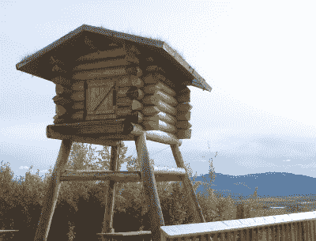

# 最后边界的温度记录

> 原文：<https://hackaday.com/2019/08/22/temperature-logging-on-the-last-frontier/>

在阿拉斯加，气候变化的影响显而易见。融化的永久冻土已经在移动地基和摇晃道路。更热的夏天也将食物储藏从冰箱变成了烤箱。

A permanent food cache. Via [Wikipedia](https://commons.wikimedia.org/w/index.php?curid=6371031)

[rabbitcreek]的朋友与孩子们一起建造食物贮藏处，作为教他们传统土著活动的一部分。食物贮藏处通常在埋在地下的盒子里或者用杆子支撑起来的小木屋里。两者都是为了防止饥饿的熊进入。正如你所料，监控这些偏远地区的温度至关重要，这样食物才不会变质。他的朋友想要一个一劳永逸的温度监测系统，可以在冬天收集八个月的数据。

阿拉斯加数据记录器提出了一系列非常严肃的要求。它必须防水，尤其是当冰雪变成水的时候。理想情况下，它应该耗电，并有很长的电池寿命。最重要的是，它必须便宜，而且相对容易让孩子们建造。

这个令人敬畏的小数据飞船是围绕家用净水器中使用的 O 形环设计的。涂上油脂的 O 型圈安装在两个 3D 打印的外壳之间，这两个外壳用尼龙螺栓紧固。两个防水温度探头从外壳伸出，一个在缓存内部，另一个在元素外部。它是围绕一个 Adafruit 羽毛记录器建造的，由一个 18650 电池供电。数据是通过访问网站和拉动 SD 卡提取文本文件来收集的。真的没有其他办法，因为这些网站远远超出了手机覆盖范围。还是有？

虽然它很可能撑不过最后的边界，但这个自给自足的气象站是阳光充足情况下的简单解决方案。