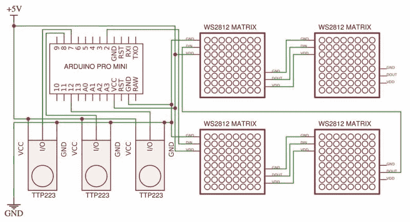

# 在 ATmega328 上下棋的丰富多彩的方式

> 原文：<https://hackaday.com/2019/08/24/a-colorful-way-to-play-chess-on-an-atmega328/>

我们都见过这样的国际象棋计算机，它由一个物理游戏场和一个内置的计算机组成，当以某种方式输入棋子的位置时，计算机会指示您应该将棋子放在哪里。这些系统通常是在密室的壁橱里的一个布满灰尘的纸箱里找到的，因为像这样玩相当麻烦，而且很大程度上取决于内置的象棋计算机。

[【Andrei . erdei】](https://www.instructables.com/id/Playing-Chess-Against-Arduino/)对这个几十年前的概念的这种理解包括一个基于 ATmega328p 的 [Arduino Pro Mini](https://store.arduino.cc/arduino-pro-mini) 板，一个漂亮的木制框架，4 个基于 WS2812 的 65×65 mm RGB 8×8 LED 矩阵，以及一些 [TTP223](https://www.electroschematics.com/11865/ttp223-capacitive-touch-switch-circuit/) 触摸传感器，允许人们控制板上的光标。这是唯一的输入形式:使用向上和向右按钮选择要移动的棋子，用 OK 确认，然后移动到新的位置。国际象棋程序将计算其下一个位置，并在 LED 矩阵上显示。

也不需要使用物理棋子:每个 4×4 的格子使用一种特殊的模式来指示占据它的棋子。这使得它非常便于携带，但可能不如使用实体设备有趣。当你取得连胜的时候，它也扼杀了收集敌人棋子的纯粹快乐。休息后可以看看嵌入的游戏玩法视频，自己判断。

国际象棋程序的核心是[H.G. Muller]的[微型最大值](https://www.hackster.io/rom3/arduino-uno-micromax-chess-030d7c)项目。最初移植到 Arduino Uno，这个程序输出游戏到串口。在将其调整为使用 LED 矩阵后，[andrei.erdei]面临着电路板上最常见的 LED 库内存不足的问题。最终，FAB_LED 库设法用更少的内存来执行任务，允许它和程序的其余部分舒适地放入 ATmega328p 提供的辉煌的 2kb SRAM 中。

经典的 8 位国际象棋引擎是软件工程的奇迹。想知道他们如何对抗现代象棋软件吗？[看看这篇文章](https://hackaday.com/2019/05/23/pitting-8-bit-chess-games-against-modern-foes/)！

 [https://www.youtube.com/embed/b8A6UThnWm0?version=3&rel=1&showsearch=0&showinfo=1&iv_load_policy=1&fs=1&hl=en-US&autohide=2&wmode=transparent](https://www.youtube.com/embed/b8A6UThnWm0?version=3&rel=1&showsearch=0&showinfo=1&iv_load_policy=1&fs=1&hl=en-US&autohide=2&wmode=transparent)

