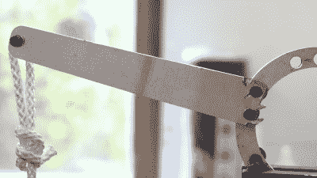

# 电动自行车传动系统设计的考验和磨难

> 原文：<https://hackaday.com/2019/08/26/the-trials-and-tribulations-of-e-bike-drivetrain-design/>

[Tom Stanton]在制造商社区中享有盛誉，多年来在各种电动汽车制造上投入了大量精力。去年在升级他的电动自行车的过程中，他遇到了一些主驱动滑轮的问题。他没有依靠猜测，而是用工程学来解决这个问题。

Static weight tests were carried out in combination with FEA to determine the root cause of the problem.

问题在于皮带轮轮毂上的安装螺栓，在高扭矩下会被拉出。[Tom]最初的有限元模拟表明设计是合理的，但事实证明并非如此。在进一步分析和测试后，[Tom]确定他的分析没有正确模拟螺栓拔出情况。在软件中修正后，很明显，螺栓孔周围没有足够的材料来承受扭矩载荷。

随着模拟现在更加接近现实，[Tom]能够纠正设计。新零件的安装部分得到了加强，滑轮能够成功地应对使用中的负载。

这是使用工程模拟工具快速解决问题的一个很好的例子，而不是简单地猜测和希望事情会继续下去。我们以前也看过[汤姆]的作品，比如这个有趣的后院投石机建筑。休息后的视频。

 [https://www.youtube.com/embed/jVXE9G29VVw?version=3&rel=1&showsearch=0&showinfo=1&iv_load_policy=1&fs=1&hl=en-US&autohide=2&wmode=transparent](https://www.youtube.com/embed/jVXE9G29VVw?version=3&rel=1&showsearch=0&showinfo=1&iv_load_policy=1&fs=1&hl=en-US&autohide=2&wmode=transparent)

