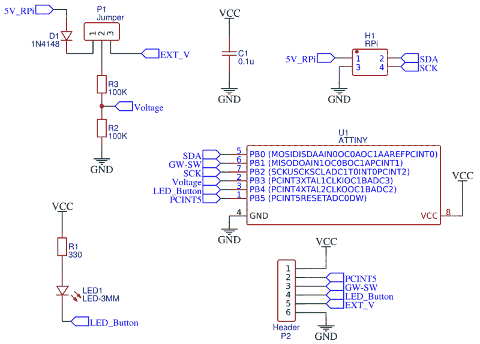

# 用一个小小的守护进程为你的树莓派修复一顶便宜的 UPS 帽子

> 原文：<https://hackaday.com/2019/08/27/fixing-a-cheap-ups-hat-for-your-raspberry-pi-with-a-tiny-daemon/>

不间断电源(UPS)不仅仅是连接到你的台式电脑上的东西。你的树莓派 SBC 也可能从中受益。然而，现有的选择不是太好，就是太贵。这导致包括约阿希姆·鲍曼在内的一些人兴高采烈地修改廉价的中国 UPS HAT(T1)主板，比如 T2 的极客蠕虫 UPS HAT(T3)，以修复其无数的问题和缺失的功能。

受该板上许多其他黑客的启发，这些黑客[修复了像需要按下 UPS 上的按钮来启动 Raspberry Pi 这样的事情](https://tinkerman.cat/post/geekworm-power-pack-hat-hack),【Joachim】开始制作一个类似的基于 ATtiny 的解决方案，它将解决所有问题，首先是这个 Geekworm UPS 不会检测到连接的 SBC 何时关闭，并将愉快地运行锂电池组。找到西蒙的一篇[博客文章非常有帮助，他之前对电路板进行过逆向工程。](https://brousant.nl/jm3/elektronica/104-geekworm-ups-for-raspberry-pi)

在[Simon]的项目中，PIC MCU 用于为 UPS HAT 提供一个监控器。它还绕过了 HAT 对树莓 Pi 是否通电的控制。然而结果并不符合[Joachim]的需要，因此 ATtiny 守护程序项目诞生了。这使用了[Simon]实现的一些修复，并添加了一个在 Raspberry Pi 上运行的守护进程，以在 UPS 和 OS 之间建立双向通信。

The final schematics for the project.

UPS 的设置也存储在 HAT 上 MCU 的 EEPROM 中，守护程序可以根据需要更新和读取。完整的系统提供了一个完整的新特性列表，如上面链接的 Github 项目页面所列。可能最重要的是警告、硬关机和重启的阈值。整个附加板也仅使用通孔元件，即使新手也能轻松组装。

The completed and assembled board, without installed ATtiny MCU.