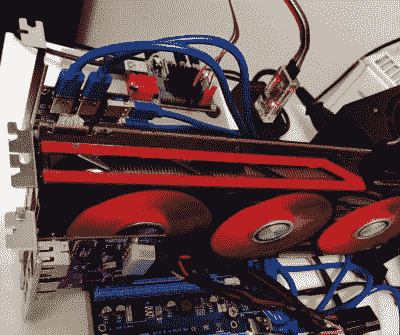

# PCIe 乘数扩大树莓 Pi 4 的可能性

> 原文：<https://hackaday.com/2019/09/05/pcie-multiplier-expands-raspberry-pi-4-possibilities/>

不言而喻，当 Raspberry Pi 4 宣布时，硬件黑客们很兴奋，但这不仅仅是因为每个人都喜欢的 Linux SBCs 系列有了一个新的条目。新的 Pi 提供了许多引人注目的硬件升级，包括板载 PCI-Express 接口。唯一的问题是 PCIe 接口专用于 USB 3.0 控制器；但是没有什么是热风返工站解决不了的。

 我们之前已经看到过稳扎稳打的黑客移除 Pi 4 上的 USB 3.0 控制器来连接各种 PCIe 设备，结果有些喜忧参半，但[【科林·赖利】通过成功获得与小型 Linux 计算机](http://labs.domipheus.com/blog/raspberry-pi-4-pci-express-it-actually-works-usb-sata-gpu/)一起工作的 PCIe 倍增板，提高了标准。虽然仍有一些软件问题需要解决，但结果是非常有希望的，他已经有一些设备工作了。

将第一个 PCIe 端口添加到 Pi 4 已经很好理解了，所以[科林]只需遵循[像[托马兹·姆洛杜乔斯基]](https://hackaday.com/2019/07/10/giving-the-pi-4-pci-express/) 这样的黑客树立的榜样。果然，当他插入端口倍增器板时(在他称之为“专业的扭动”之后)，适当的条目出现在`lspci`中。

但是有一个问题。虽然内核识别了端口倍增器板，但他插入的任何东西都没有显示出来。检查内核日志，他发现了与总线冲突相关的消息，其中一条似乎特别重要:“桥后面的*设备不可用，因为不能为它们分配*【bus 02】。长话短说，原来 Raspbian 内核是专门配置为只允许一条 PCI 总线的。

幸运的是，一旦你知道问题是什么，就很容易解决。使用“设备树编译器”工具，[Colin]能够编辑 Raspbian 设备树文件，并将 PCI“总线范围”变量从`<0x0 0x1>`更改为`<0x0 0xff>`。从那时起，只需要插入不同的设备，看看什么可以工作。USB 控制器等简单的东西没有问题，但他尝试的英伟达 GTX 1060 获得 ARM Linux 支持将不得不成为另一个话题。

感谢保利的提示。]