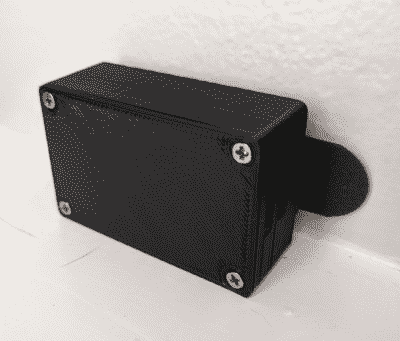

# 粒子网格为粉丝网络提供动力

> 原文：<https://hackaday.com/2019/09/12/particle-mesh-powers-the-internet-of-fans/>

随着冬天的到来，[Ben Brooks]正在寻找一种方法来帮助他的燃木壁炉的热量在整个家中循环。他没有采用商业解决方案，而是决定开发自己的自动空气循环系统，该系统由他最喜欢的技术之一粒子光子的网状网络功能驱动。

Particle Xeon remote sensor

这里的想法很简单:使用一个远程温度传感器来告诉壁炉后面的风扇什么时候启动，并开始与房子的其他部分分享一些温暖。但是像往常一样，它最终比预期的要棘手一些。首先，当[Ben]仔细观察他计划使用的 Vornado 660 风扇时，他意识到它的速度控制器足够“智能”，简单地在交流线上放置一个继电器不会允许他打开和关闭它。

因此，他必须进行一些逆向工程，以弄清楚板上的 Sonix SN8P2501B 微控制器是如何控制风扇的，然后将光子直接连接到芯片上与各种物理控制相对应的引脚。这使得光子不仅可以“推动”按钮来触发不同的速度，还可以读取控件来查看是否有人试图超越当前的设置。

对于远程端，[Ben]正在使用一种粒子氙，这是专为物联网终端和传感器应用而设计的。结合 TMP36 温度传感器和 3.7 V 500 mAh 电池，这使他能够轻松地组装一个无线远程温度计，该温度计将定期向光子的网状网络发布当前温度。

这不是我们第一次看到粒子光子被用来增强一个不起眼的硬件。我们之前见过一个被嫁接到咖啡机上的，如果你能相信的话，有人甚至[把一个插在一把雨伞里来创造一个移动气象站](https://hackaday.com/2018/12/25/the-umbrella-that-tells-you-the-weather/)。