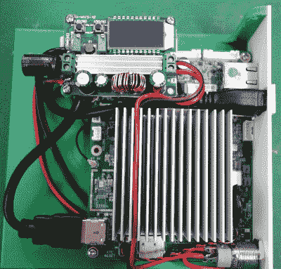

# 原子 Pi 获得 3D 打印的 Mac 改造

> 原文：<https://hackaday.com/2019/09/15/atomic-pi-gets-a-3d-printed-mac-makeover/>

Atomic Pi 在价格上是一个相当不错的套件，但它并不是一种交钥匙产品。甚至在更大的程度上，比你通常对这样的“开发”板所期望的更大，用户负责将实际使用它所需的其余部分放在一起。但是有了这个由[Renri Nakano] 设计的东西，你可以把原子 Pi 变成一台危险地接近实用计算机的东西，而且是一台时髦的计算机。

 受 2019 款苹果 Mac Pro“奶酪刨丝器”的启发，这款 3D 可打印外壳对于原子 Pi 来说是外形和功能等同的部件。它集成了必要的电源来启动和运行，而不需要官方的分线板或电源模块，这很好，因为在撰写本文时，它们似乎还不可用。此外，它有一个看起来很酷的电源按钮，所以这一定是有价值的。

还有一个集成的 USB 集线器，可以为 Atomic Pi 提供更多的可扩展性，还有一根短的 HDMI 延长线，可以在外壳背面放置一个视频端口。[Renri]甚至想留下一个开口，这样你就可以为你的无线天线布线。

在这一点上，我们已经看到了几个模仿[2019 Mac Pro](https://hackaday.com/2019/06/19/the-process-behind-manufacturing-that-mac-pro-grille/)独特外壳设计的项目。水平承诺的范围从[在 CAD 中重新创建设计并将其从铝中铣出](https://hackaday.com/2019/06/25/the-cheese-grater-in-fusion-360/)到[在厨房的真正奶酪刨丝器中插入树莓皮](https://hackaday.com/2019/06/21/grate-design-on-this-cutting-edge-raspberry-pi-case/)。自然，我们和下一个黑客一样喜欢一个执行良好的互联网迷因，但尽管如此，我们还是很高兴看到[伦里]努力确保这个案件不仅仅是一张漂亮的脸。

【感谢 baldpower 的提示。]