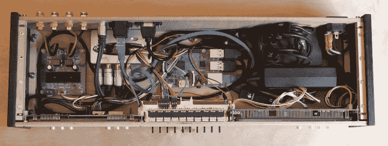

# Scratch 构建的媒体播放器频道 1980 年代设计

> 原文：<https://hackaday.com/2019/09/15/scratch-built-media-player-channels-1980s-design/>

不，你看到的不是一台有人改装过的 30 年前的 Teac 图形均衡器。由[GuzziGuy]创建的 MWA-002 网络音乐播放器完全由新组件构建而成，可以轻松地与我们见过的一些最华丽的自制音频设备相媲美。将模块化硬件与现代制造技术相结合，这款受 20 世纪 80 年代启发的产品证明了[对于专注的黑客和制造商来说，我们已经走了多远。](https://imgur.com/a/7NiOgrQ)

这个外壳，虽然看起来完全像是一个重新利用的老式硬件，却是在 CNC 路由器的帮助下建造的。它由实心橡木、胶合板和贴面的中密度纤维板制成，这些材料都经过精心的加工和切割。甚至前面板的文字都是用 CNC 雕刻的，然后用黑漆填充，使字母突出。

在内部，MWA-002 由运行 Mopidy 的 Raspberry Pi 3 驱动，可以播放本地曲目和流媒体音频。由于对 Pi 的内置功能不满意，[GuzziGuy]正在使用百灵达 UCA202 来制作 CD 品质的音频，然后将其输入 TPA3116 放大器。反过来，放大器的输出端接在播放器上的一组插孔中。就像过去的立体声设备一样，这款播放器被设计成可以连接到更大的音频系统，并且没有任何内置扬声器。

主要展示的是一个 256×64 双叶 GP1212A02A FVD，它具有与时代相适应的光芒，同时仍具有现代特征。[GuzziGuy]说，由于缺乏可用的库，与他过去使用的液晶显示器相比，这种 I2C 显示器更难连接，但我们认为最终产品证明了这种努力是值得的。他买了 VFD 频谱分析仪和 LED VU 计作为交钥匙模块，但中心均衡器控制是完全定制的；使用双 MCP3008 ADCs 读取滑块的状态，使用 Linux 音频开发人员的简单插件 API (LADSPA)相应地调整 PI 的音频输出。

在 Hackaday，我们对漂亮的音频设备并不陌生，但一般来说，大多数项目都涉及[对现有设备](https://hackaday.com/2018/05/10/1960s-console-stereo-gets-raspberry-pi-touch-screen/)进行现代化改造或增强。虽然这些项目令人钦佩，但从模块化组件和原始建筑材料中创造出这种水平的工程确实是一个完全不同层次的成就。