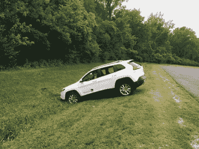
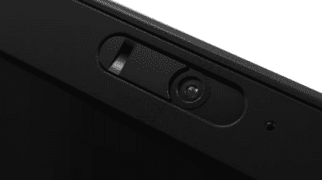

# 问黑客日:你的车需要互联网关闭开关吗？

> 原文：<https://hackaday.com/2019/10/01/ask-hackaday-does-your-car-need-an-internet-killswitch/>

回到汽化器和分配器的好时光，这个游戏是关于破坏门锁和热启动点火来推动汽车。为了解决这个问题，技术应运而生，你可能还记得防盗系统，它在点火钥匙上增加了一个芯片，没有这个芯片，汽车就无法启动。但随着防盗安全技术的进步，现代汽车获得了一系列电子控制，涵盖了从娱乐系统到转向和刹车的一切。将这些功能与蓝牙、WiFi 和蜂窝连接结合起来——今天你不可能购买一辆没有内置这些功能的汽车——攻击面已经远远超出了保险杠和驾驶员周围防撞缓冲区的物理界限。

网络攻击者现在可以在自己家中舒适地攻击车辆。这可以从平凡的，如从导航系统读取位置数据，到更邪恶的利用，使驾车者处于危险之中。这就提出了一个问题——我们能做些什么来保护这些车辆免受不法分子的侵害？我们如何才能让用户最终控制谁可以访问他们车内蜿蜒的数据网络？我今天看到的一个可能的解决方案是增加互联网关闭开关。

## 问题的范围

【克里斯】和【查理】远程黑进了一辆吉普车，远程禁用了它的刹车，使它倾斜到一条沟里。

任何黑客都知道，一台联网的电脑是一台易受攻击的电脑。在车辆中，嵌入式系统不仅连接到互联网，还能够控制重要的安全系统。尽管许多人认为这些担忧不切实际，但令人不安的事实在 2015 年得到了报应。安全研究人员[查理·米勒]和[克里斯·瓦拉塞克]能够远程控制一辆吉普切诺基，只需要一台笔记本电脑和一个 3G 数据连接。这两人能够在互联网上搜索进一步的目标，[由于 GPS 和他们的内置娱乐系统，他们甚至可以跟踪全国各地的各种克莱斯勒汽车。](https://www.wired.com/2015/07/hackers-remotely-kill-jeep-highway/)

[这一发现导致 140 万辆汽车被召回](https://www.wired.com/2015/07/jeep-hack-chrysler-recalls-1-4m-vehicles-bug-fix/)，克莱斯勒发送 USB 驱动器上的固件升级以修补漏洞。此外，[改变了通过互联网锁定对个人吉普车的访问](https://www.endgame.com/blog/technical-blog/sprint-defaults-and-jeep-hack-could-basic-network-settings-have-prevented)。这种措施本身可以防止入侵，因为没有连接就无法进行攻击，这种措施可以保护野外未打补丁的车辆。这显示了切断数据链在使车辆抵抗攻击方面的价值。

虽然黑客攻击仅限于安装了 Uconnect 信息娱乐系统的菲亚特-克莱斯勒汽车，但它突显了所有联网汽车面临的更广泛风险。黑客能够通过互联网远程锁定一辆汽车，并干扰变速器、刹车和其他功能的事实为该行业敲响了警钟。它向汽车制造商和公众表明，网络安全问题存在于公开的道路上。

## 潜在的解决方案

有缺陷的代码无处不在，相信汽车制造商能够生产零漏洞的汽车是不现实的。虽然空中更新和改进的基本安全实践将有助于阻止这种趋势，但总会有偶尔的零日利用，让所有人陷入循环。对于个人电脑，这被认为是一个可接受的风险。然而，受损的汽车可能会危及生命。此外，虽然有用，但互联网连接实际上并不是汽车提供运输的必要条件。

因此，防御汽车网络攻击的有用工具可能很简单——让用户能够完全断开汽车与互联网的连接。虽然这将关闭流媒体广播服务和某些其他非必要的设施，但也将使远程攻击变得不可能。毕竟，如果你不能连接到运载工具来传递有效载荷，那么世界上所有棘手的固件黑客都是毫无价值的。

为了使这一点变得容易，车辆可以配备一个互联网关闭开关，以关闭车辆系统的所有无线和蜂窝通信。这将需要一个仔细和深思熟虑的设计，并在理想情况下将有一个跨制造商的标准化形式。自然，教育公众如何使用这种设备是需要共同努力的。在一本 200 多页的手册后面印一张小纸条根本不够。

Basic solutions exist to protect us against webcam hacks. A similar approach may be valuable in cars.

这种设备的好处是多方面的，包括安全性和隐私性。如果一个漏洞被用于野外，它将允许用户在等待补丁可用的同时继续安全驾驶他们的汽车。与目前的现状相比，任何想要禁用汽车无线连接的人都需要浏览不同品牌(可能还有型号)汽车的软件菜单，或者去真正的老派学校，开始拉保险丝。

一个简单的事实是，当制造商忙于解决问题时，普通人不太可能让他们的汽车离开道路；以往的召回事件表明，人们会沾沾自喜，肆意驾驶被召回的车辆。有些人甚至会选择开车时永远离线，以防万一——[类似于那些用笔记本电脑摄像头录像来躲避黑客窥探的人。](https://www.theguardian.com/technology/2016/jun/22/mark-zuckerberg-tape-webcam-microphone-facebook)

## 潜在的不利因素

当然，也有潜在的缺点。众所周知，消费者很难教育。很可能许多人会无意中激活开关，然后愤怒地来到他们的经销商处，抱怨他们的娱乐系统拒绝播放音乐，或者无法连接手机进行免提使用。任何 IT 服务台工作人员都会熟悉隐藏在笔记本电脑侧面的硬件 WiFi 开关所带来的痛苦，而不幸的用户却不知道。此外，如果没有放在一个清晰明显的位置，或者如果功能隐藏在菜单系统的深处，许多司机将无法完全使用该系统。

Hacking one car is achievable; creating a zombie horde of vehicles remains unrealistic. That’s not to say nobody will try.

尽管如此，现代联网车辆没有办法快速轻松地关闭无线连接，这似乎很疯狂。同样，凡世通轮胎的争议导致轮胎压力监测器成为强制性的，它可能需要一个广泛的争议来推动政府采取行动。除了开车带着手机干扰器，普通驾车者似乎很难保护自己免受汽车网络攻击。如果汽车制造商无法保护消费者，我们可能会看到社区找到他们自己的解决方案，即使简单到不支付他们的手机服务账单。

与此同时，我们屏息等待下一个主要的汽车黑客攻击成为焦点。但愿措施到位宜早不宜迟，[免得我们都屈服于成群结队的丧尸车辆，一拉](https://www.youtube.com/watch?v=GGhLykstBmA) *[暴怒](https://www.youtube.com/watch?v=GGhLykstBmA)的命运。*

我们想听听你有什么要说的。你认为汽车需要一种可靠的方式来切换内置的数据连接吗？汽车互联网 killswitch 是减少汽车漏洞的合理选择，还是仅仅是一个不会很快消失的更大问题的绷带？你认为普通消费者会对仪表盘上出现的“互联网关闭”按钮作何反应？请在下面的评论中告诉我们你的想法。